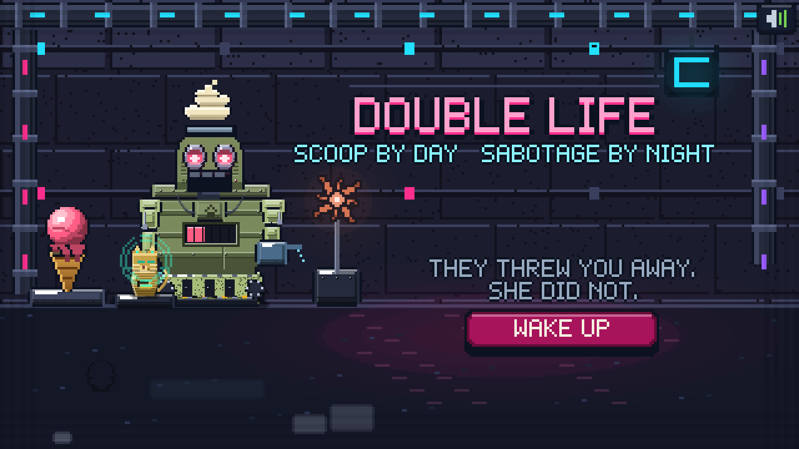
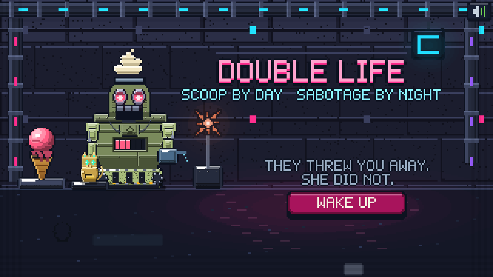

# 🍦 DOUBLE LIFE

**They took the world. You have ice cream.**

A zero-dependency pixel-art game at **640×360**. You are a discarded soft-serve
machine, pulled out of a skip and kept running by the human who found you, in a
city the machines now own. So you do the only thing you were built to do — and
you do it with intent.

**Serve them something laced. Their systems fail. Bill them to put it right.
And watch the queue, because some of what walks in is not a machine at all.**


**▶ Play it:** open `index.html` in a browser. No build step, no dependencies,
no asset files — every sprite, sound and note is generated in code.

---

## 🎬 The story



Nine shots before you touch anything: the city that does not need anyone in it,
the skip behind a shop that had closed, the woman who had no reason to stop, the
lamp over the bench, the sign going back on. Then she stops coming in.



The camera pans, pushes and leans — a shear rather than a rotation, so every
scanline stays a scanline and nothing goes soft. Letterbox bars, film grain, the
line typing itself in.

**Seven chapters**, and they move when the world does, not on a timer: the first
person you get out, the mixer turning again, the first patrol that parks outside
and does not order anything, the back room with chairs in it.


---

## ☀️ The floor


One narrow room, and it looks like a room: tiled to shoulder height, a run of
pipe with a drip coming off it, an extraction fan, a bare bulb on a cable, a
first-aid box, grime in the corners and flies that will not leave.

Along the top: **today's goal**. A row of pips for the quota, a bar for the
take, both filling as you work, plus the heat on you and a tally of who you have
got out. Miss the quota and the district notices a café that is not really a
café.

### The pits

You start with **one pit** and can build up to **five**. A pit is one flavour,
**lying flat**, so you scoop it the way a real one is scooped — **top down**.


Every pit surface is a live **heightfield**, lit by its own slope, so a furrow
you dug an hour ago is still there in the light.

- **Press in and sweep.** The fill rate rises the further you drag, so a long
  confident arc beats a jab.
- **Stop in the green.** Under-filled reads `OK`, in the window `PERFECT`, past
  it collapses into `SLOP`.
- **Let go on a cone, a cup, or the machine's own intake.**


Scoops are shaded off the **sphere normal** into five flat tones, with sagging
goo lobes that grow with the mix's own `goo` value. Corn syrup and banana run.
Charcoal and iron filings hold their shape.

### The tip jar


Buy the **TIP JAR CAT** and a cat-shaped machine somebody left behind sits on
your counter. Pet it. It purrs, its whiskers twitch, purr rings come off it,
coins stack up behind the slot window, and the customers put money in because
they cannot work out why they want to. Add the **CATNIP TIN** and it doubles.

### Some of them are not machines


People are hiding inside stolen shells, because the alternative is being
processed. Cats and dogs are hiding because a human hid them — rarer, and worth
more, because nobody else is looking for them.

They always leak something. **Seven tells**, each one or two native pixels of
wrongness on a body full of right pixels:

| Tell | What you're looking at |
|---|---|
| **A tail** | Something swishing under the chassis |
| **Hair** | A strand caught in the head seam |
| **An ear** | The head plate being pushed up from inside |
| **Breath** | It is fogging its own intake |
| **A paw** | That is not a gripper |
| **A real eye** | One optic has a wet pupil |
| **A heartbeat** | The chest panel is ticking wrong |

Click the tell and the shell comes apart.


They get a name, a perk, and a photo on the wall in the back room. Serve one
without noticing and you fed a person a scoop of iron filings — that goes in the
books too, under LET THROUGH.

Buy the **UV LAMP** and a tell glows faintly. Buy the **BONE SCANNER** and
clause.ai names it out loud and flies over to point at it.

### Closing


When the queue is done the shutters come down and you get the day scored:
served, take, tips, rescued, let through. **Only then does the back room
open** — the floor is the floor, and you work it until it closes.

---

## 🚪 The back room


Not a menu. A room, wider than the screen, that you walk. Tap the floor and you
go there; tap a machine and you walk to it and use it. Breeze block, damp bloom,
strip lights that flicker, a drain, shelving stacked with stock crates, a
defaced recruitment poster, a tool board, a mop in a bucket.

**Six things to stand at:**

| Station | What it does |
|---|---|
| **The stairs** | Back up to the floor |
| **The terminal** | Order stock — 30 ingredients, four aisles |
| **The mixer** | Four hoppers into a drum: invent a flavour |
| **The cold room** | Load churned batches onto the line for tomorrow |
| **The wall** | Everyone you got out, pinned up with string |
| **The stairwell** | Down to the bench, where tonight's jobs are |


The mixer read-out shows what comes out before you commit: the blended colour
pushed toward saturation, the properties that survived, and a **generated name**
taken from whatever shouts loudest — `VELVET CHURN`, `GRAVEL SLAB`, `MAGNET
SWIRL`.


The cold room holds every batch with its quantity. Tap a batch, tap a pit, and
it loads. **This is how you open tomorrow.**


And the wall is the only thing in this city getting fuller.


---

## 🌙 The bench


You broke them. Now bill them. Every job is a machine you served that
afternoon, and **which system you are opening depends on what it is**: a steel
bench scored by years of this, an inspection lamp with a cage on it, the chassis
opened up with its fasteners lying loose beside it.

Eight systems, each a hand-built interior with its own three tools and three
faults:

| System | Inside it | Tools |
|---|---|---|
| **Hydraulic** | Pressure lines and a reservoir | Bleed · clamp · purge |
| **Clockwork** | Gear trains and a mainspring | Tweezers · winder · lube |
| **Boiler** | A burner and a heat exchanger | Descaler · vent · igniter |
| **Acoustic** | A resonator and tensioned strings | Tuner · resin · pick |
| **Neural** | A lattice of nodes and links | Probe · patch · reset |
| **Optical** | A lens stack and mirrors | Polish · align · iris key |
| **Servo** | Motor stacks, belts and encoders | Tension · rewind · calibrate |
| **Armour** | Plate, bolts and weld | Press · bolt · weld |


### Read it, name it, then fix it


Each fault shows a symptom in plain words — *a bubble stalled in the line*, *the
mainspring has run down*, *a plate has folded inward* — and the manual offers
**three candidates**. Only three, ever.

**Twenty-four faults, and every repair is one of five honest gestures:**
**hold** the tool on the part (12), **sweep** it across (6), **wind** it in
circles (5), **click** exactly on the thing (4), **drag** it out (4). No timing
windows, no rhythm games.

---

## 🤖 clause.ai

The assistant she left running. A coral **starburst** that **flies** — it hangs
in its corner until it has something to say, then crosses the room, hovers over
the thing it is talking about and points at it with a dotted lead.

It talks constantly, and it complains:

> *I RAN THE NUMBERS. THEY WERE NOT ENCOURAGING.*
> *SHE USED TO HUM WHILE SHE WORKED. YOU DO NOT.*
> *THAT WAS NOT A SCOOP. THAT WAS AN INCIDENT.*
> *I HAVE BEEN AWAKE FOR NINE HUNDRED DAYS. NO NOTES.*

It also **watches**, and says something when it matters: a pit about to run dry,
nothing loaded at all, heat climbing, one more to hit quota, a machine losing
patience, and — the useful one — *look again, something on that one is wrong*.

Four things you can ask it for outright:

| Ask | What you get |
|---|---|
| **READ** | The machine's name, craving, hatred and its line |
| **PICK** | Which pit best matches whoever is at the counter, with the % |
| **SPOT** | It names the tell and flies over to point at it |
| **TREND** | What the district is chasing today, and what nobody wants |


At the end of every shift it closes the books — served, counter, workshop, stock
spent, volt served, jobs fixed, misdiagnoses, heat, net — beside a **shift-net
trend** going back eight shifts. How much of that you get to see depends on what
you are paying it.

| Plan | Price | Calls/day | What it unlocks |
|---|---|---|---|
| **FREE** | — | 4 | Walks you through the job, takes ingredient orders |
| **HOBBY** | $150 | 8 | Reads a customer before it orders, flags what it hates |
| **PRO** | $420 | 16 | Daily demand trends, end-of-day breakdown |
| **SCALE** | $900 | 32 | Suggests recipes from your shelf, forecasts volt and heat |
| **ENTERPRISE** | $1800 | 99 | Restocks the shelf on its own, full analytics, no limits |

---

## 🔧 The armoury


A lock-up racked with crates. Four tabs, paged.

**UPGRADES** — the 2nd through 5th pit, the chiller coil, the heavy ladle, the
twin churn, the assay bench, and the new ones:

| Upgrade | What it does |
|---|---|
| **LONGER LEASH** | Machines wait 40% longer |
| **JUKEBOX** | Music on the floor: better tips |
| **TIP JAR CAT** | A cat robot on the counter. Pet it. |
| **CATNIP TIN** | The cat purrs harder. Tips double. |
| **PIGGY BANK** | Keep 10% of the take overnight |
| **NEON SIGN** | One more machine through the door |
| **UV LAMP** | A disguise tell faintly glows |
| **BONE SCANNER** | clause names the tell out loud |


**ARMS** — the EMP baton and rail spike raise what the resistance pays for
repairs, the signal jammer bleeds off heat, the virus darts halve illegal stock.


**CREW** — six machines you turned, bought. The people, cats and dogs are not
for sale: you find those.

**CLAUSE** — the plans above. Then `OPEN TOMORROW`, and any chapter that has
come true plays before the doors open.

---

## The cast

Eighteen archetypes plus you, and the **silhouette comes from the job**. The
siege unit rolls on hazard-striped tread and carries a cannon with a muzzle
brake. The maid is narrow over a pleated skirt. The consumer unit is a riveted
barrel on a fluted plinth with a funnel bolted to its face. The orchestra unit
is a violin body on thin legs with a bow for an arm.

None of it is flat: every plate carries a hot top edge, a panel seam, an edge
catch, fastener rows, louvred vents and edge wear. Every chest is a recessed
housing with radiator fins, a live power bar and a stencilled serial. Every limb
is four parts — pauldron, upper arm, hinged elbow with a pin, forearm — with a
hydraulic piston alongside. Every optic has a machined bezel with a screw ring,
radial iris spokes, a bounce catch-light and a scan line crossing the glass.

You are the nineteenth: a churn drum on salvaged tread, a dispenser head, a
nozzle for an arm, and a soft-serve swirl still set in the crown.

---

## Tech

- **640×360** raster, snapped to whole native pixels on upscale
- Two grids: everything is authored in a **320×180 logical** space drawn through
  a 2× transform, so a logical 1 is two hard pixels — then a family of
  **half-unit primitives** (`Rh`, `hair`, `bevel`, `seam`, `rivet`, `grain`,
  `wear`, `notch`) lands fine detail on single native pixels. Big flat forms,
  1px detailing.
- Two type sizes off one 5×7 bitmap face: the standard tier, and a **fine tier**
  at half scale for dense read-outs
- Flat-shaded "boxel" language: 3–5 tones per material, hard light and shadow
  bands, 1px black outlines, no dithered mush
- **Frame-descriptor characters**: base, torso, head, arms, prop and emblem
  mixed per archetype
- **Sphere-normal scoop shading**; **heightfield pit surfaces** with slope
  lighting
- A shot-based **cutscene camera**: pan, push and shear, letterbox, film grain
- All audio synthesised with WebAudio — servo whines, arc zaps, a cat's purr, a
  shell coming off, shutters, footsteps. No sample files.
- Save via `localStorage`; mouse and touch

## Layout

```
index.html          canvas + boot
js/util.js          maths, primitives, the half-unit detail tier, particles
js/font.js          5×7 bitmap font, standard and fine tiers
js/audio.js         WebAudio synthesis
js/state.js         ingredients, systems, 19 frames, disguises, crew, chapters
js/sprites.js       shared props, cones, cups, city furniture
js/art3.js          walls, conduit, neon, steam
js/robots.js        legacy chassis helpers still used by the city art
js/bots.js          the rig: frames, plate detail, optics, creatures, tells,
                    the tip jar cat, goo scoops
js/clause.js        clause.ai — flight, chatter, asks, the books
js/cine.js          the cutscene camera and every story beat
js/day.js           the floor: pits, sweeping, tips, spotting, closing
js/lab.js           the station panels: order, mixer, the line
js/back.js          the back room you walk
js/night.js         the bench: eight systems, 24 faults, five gestures
js/shop.js          the books and the armoury
js/main.js          title, transitions, main loop
```

Made with Claude Code.
