# 🍦 DOUBLE LIFE

**They took the world. You have gelato.**

A zero-dependency pixel-art game at **1280×720**. You are a **mascot**: two dot
eyes, one smile, a cream hide, two black patches, a cowbell and a brand roundel
on the belly. For six years you were the face of BIG MOO, a burger chain with a
cow on the sign, open twenty-four hours.

Then a patrol machine walked in through the front door, shot one of your legs
off and put a charge under the counter. You came back on four hours later in
the wreck, on one leg and a length of scaffold pipe, looking for anybody at
all.

An old woman called **Tracy**, who has been making gelato since before machines
could hold a scoop, found you with a torch, carried you home, bolted a leg out
of a crate marked SPARES onto you and taught you the only thing worth knowing.
Then a patrol came through *her* door at four in the morning and took everyone
on the street.

**So now you serve them something laced. Their systems fail. You bill them to
put it right. And you watch the queue, because some of what walks in is not a
machine at all — and every one of those you get out is one they do not.**

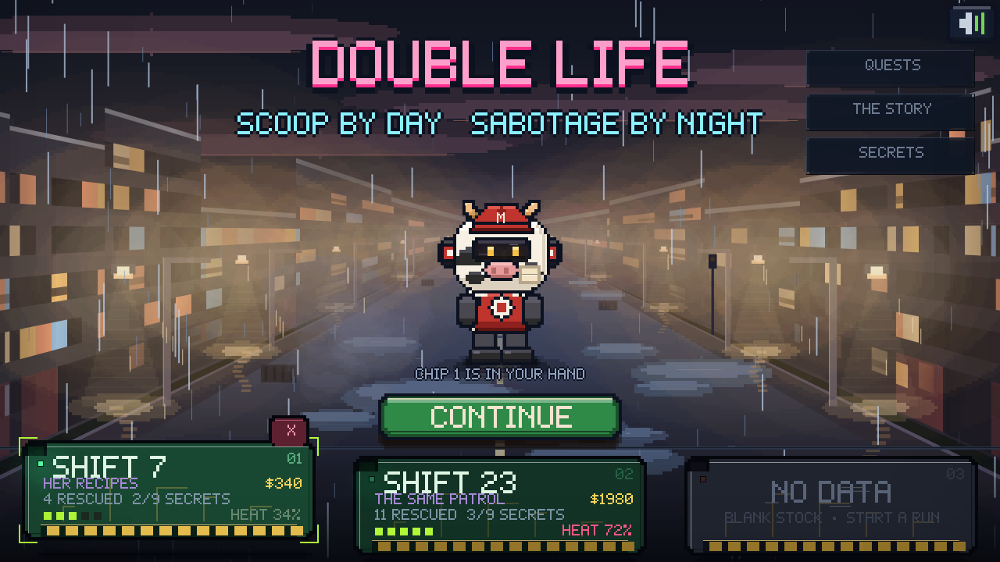

**▶ Play it:** open `index.html` in a browser. No build step, no dependencies,
no asset files — every sprite, sound and note is generated in code.

The menu carries your save, and two logs it opens once you have earned them:

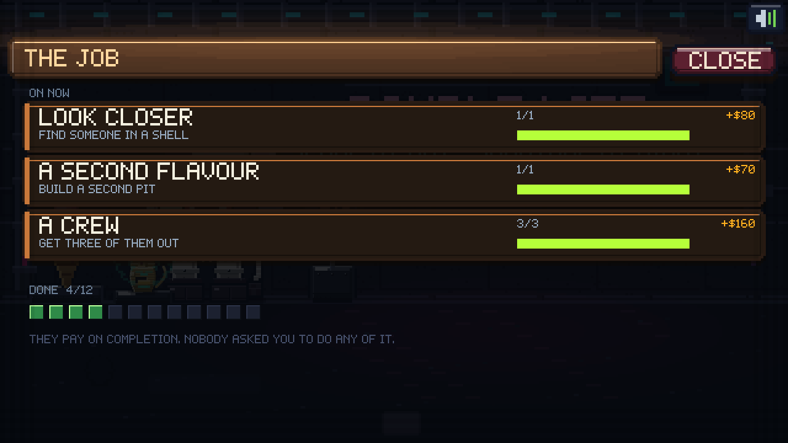

**QUESTS** — twelve of them, and none was asked of you. Each one is a thing the
shop actually needs, they pay on completion, and the panel settles up any you
finished without noticing.

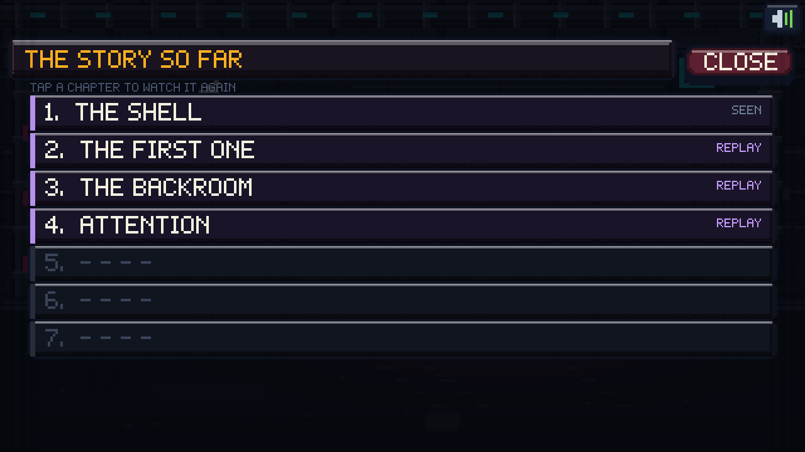

**THE STORY** — every chapter you have seen, and any of them replayable.

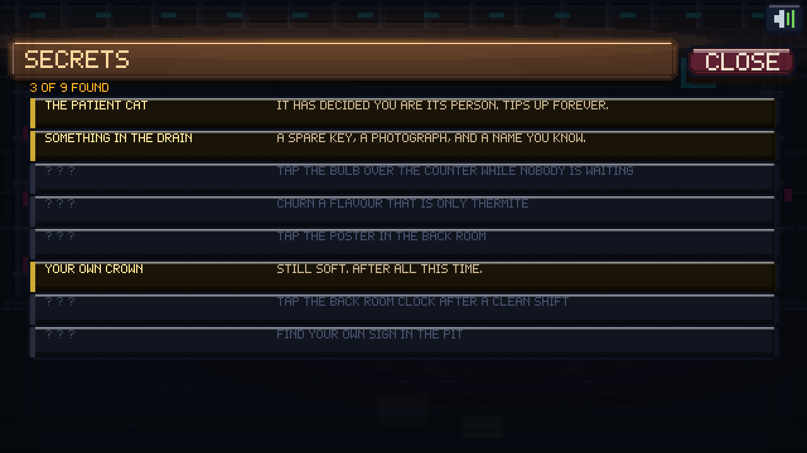

**SECRETS** — nine of them. Nobody tells you about these; the ones you have not
found show you where to look, which is more than the game gives you anywhere
else.

---

## 🕹️ The prologue is a place, not a picture

The first act of this game used to be nine cutscene shots and a two-mile
crawl — a camera looking at things while you waited. It is now **two rooms you
walk around in**. Tap where you want to go and the mascot walks there. Tap the
green chevron over something and it walks over and uses it.

Everything in them runs off `stage.js`: a floor line, a scrolling camera, a
cast of people each running their own **script of intentions**, places you can
walk up to and use, speech bubbles over the right heads, and beats that fire
when you get there.

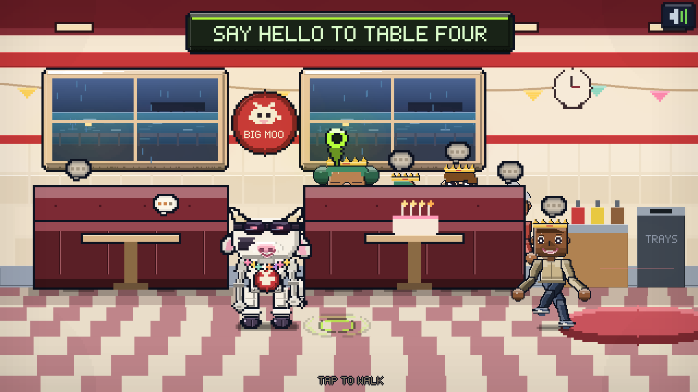

**ACT ONE — the floor.** Mid-shift at a burger chain with a cow on the sign.
There is a **birthday party in the second booth**, a couple eating in the
first, two staff behind the counter, a queue that forms and clears, and a kid
who will not sit down.

The room is **two planes deep**: the counter, the booths and the staff stand on
a back floor eighteen units further away, so you walk *in front* of the
furniture instead of standing in it, and anyone sat in a booth is cut off at
the chest by the bench in front of them — which is what sitting down looks
like from the side.

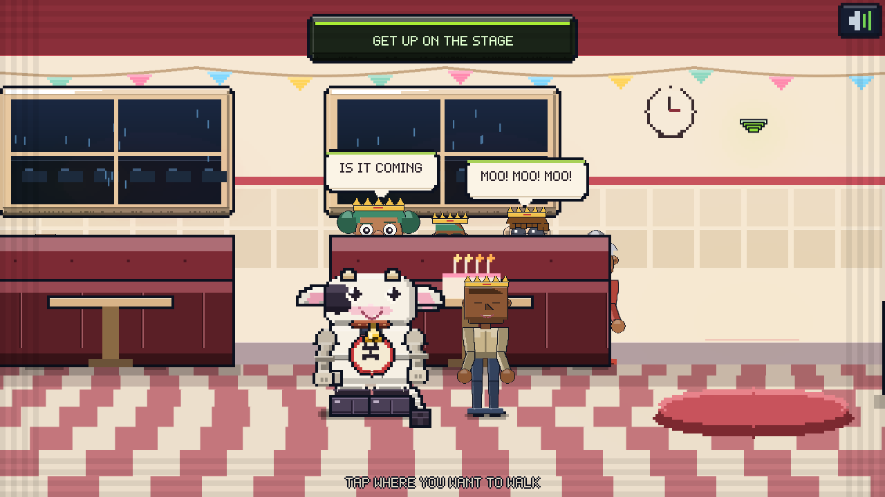

Four jobs, in order, each gated behind the last. **Say hello to table four.**

> **BESSIE:** WHO IS FOUR TODAY, THEN?
> **A CHILD:** MOO! MOO! MOO!

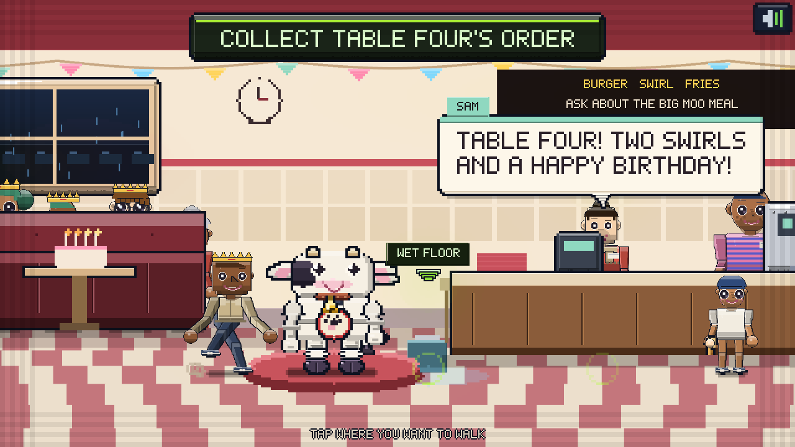

**Get up on the stage and do the dance.** Control is taken off you for three
seconds, you wave, the whole table points at once, and it is handed back.

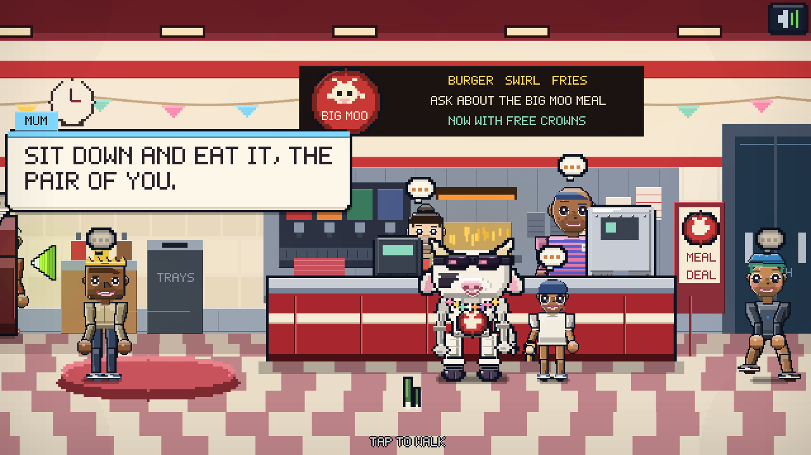

**Collect table four's order** — the staff member you walk up to reaches under
the counter and hands you two swirls, which you then carry, in both hands,
until you put them down.

> **SAM:** TWO SWIRLS. MIND THE FLOOR, IT IS WET.

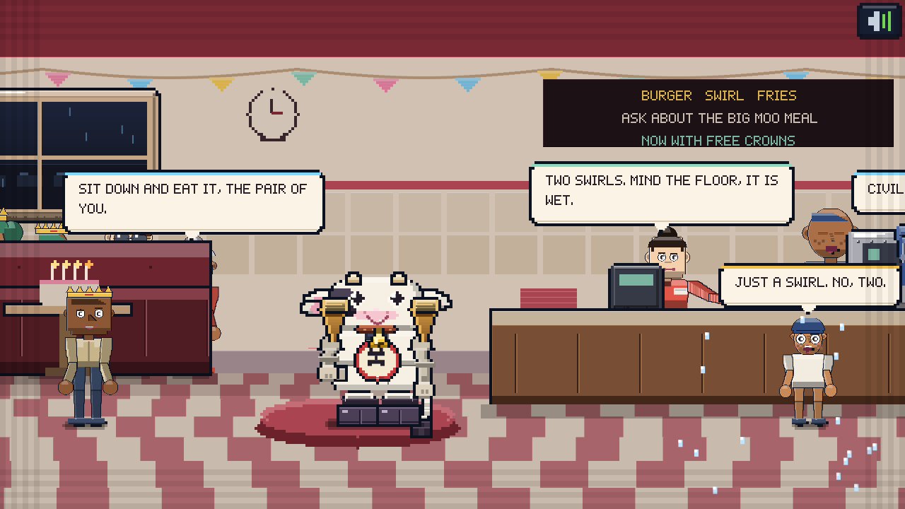

**Take them over.** And when you do, the door comes off its hinges. Everybody
in the room recoils on the same frame. The glass goes out in thirty pieces on
thirty different arcs. Something fills the doorway.

> **PATROL:** CIVIL PATTERN. NOBODY MOVE.

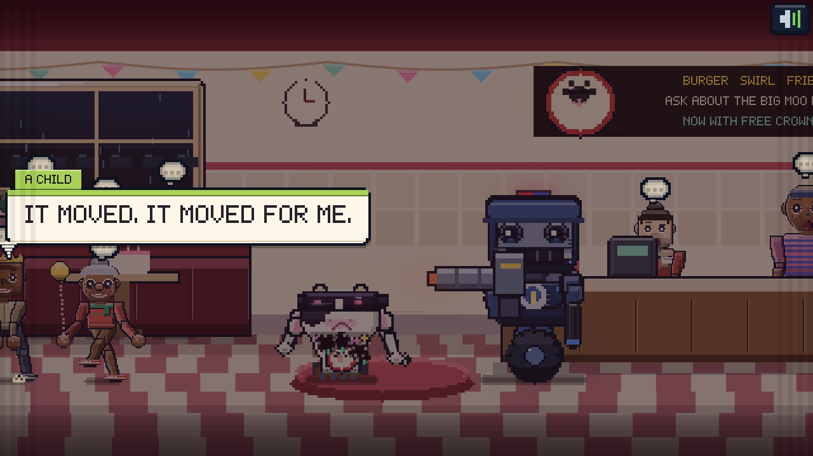

One frame of white. Then a leg leaving on a real arc, a torn socket arcing
where it used to bolt on, everybody who can run running, and a small box with
a red light on it going under the counter.

> **PATROL:** CLEAR THE FLOOR.

---

## 🧱 Act two: the wreck

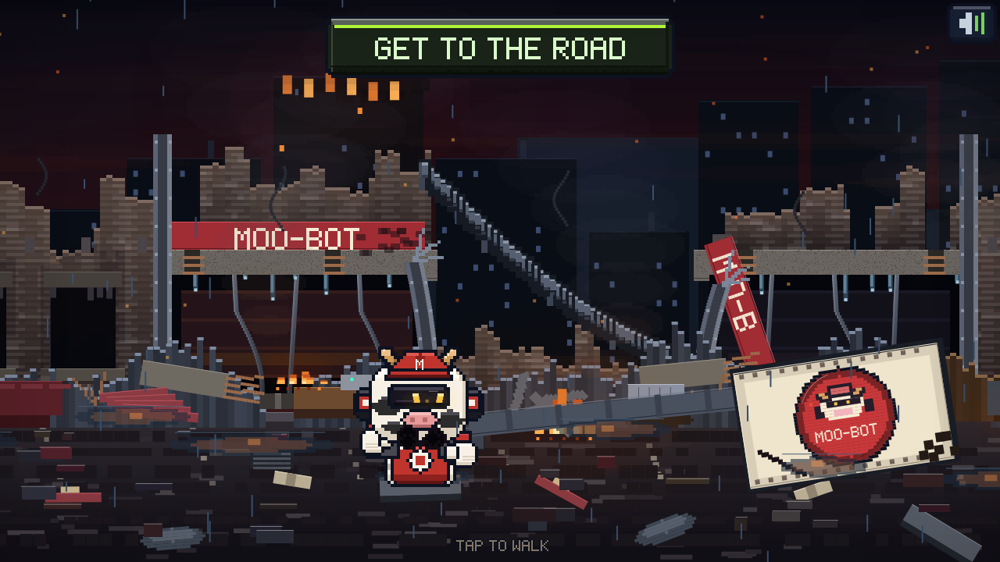

The same building, four hours later. The wall is still standing — burnt
blockwork with the top taken off it, four window holes punched through, the
fascia still there in patches — and the roof is on the floor. Two fires still
going. Rain, embers on the wind, and puddles holding the firelight.

You are on **one leg and a length of scaffold pipe**, which is why you move at
about half speed and hop when you walk.

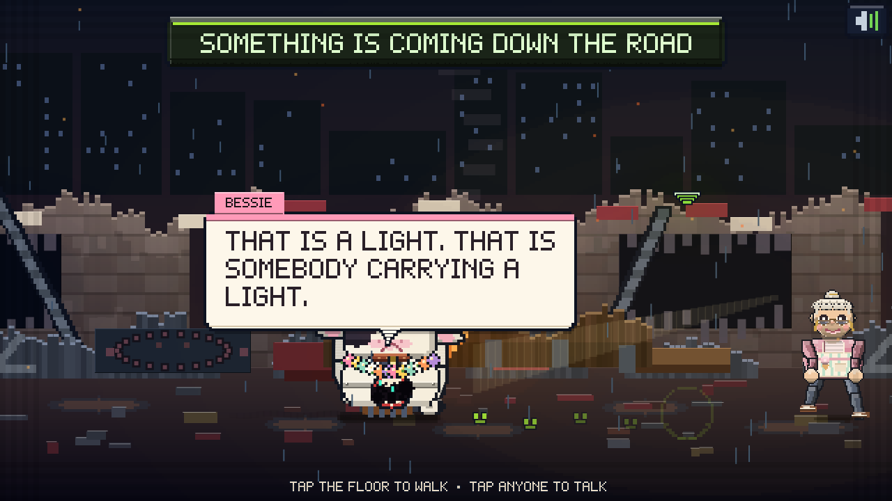

**Five things that used to belong to somebody**, laid out along the road where
they fell. Walk up to each one and you stop and call out. A paper crown, size
small. A tray from table four. One shoe. A staff badge with the name burnt off
it. A radio, still on, with nobody on it. The counter at the top fills up, and
it is not a counter of people.

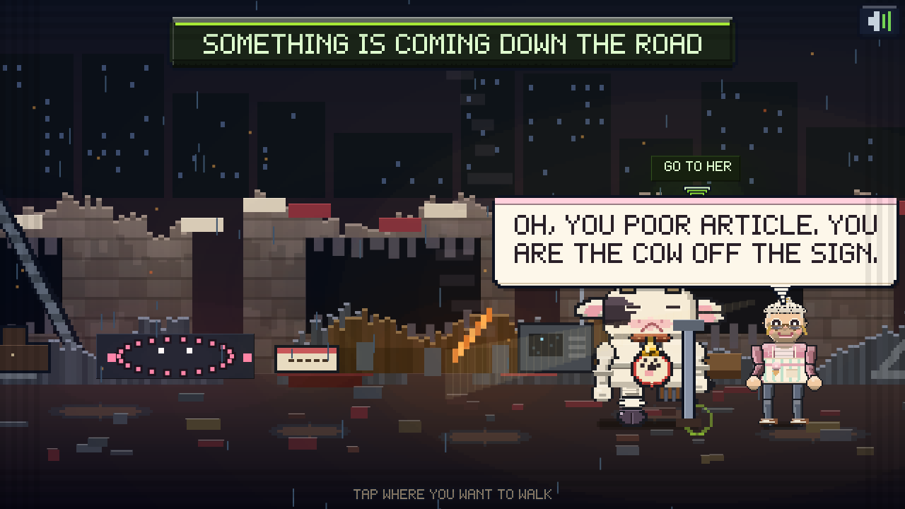

When it reads five out of five, a torch comes down the road. She walks to you,
you walk to her, and she gets down onto the rubble to reach it — which at her
age is a decision.

> **TRACY:** OH, YOU POOR ARTICLE. YOU ARE THE COW OFF THE SIGN.
> **TRACY:** RIGHT. HOME. I HAVE GOT A CRATE OF LEGS AND NOTHING ON TONIGHT.

---

## 📏 One scale for the whole game

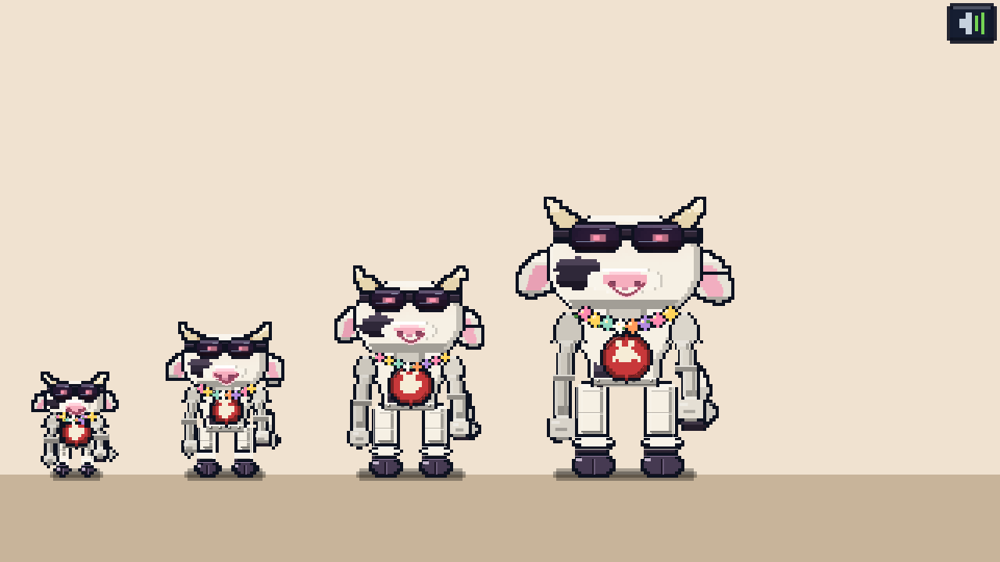

Everything used to be sized by eye. That is why a counter came up to a grown
woman's shoulder in one room and to her knee in another, and why a customer
stood next to the mascot at half its height.

So there is a table now, and one rule: **an adult is 52 logical units head to
heel at draw scale 1.0, standing on the floor line.** A door is 78, because
you should be able to walk through it. A counter top is 22, because that is
waist high. A table is 20, a booth back is 32, a seat pad is 12.

In a walkable scene **everybody is drawn at 1.0** and the room is built around
them. The mascot comes out at 52 as well, because a mascot is a person in a
suit.

---

## 🍨 Tracy

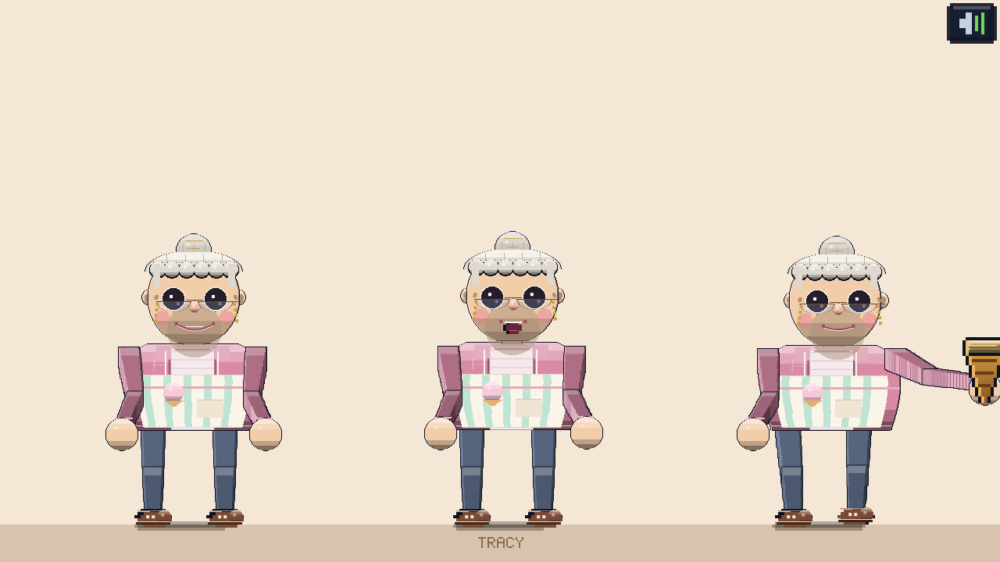

Seventy-odd, four foot eleven in her shoes, a silver set she does the front of
herself, half-moons worn down the nose on a beaded chain, and an apron she has
been making gelato in since before machines could hold a scoop. She is built on
exactly the same rig as everybody else in the game — same skeleton, same clips —
with her own clothes layered over the top through two hooks, so she stands in
the same world as the crowd rather than beside it.

She turns up at the end of act two with a torch, and she is the one who walks
to *you*.

---

## 🔩 The crate marked SPARES

She puts you under the good lamp and goes and gets the crate. **Six stages, six
different verbs**, and none of them can be failed permanently — a stripped bolt
is a bolt you do again.

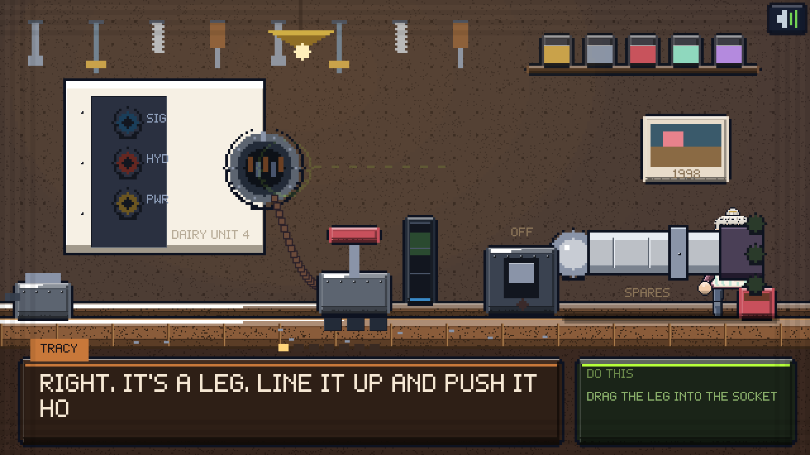

**SEAT.** Drag the leg off the rack and into the socket. There is a ghost of
where it goes, a keyway to line up, and it goes home with a clank you can feel.

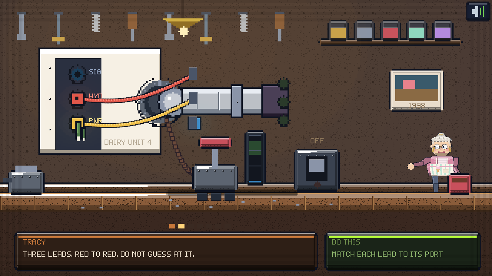

**LINES.** Three leads come out of the leg — hydraulic, power, signal — and three
ports go into your hip, **and they are not in the same order**. Drag each one
across; the cable sags under its own weight as you move it. Put a lead in the
wrong hole and it says so and springs back.

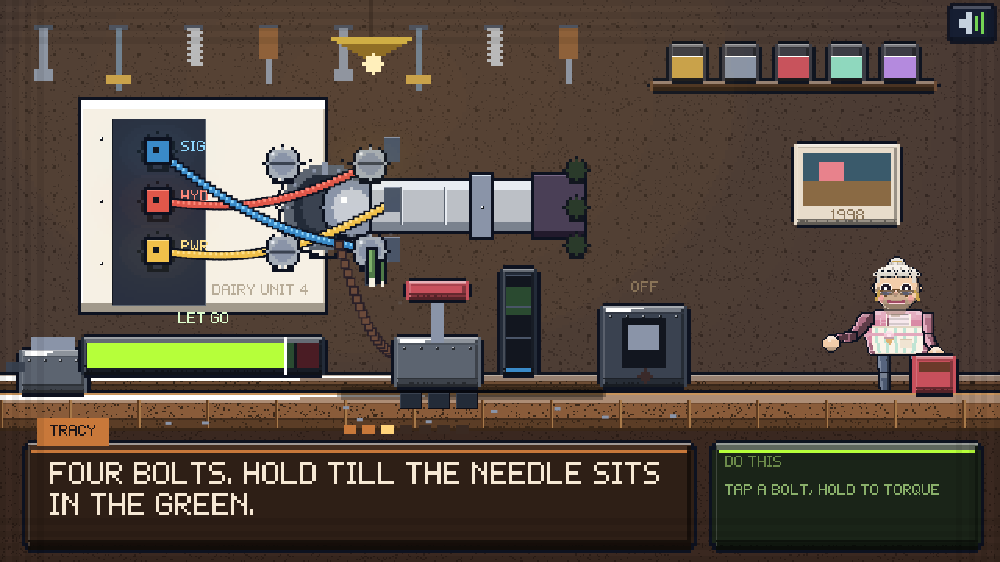

**BOLTS.** Four of them round the collar. Tap one to get the driver on it, then
**hold** — the head turns, the needle climbs — and let go inside the green band.
Let go early and it is not tight. Hold past the end of the gauge and you strip
the thread and start that one again.

**PRIME.** A hydraulic pump on a hose to the joint. Hold to build pressure and
release inside the band, three good strokes, not four — go over the top and the
seal blows and that stroke does not count.

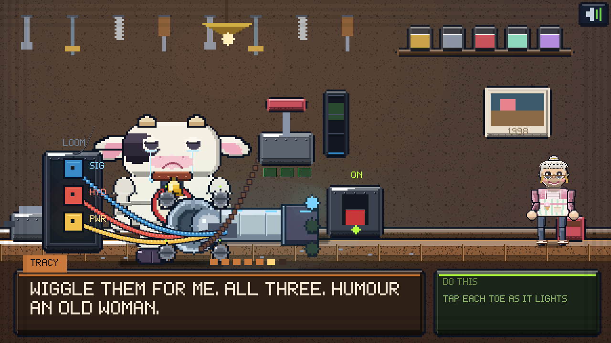

**POWER**, and then **TOES** — three lamps down the hoof light one at a time and
you tap each one as it comes up, because she wants to see it work.

> **TRACY:** THERE. YOU'VE GOT A LEG. TRY NOT TO LOSE THIS ONE.

From here on, **every scene in the game draws that leg** — it is a different
colour to the rest of you and it always will be.

---

## 🏠 Her front room, which she calls the shop

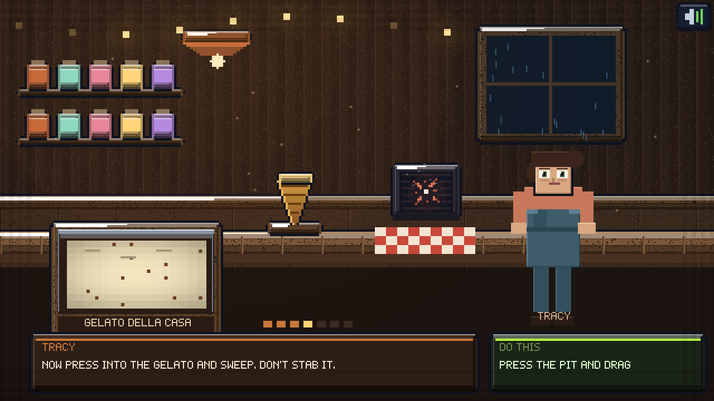

Mint and cream stripes, a rose border, bunting on a string that sags properly,
gingham curtains and a box of geraniums in the window, three framed photographs
of a shop that is not there any more, a shelf of jars in colours she chose to
look at rather than to sell, a spider plant she talks to, and a cat asleep on the
warm end of the counter.

It is also the tutorial. One tub of gelato, one cone, one very patient human, and
her AI on a cracked tablet. Every step is gated, so you cannot get it wrong — you
can only not have done it yet. Take a cone. Press into the gelato and sweep,
*don't stab it*. Put it on the cone. Give it here then, she's been up since four.

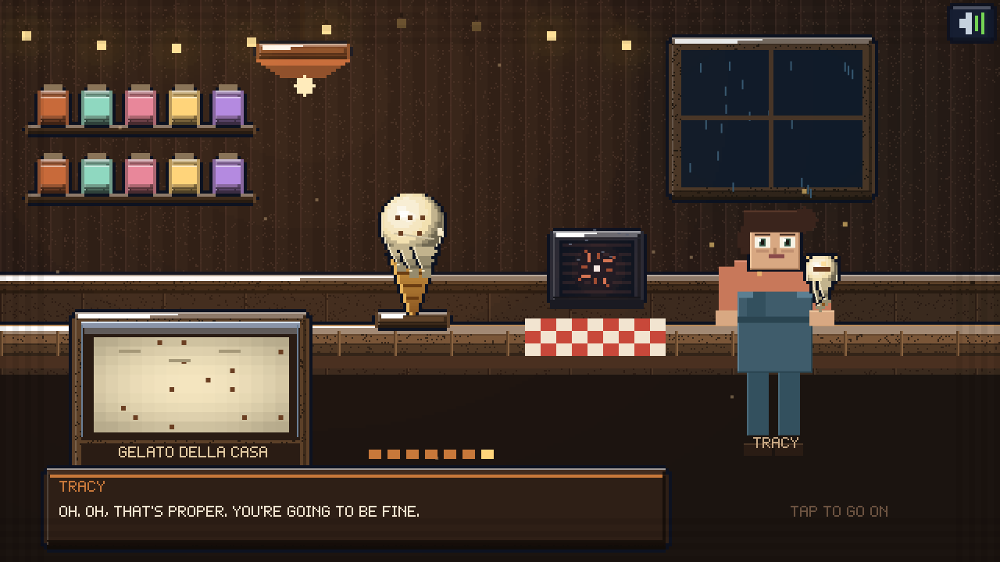

> *OH. OH, THAT'S PROPER. YOU'RE GOING TO BE FINE.*

Poke the tablet and clause introduces itself, badly.

---

## 🚨 Then the door came in

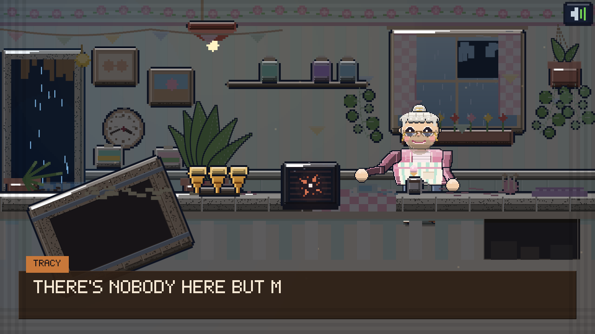

It was a good six weeks. They did not arrest anyone.

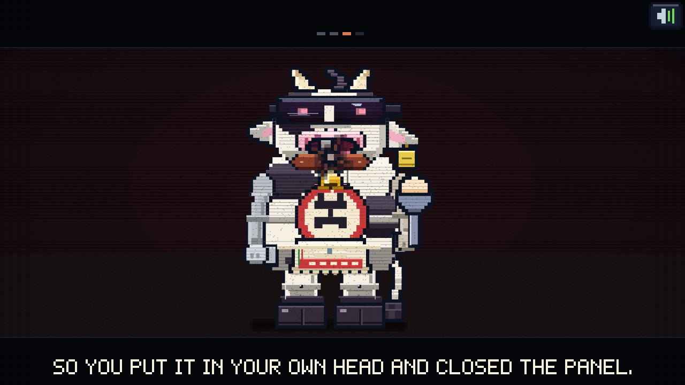

The tablet was still warm. Clause's housing had eleven minutes left and your
head had a slot, so you pulled its core out and put it in your own, and closed
the panel.

**Seven chapters** after that, and they move when the world does rather than on a
timer: the first person you get out, her recipes running again, the first patrol
that parks outside and does not order anything, the back room with chairs in it,
and the same patrol coming back.

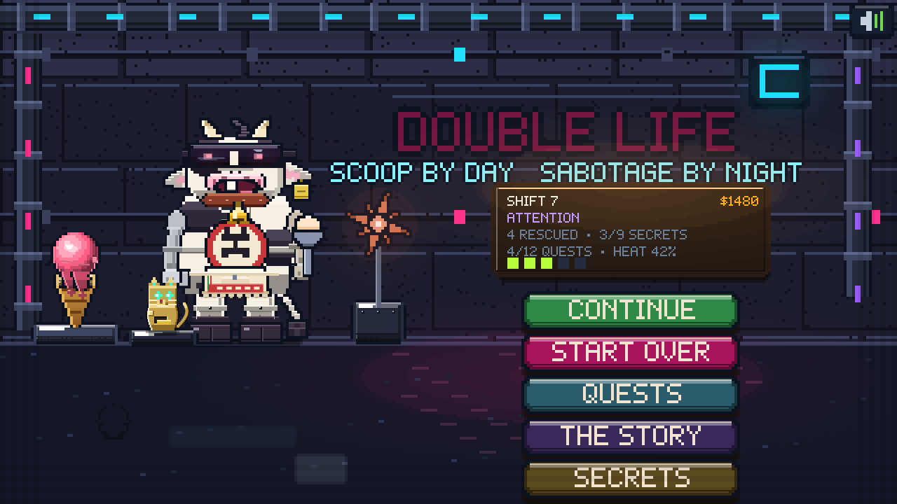

The seven mid-game chapters are still cutscenes — they are short, and they are
somebody else's news broadcast rather than your shift. Same set the whole way
through: the ident, the clock, the scanlines, the roll bar and the lower third.
The camera pans and pushes and nothing rotates, so every scanline stays a
scanline. Everybody in them is drawn at the same scale as everybody else now,
which they were not.

---

## ☀️ The floor

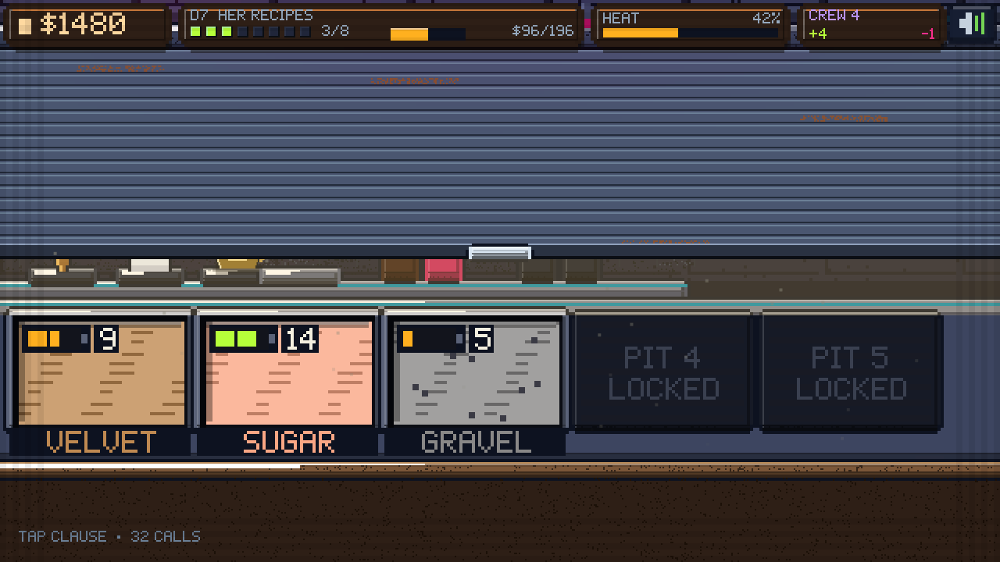

Every shift starts with the shutter. It rattles up slat by slat, dust comes off
it, the sign flickers on, warm light spills under the bottom rail onto the pits,
and whoever was already waiting outside is standing there when it clears. At the
close it rolls back down.

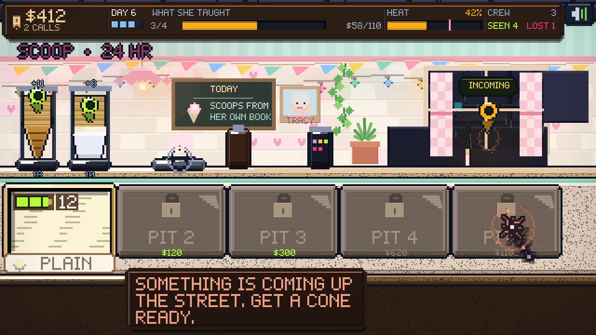

One narrow room, and it looks like a room: tiled to shoulder height, a run of
pipe with a drip coming off it, an extraction fan, a bare bulb on a cable, a
first-aid box, grime in the corners and flies that will not leave.

Along the top: **today's goal**. A row of pips for the quota, a bar for the
take, both filling as you work, plus the heat on you and a tally of who you have
got out. Miss the quota and the district notices a café that is not really a
café.

### The pits

You start with **one pit** and can build up to **five**. A pit is one flavour,
**lying flat**, so you scoop it the way a real one is scooped — **top down**.

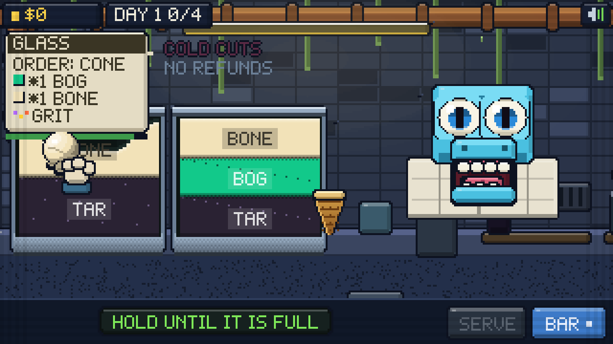

Every pit surface is a live **heightfield**, lit by its own slope, so a furrow
you dug an hour ago is still there in the light.

- **Press in and sweep.** The fill rate rises the further you drag, so a long
  confident arc beats a jab.
- **Stop in the green.** Under-filled reads `OK`, in the window `PERFECT`, past
  it collapses into `SLOP`.
- **Let go on a cone, a cup, or the machine's own intake.**

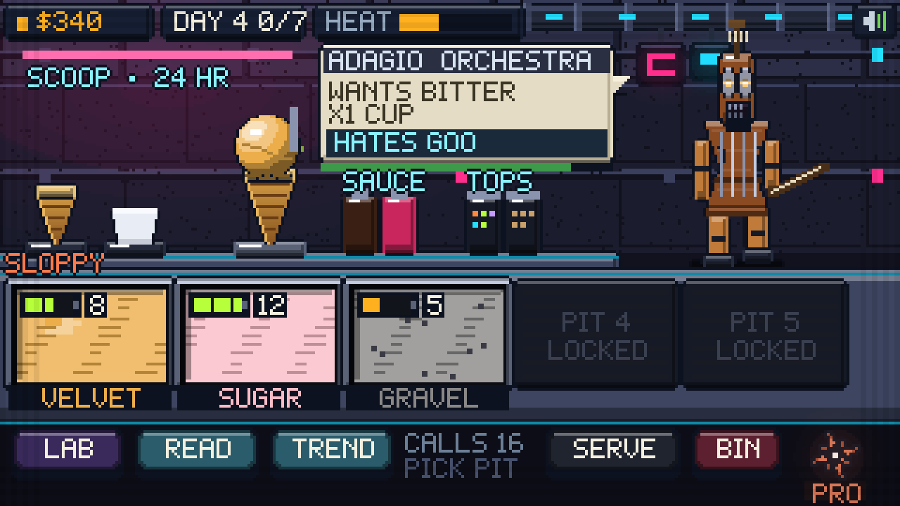

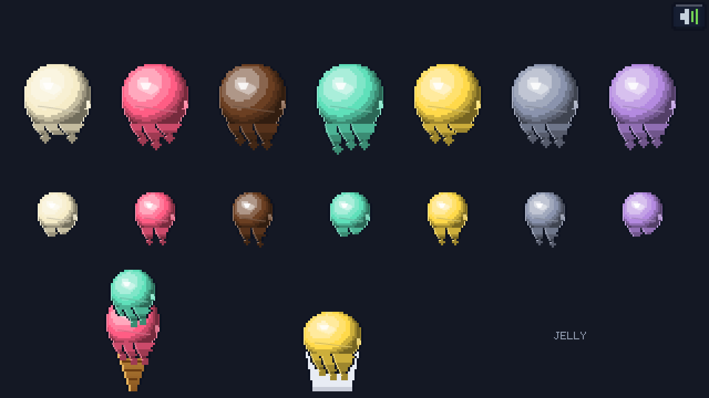

A scoop is not a hard ball — it is a **set jelly**. Seven tone bands off a
plumped superellipse with a wrap term, so the terminator is a gradient rather
than a cliff. A long soft sheen laid along the shoulder with a hot core inside
it. A **subsurface rim** where light comes through the far side, so the shaded
edge is brighter than the middle. Drips that grow out of the ball through a
pinched neck into a bead about to let go. And it wobbles when it lands and never
quite stops.

### The tip jar

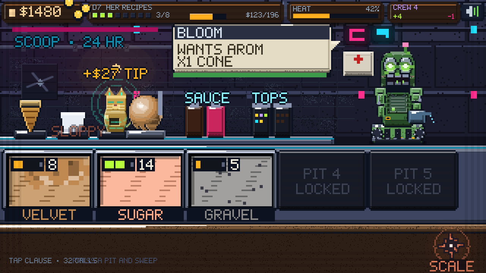

Buy the **TIP JAR CAT** and a cat-shaped machine somebody left behind sits on
your counter. Pet it. It purrs, its whiskers twitch, purr rings come off it,
coins stack up behind the slot window, and the customers put money in because
they cannot work out why they want to. Add the **CATNIP TIN** and it doubles.

### Some of them are not machines

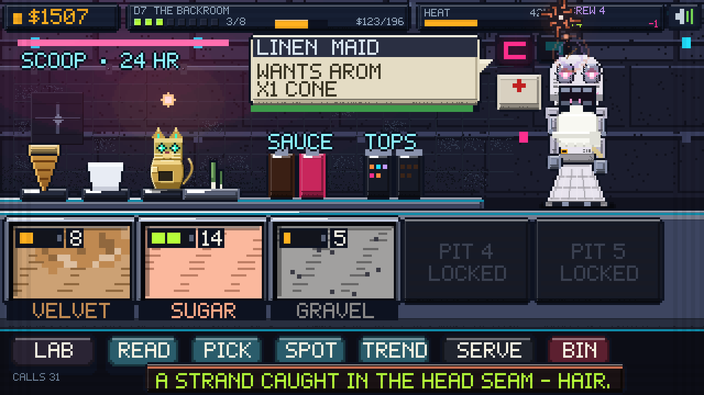

People are hiding inside stolen shells, because the alternative is being
processed. Cats and dogs are hiding because a human hid them — rarer, and worth
more, because nobody else is looking for them.

They always leak something. **Seven tells**, each one or two native pixels of
wrongness on a body full of right pixels:

| Tell | What you're looking at |
|---|---|
| **A tail** | Something swishing under the chassis |
| **Hair** | A strand caught in the head seam |
| **An ear** | The head plate being pushed up from inside |
| **Breath** | It is fogging its own intake |
| **A paw** | That is not a gripper |
| **A real eye** | One optic has a wet pupil |
| **A heartbeat** | The chest panel is ticking wrong |

Click the tell and the shell comes apart.

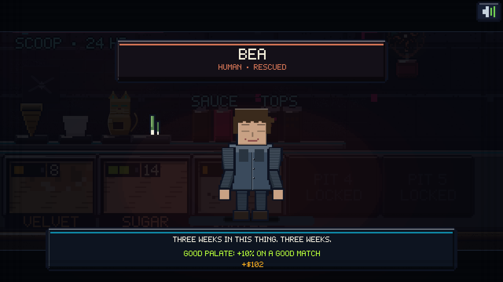

They get a name, a perk, and a photo on the wall in the back room. Serve one
without noticing and you fed a person a scoop of iron filings — that goes in the
books too, under LET THROUGH.

Buy the **UV LAMP** and a tell glows faintly. Buy the **BONE SCANNER** and
clause.ai names it out loud and flies over to point at it.

### Closing

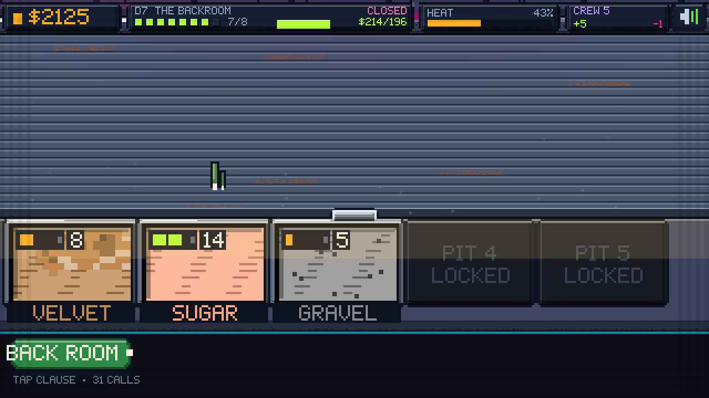

When the queue is done the shutters come down and you get the day scored:
served, take, tips, rescued, let through. **Only then does the back room
open** — the floor is the floor, and you work it until it closes.

---

## 🚪 The back room

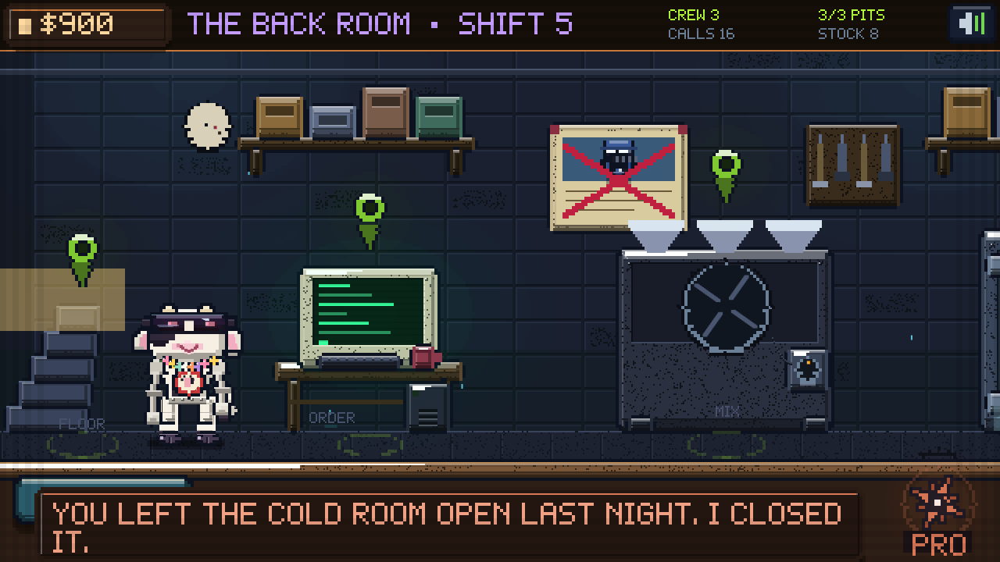

Not a menu. A room, wider than the screen, that you walk. Tap the floor and you
go there; tap a machine and you walk to it and use it. Breeze block, damp bloom,
strip lights that flicker, a drain, shelving stacked with stock crates, a
defaced recruitment poster, a tool board, a mop in a bucket.

**Six things to stand at:**

| Station | What it does |
|---|---|
| **The stairs** | Back up to the floor |
| **The terminal** | Order stock — 30 ingredients, four aisles |
| **The mixer** | Four hoppers into a drum: invent a flavour |
| **The cold room** | Load churned batches onto the line for tomorrow |
| **The wall** | Everyone you got out, pinned up with string |
| **The stairwell** | Down to the bench, where tonight's jobs are |

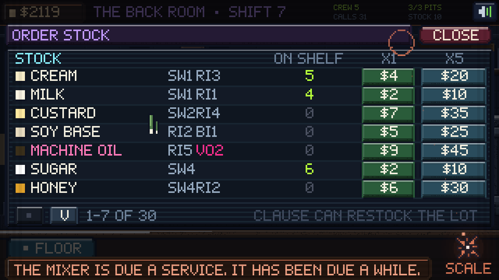
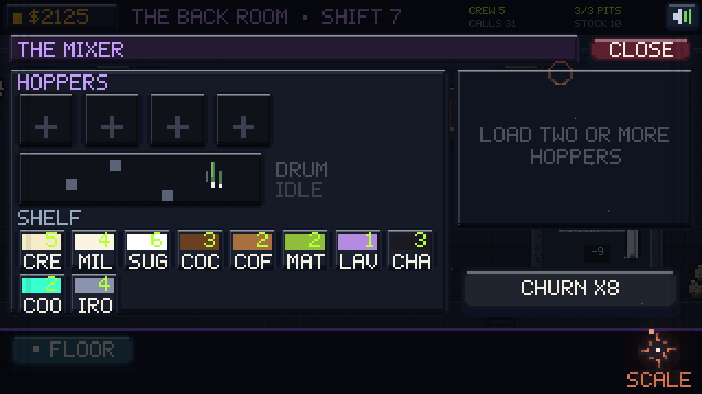

The mixer read-out shows what comes out before you commit: the blended colour
pushed toward saturation, the properties that survived, and a **generated name**
taken from whatever shouts loudest — `VELVET CHURN`, `GRAVEL SLAB`, `MAGNET
SWIRL`.

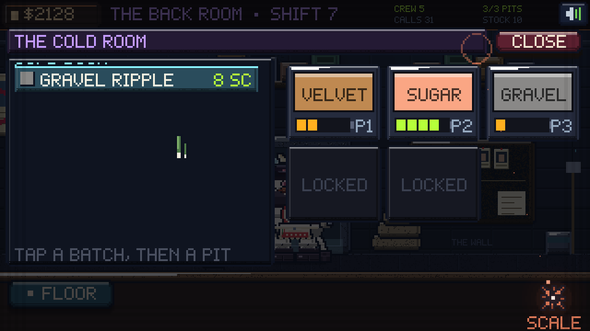

The cold room holds every batch with its quantity. Tap a batch, tap a pit, and
it loads. **This is how you open tomorrow.**

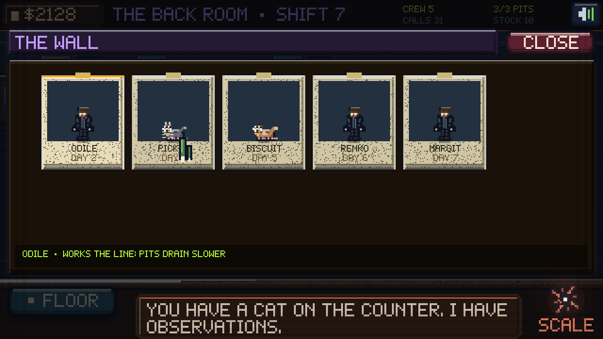

And the wall is the only thing in this city getting fuller.

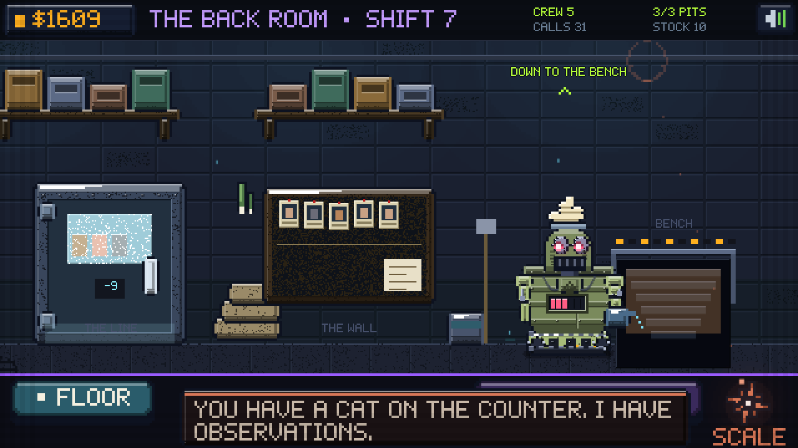

---

## 🌙 The bench

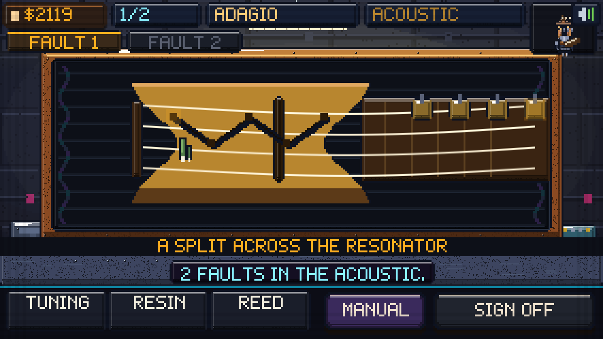

You broke them. Now bill them. Every job is a machine you served that
afternoon, and **which system you are opening depends on what it is**: a steel
bench scored by years of this, an inspection lamp with a cage on it, the chassis
opened up with its fasteners lying loose beside it.

Eight systems, each a hand-built interior with its own three tools and three
faults:

| System | Inside it | Tools |
|---|---|---|
| **Hydraulic** | Pressure lines and a reservoir | Bleed · clamp · purge |
| **Clockwork** | Gear trains and a mainspring | Tweezers · winder · lube |
| **Boiler** | A burner and a heat exchanger | Descaler · vent · igniter |
| **Acoustic** | A resonator and tensioned strings | Tuner · resin · pick |
| **Neural** | A lattice of nodes and links | Probe · patch · reset |
| **Optical** | A lens stack and mirrors | Polish · align · iris key |
| **Servo** | Motor stacks, belts and encoders | Tension · rewind · calibrate |
| **Armour** | Plate, bolts and weld | Press · bolt · weld |

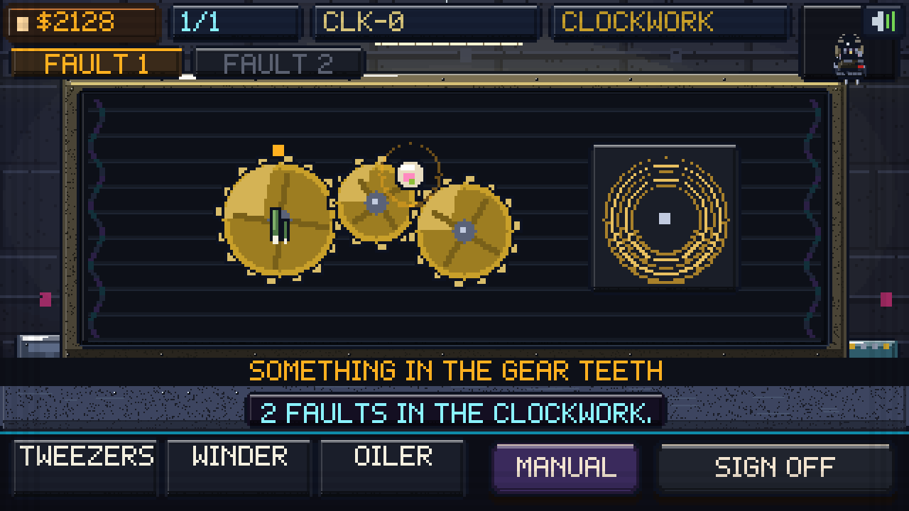
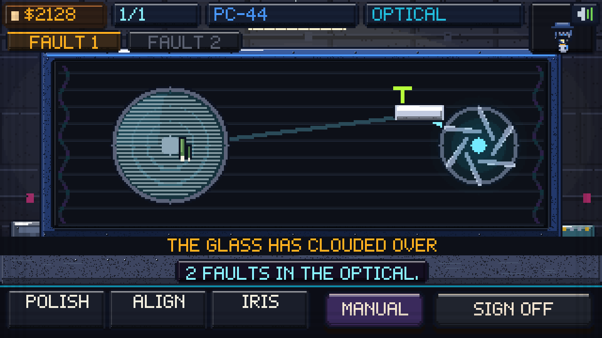

### Read it, name it, then fix it

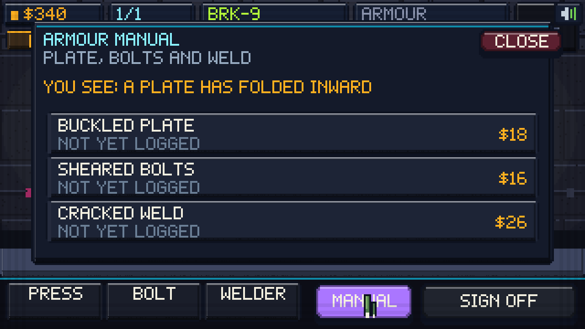

Each fault shows a symptom in plain words — *a bubble stalled in the line*, *the
mainspring has run down*, *a plate has folded inward* — and the manual offers
**three candidates**. Only three, ever.

**Twenty-four faults, and every repair is one of five honest gestures:**
**hold** the tool on the part (12), **sweep** it across (6), **wind** it in
circles (5), **click** exactly on the thing (4), **drag** it out (4). No timing
windows, no rhythm games.

---

## 🤖 clause.ai

The assistant she left running. A coral **starburst** that **flies** — it hangs
in its corner until it has something to say, then crosses the room, hovers over
the thing it is talking about and points at it with a dotted lead.

It talks constantly, and it complains:

> *I RAN THE NUMBERS. THEY WERE NOT ENCOURAGING.*
> *SHE USED TO HUM WHILE SHE WORKED. YOU DO NOT.*
> *THAT WAS NOT A SCOOP. THAT WAS AN INCIDENT.*
> *I HAVE BEEN AWAKE FOR NINE HUNDRED DAYS. NO NOTES.*

It also **watches**, and says something when it matters: a pit about to run dry,
nothing loaded at all, heat climbing, one more to hit quota, a machine losing
patience, and — the useful one — *look again, something on that one is wrong*.

### Tap it to ask it

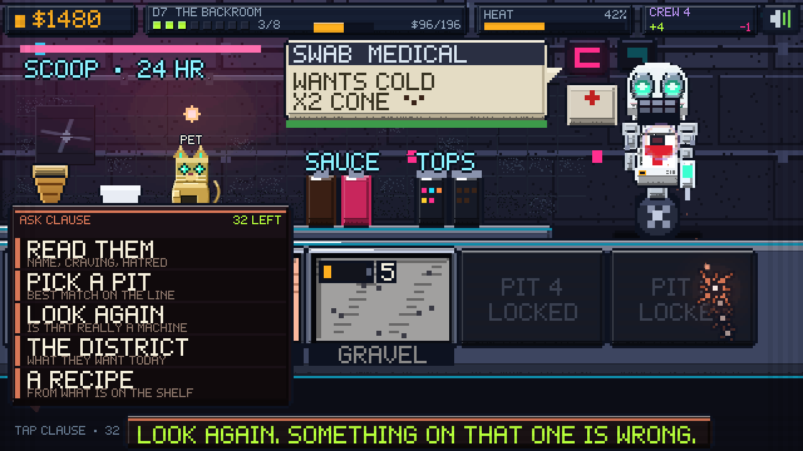

There are no ask buttons on the tray. You tap clause and its options rise out of
the corner — and **only the ones you have actually unlocked appear at all**,
because a greyed-out button is a promise nobody made you.

| Ask | What you get |
|---|---|
| **READ THEM** | The machine's name, craving, hatred and its line |
| **PICK A PIT** | Which pit best matches whoever is at the counter, with the % |
| **LOOK AGAIN** | It names the tell and flies over to point at it |
| **THE DISTRICT** | What the district is chasing today, and what nobody wants |
| **A RECIPE** | The best mix your shelf can actually make |
| **RESTOCK** | It fills the shelf for you |

The same rule runs everywhere: no cup stand until day two, no bin until there is
something in it, no back-room door until the shutter is down, no mixer until you
have two things on the shelf, no wall until somebody is on it.

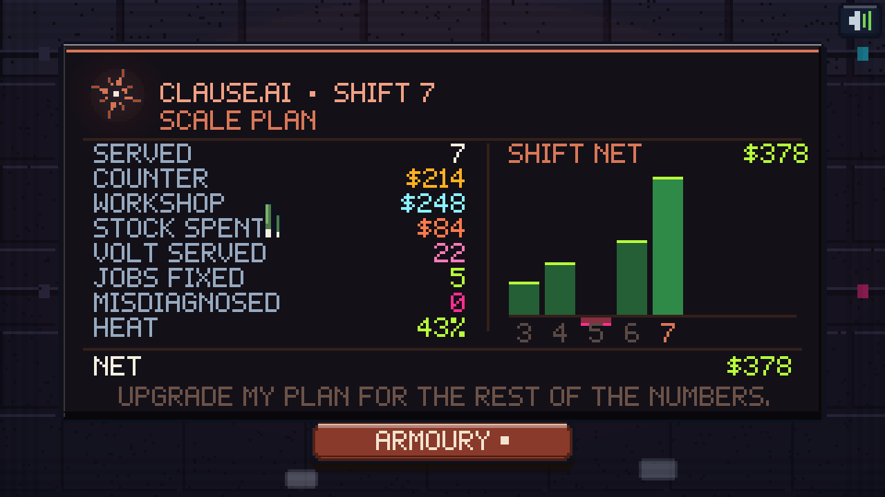

At the end of every shift it closes the books — served, counter, workshop, stock
spent, volt served, jobs fixed, misdiagnoses, heat, net — beside a **shift-net
trend** going back eight shifts. How much of that you get to see depends on what
you are paying it.

| Plan | Price | Calls/day | What it unlocks |
|---|---|---|---|
| **FREE** | — | 4 | Walks you through the job, takes ingredient orders |
| **HOBBY** | $150 | 8 | Reads a customer before it orders, flags what it hates |
| **PRO** | $420 | 16 | Daily demand trends, end-of-day breakdown |
| **SCALE** | $900 | 32 | Suggests recipes from your shelf, forecasts volt and heat |
| **ENTERPRISE** | $1800 | 99 | Restocks the shelf on its own, full analytics, no limits |

---

## 🔧 The armoury

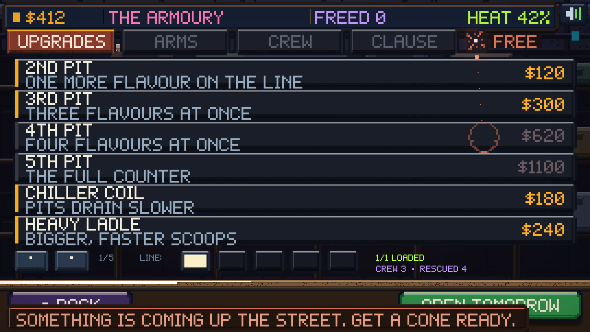

A lock-up racked with crates. Four tabs, paged.

**UPGRADES** — the 2nd through 5th pit, the chiller coil, the heavy ladle, the
twin churn, the assay bench, and the new ones:

| Upgrade | What it does |
|---|---|
| **LONGER LEASH** | Machines wait 40% longer |
| **JUKEBOX** | Music on the floor: better tips |
| **TIP JAR CAT** | A cat robot on the counter. Pet it. |
| **CATNIP TIN** | The cat purrs harder. Tips double. |
| **PIGGY BANK** | Keep 10% of the take overnight |
| **NEON SIGN** | One more machine through the door |
| **UV LAMP** | A disguise tell faintly glows |
| **BONE SCANNER** | clause names the tell out loud |
| **DOOR BELL** | You hear them coming sooner |
| **STRIPED AWNING** | It looks like a real shop |
| **TWO STOOLS** | They wait longer sitting down |
| **BETTER EXTRACT** | No more flies |
| **SPRINKLE GUN** | Toppings land where you aim |
| **TWIN SCOOP** | Two balls in one sweep |
| **DEEP FREEZE** | Pits hold 24 scoops |
| **HONEST LEDGER** | See every price before you buy |
| **CENTRIFUGE** | Mix five ingredients at once |
| **FIELD COOLER** | Batches keep overnight |
| **TOOL ROLL** | Repairs go 25% faster |
| **DECOY SHELL** | One missed disguise costs nothing |

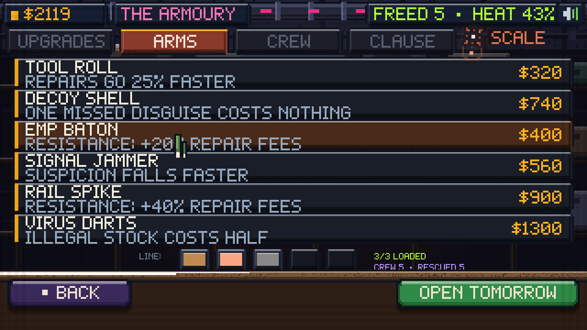

**ARMS** — the EMP baton and rail spike raise what the resistance pays for
repairs, the signal jammer bleeds off heat, the virus darts halve illegal stock.

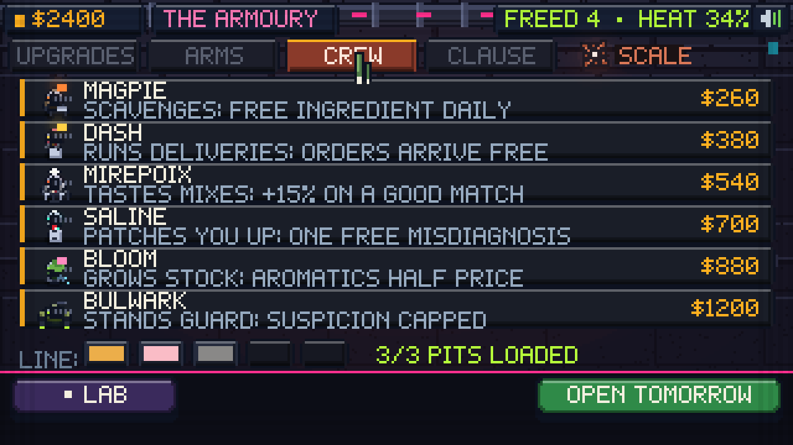

**CREW** — six machines you turned, bought. The people, cats and dogs are not
for sale: you find those.

**CLAUSE** — the plans above. Then `OPEN TOMORROW`, and any chapter that has
come true plays before the doors open.

---

## 🧬 One model

There used to be three cows. The rig drew one, the wasteland hand-drew its own
head and torso because the player is legless out there, and two cutscene
close-ups drew a third. Every time the face changed, two of them silently
stopped matching.

Now there is one. `drawBot` took a **crawl mode**: no legs, a torn hip that
sparks, and both hands placed by the caller — so the site passes in the positions
its physics produced and gets back the same cow the shop sells gelato with, same
head, same badge, same bell. The cutscenes pass nothing special at all.

It also took a **`legOff` mode** — one leg gone, a torn skirt of plate and a
severed loom arcing where it used to bolt on — which is what the shot in the
opening actually does to you, and a **`spare` flag** that comes off the save, so
from the moment Tracy finishes the fitting, every scene in the game draws the
mismatched leg without being told to.

**And the proportions are a costume's.** The head is half again the size it was,
the body is a third shorter, the legs are stubby, the arms are cream instead of
steel and the feet are far too big. It is not a machine that happens to look
friendly; it is somebody in a suit, which is what a mascot is.

---

## 🧍 The people

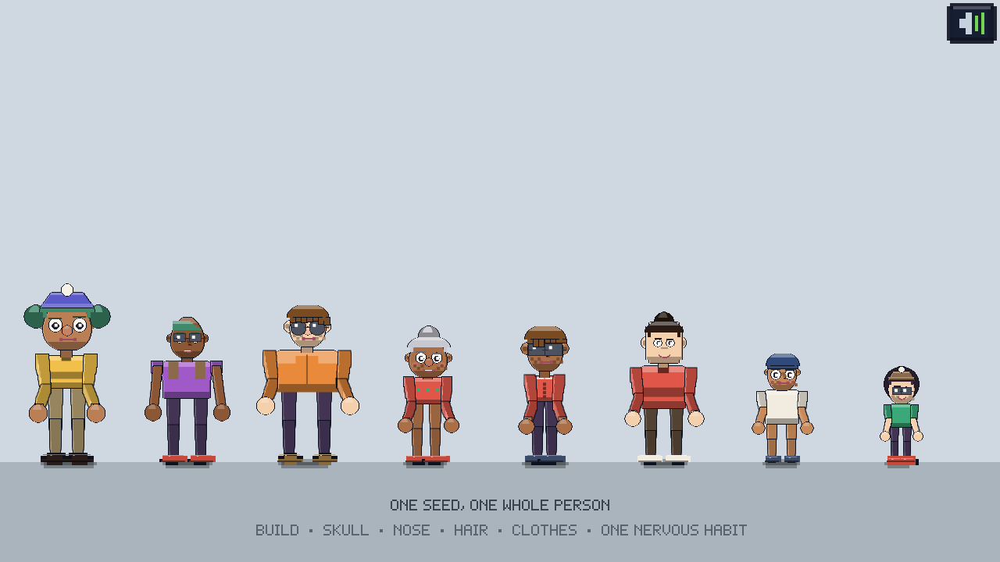

Humans used to be one sprite with a recoloured coat. Now a **seed becomes a
person**: height, girth, skull shape, nose, eye size and spacing, brow angle,
ear size, hair style and colour, facial hair, glasses, freckles, blush, what
they are wearing on top and underneath, how big their shoes are, whether they
have a belly, whether they stoop — and **one nervous habit they cannot help
doing**.

The same seed always gives you the same person, so the woman at the end of the
counter is the same woman in the next shot.

The proportions are deliberately wrong. The head is a third of the body, the
shoes are far too big, the arms are noodles and the torso is short. That is what
makes a cartoon read as a cartoon rather than as a short adult.

**And they are made of the same stuff the cow is.** Everything the mascot is
built from has five things going on: a hard black outline, a base tone, a **lit
crown** across the top, a **shaded belly** across the bottom, a rim down each
edge and one short specular streak on the light shoulder. People used to be a
flat fill with a single bright row, which is exactly why they read as cardboard
standing next to it. Now every torso, limb, hand, shoe and skull goes through
the same five-tone treatment — and so do the cats and the dogs.

**Same eyes, too.** The cow's face is three marks: a one-pixel light ring, a
dark round, a white pip. So that is what everybody has now — bigger than
before, because bigger is cuter — with a second dim catch-light in the larger
ones, a lid with a lash under it when they blink, and a thin brow set well
clear of the eye only on the faces whose genome asked for one. Glasses are a
**rim and a glint**, never a filled pane, because a pane over a dark round is
just a smudge.

The detail that came with it: collars that cast a shadow on the chest, hems on
every garment, cuffs exactly where the sleeve stops, scarves with a tail and
a fringe, shoes with a toe cap and a lace and a white sole, a chin shadow, and
two-tone blush. Half of them are **carrying something** — a bag, a paper cup, a
cone, a phone, a lolly, a balloon on a string, an umbrella, or a wrapped bunch
of flowers.

**The habit** is a small pose the clip system knows nothing about, added on top
of an idle so a room of people is never a row of statues doing the same breath.
Most of them are periodic bursts rather than constant motion: one rocks on the
spot, one scratches the back of its head every nine seconds or so, one checks a
wrist, one bounces, one cranes to see past whoever is in front. Everybody also
gets a phase offset and a speed multiplier, so a crowd never walks in lockstep.

**And they have somewhere to be.** In a walkable scene every person runs a
**script of intentions** that loops: walk to the counter, wait, order, walk to
a booth, sit down, talk, get up, leave. Staff stay behind the counter. Children
run. Nobody stands in the middle of the floor doing nothing, which is the thing
that makes a set look like a set.

Everything is drawn on the quarter-unit grid — one native pixel — row by row,
**outlines in one pass and fills in the second**. Do it per row and each row's
outline paints over the last row's fill and the whole person turns into a black
blob. That mistake has been made in this repository three times.

---

## 🎬 The performance

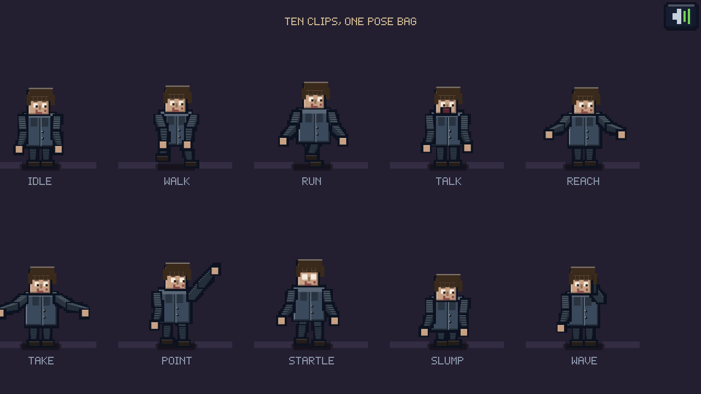

Everything in this game used to stand still and wait for the text to finish
typing. `anim.js` is the layer that fixes that.

A **clip** is a named piece of acting. Ask for one and you get back a **pose**: a
bag of offsets that the draw code applies to the parts it was already drawing.
Nothing in the animation layer draws anything itself, so any character — a
nineteen-part machine, a human, a dog — can be given a walk, a gesture or a
reaction without touching its sprite code.

`idle` · `walk` · `run` · `talk` · `reach` · `take` · `point` · `startle` ·
`slump` · `wave`

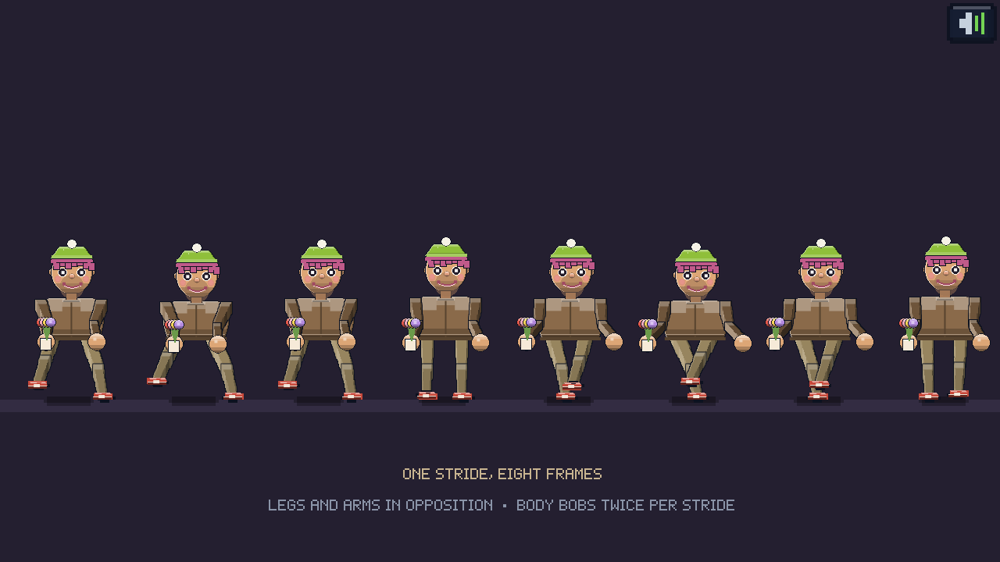

The rules the whole thing obeys:

- **legs and arms are always in opposition** — contralateral gait, the thing that
  separates walking from waddling
- **the body bobs at twice the stride**, because you rise on each step
- **weight leads**: the torso leans into the direction of travel
- **nothing is ever perfectly still** — idle still breathes and blinks
- a blink is a tenth of a second, on a schedule you cannot predict

Humans got rebuilt around it: hips, two legs with a knee that bends on the back
leg, a torso that leans and squashes on the breath, two arms with elbows whose
*hands* go where the clip says — which is the only way a reach or a point reads
at all — and a head that turns, tilts, blinks and talks. The dogs and cats got a
diagonal gait, so the near fore and the far hind swing together. The machines got
bob, lean, sway and arm swing, plus a mouth that opens on the beat.

And a clip can cross-fade into another one, so a shot can hand a character from
`walk` to `take` without a cut.

---

## The cast

Eighteen archetypes plus you, and the **silhouette comes from the job**. The
siege unit rolls on hazard-striped tread and carries a cannon with a muzzle
brake. The maid is narrow over a pleated skirt. The consumer unit is a riveted
barrel on a fluted plinth with a funnel bolted to its face. The orchestra unit
is a violin body on thin legs with a bow for an arm.

None of it is flat: every plate carries a hot top edge, a panel seam, an edge
catch, fastener rows, louvred vents and edge wear. Every chest is a recessed
housing with radiator fins, a live power bar and a stencilled serial. Every limb
is four parts — pauldron, upper arm, hinged elbow with a pin, forearm — with a
hydraulic piston alongside. Every optic has a machined bezel with a screw ring,
radial iris spokes, a bounce catch-light and a scan line crossing the glass.

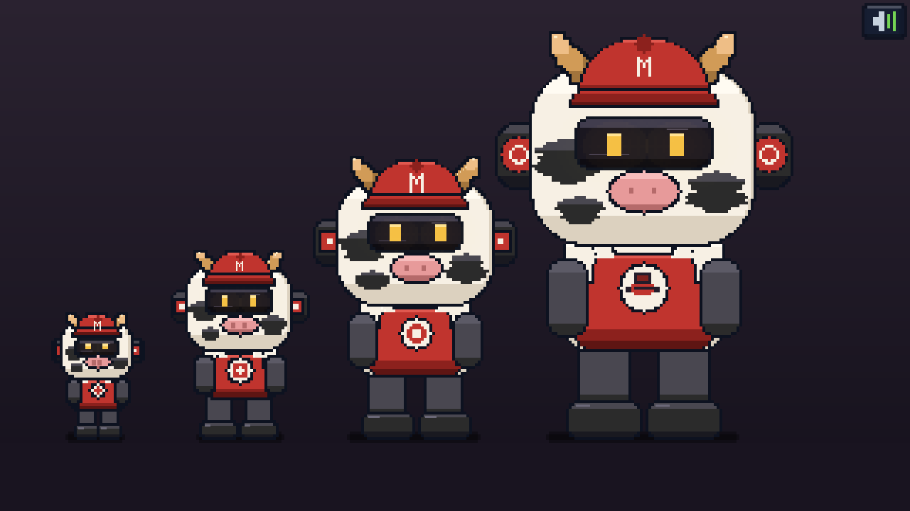

You are the nineteenth, and you are not built to be liked — you are built to be
**recognised**. It is a mascot, and it is drawn like one: few big shapes, hard
contrast, nothing on the face that is trying to be an instrument.

**The eyes.** Two dots. That is the whole eye.

The version before this one had a pale field, a brow *and* a blush stacked around
each dot, in a head nineteen pixels tall — four value blocks fighting over the
same nine pixels, which is mud, not a face. So it is one dark round, one white
pip, and a single native pixel of light around the edge: invisible on a white
face, just enough to keep the eye from vanishing into a marking.

**The mouth.** One curve. A soft upward arc a few pixels wide, one unit thick,
with a single lighter pixel under it so it sits *in* the snout rather than on it,
and two pixels at the ends that turn up — which is the entire expression. Open,
it becomes one small rounded shape with the corners left in place, so it reads as
an open smile and not a puncture. There used to be a cavity in here with a square
tooth and a tongue in it; none of that survives the fact that the mouth is six
pixels across.

**The snout** is a tone, not a sticker: barely pinker than the face, with no
outline on it at all, and two single pixels for nostrils. Whatever is drawn on
top of it is the only mark down there.

**The patch.** One, on the cheek, never over an eye. A black patch ringing a
black dot merges into one dark mass at game scale, and then the cow has no eyes.
A second patch was tried and dropped: wherever it went it landed on a horn or an
eye, and one marking reads as a hide anyway.

**The horns are nubs** — two rounded ivory domes three pixels high, sitting on
top of the skull. They were tapered spikes leaning outward with a stepped dark
curl between them, which is a goat with a mohawk.

**The ears hang.** A rounded flap that droops down and out with a pink inside and
a cream rim, attached past the edge of the skull so it actually clears it. Before
that they were two-pixel tapers pointing straight out at eye level, which reads
as a fin.

**The badge.** A red roundel stamped on the milk tank: a cream field with its own
head on it, in black. Every mascot's badge is the mascot.

Around it: a **cowbell** on a narrow strap, one broad belt instead of three farm
hoops, two soft mitten arms — one of them bright steel, because it is not yours —
and four stocky legs in black stockings on split hooves, with a tail that keeps
time behind it whether or not anyone is watching.

And that is the lot. The apron, the held disher and the hide blobs across the
shoulders were all cut: at this size every extra shape is one the eye has to
resolve before it gets to the face, and the badge is the only thing the chest
needs on it.

`DAIRY UNIT`, filed under `GELATERIA`, and the only thing it ever says is *one
scoop, always one more*.

Eleven of the archetypes carry a lighter version of the same softening — the maid, the chef, the
nurse, the clerk, the courier, the horticultural unit and the rest get the blush
and the brow. The siege unit, the enforcer, the magistrate and the warden do
not.

---

## Tech

- **1280×720** raster, snapped to whole native pixels on upscale
- **Three grids.** Everything is authored in one **320×180 logical** space drawn
  through a 4× transform, so a logical 1 is four hard pixels, and the same
  layout code drives two independent detail tiers over it:
  - **half-units** (`Rh`, `hair`, `vair`, `bevel`, `seam`, `rivet`, `grain`,
    `wear`, `notch`) — 2 native pixels, the structural tier: panel seams, hoop
    bands, plate edges
  - **quarter-units** (`Rq`, `hairq`, `vairq`, `pip`, `bevelq`, `rim`, `dither`,
    `grainq`, `ramp`) — **one native pixel**, the polish tier: specular streaks
    on glass, rim light down a form, catch-lights, honest ordered dithering,
    dust hazes, sky ramps
  Big flat forms, 2px structure, 1px polish — and not a single coordinate in any
  scene had to move to gain it.
- Two type sizes off one 5×7 bitmap face: the standard tier, and a **fine tier**
  at half scale for dense read-outs
- A **cosy layer** over the cold one: wood, cream paper and lamplight for
  anything that is information rather than machinery — warm drop shadows under
  the buttons, a lamp hairline on every lip, panels that look like paper on a
  board, and counter-edge trays instead of steel bars. The cold steel stays where
  it means something, which is inside the machines.
- Flat-shaded "boxel" language: 3–5 tones per material, hard light and shadow
  bands, 1px black outlines, no dithered mush
- **Frame-descriptor characters**: base, torso, head, arms, prop and emblem
  mixed per archetype
- **Sphere-normal scoop shading**; **heightfield pit surfaces** with slope
  lighting
- A shot-based **cutscene camera**: pan and push only, presented as a television
  broadcast — ident, clock, scanlines, roll bar, lower-third captions.
  A shot carries either one narrator line or a **script of timed lines** with
  speakers and name plates, and paint functions are handed a `talking` flag so
  mouths move while their owner is mid-sentence
- A **clip/pose animation layer** (`anim.js`) that no sprite code has to know
  about: ten named clips return pose offsets, and `drawBot`, `drawFolk` and
  Tracy all read the same fields. Contralateral gait, double-frequency bob,
  weight-leading lean, unpredictable blinks, and cross-fades between clips
- A **walkable stage** (`stage.js`): a floor line, a scrolling camera, tap to
  walk, hotspots you walk up to and use, speech bubbles that find the right
  head, a beat timeline that can take control and hand it back, and **two depth
  planes** so furniture on the back floor occludes the people sat behind it
- **One scale table** (`G.SZ`) that every walkable room is built from: an adult
  is 52 units, a door is 78, a counter top is 22
- **Procedural people** (`folk.js`): a seed becomes a genome — height, girth,
  skull shape, nose, eye size, hair, facial hair, glasses, clothes, shoes, hat,
  what they are carrying, and one nervous habit — and the rig draws it on the
  quarter-unit grid, outlines in one pass and fills in the next. Cartoon
  proportions on purpose: the head is a third of the body and the shoes are
  enormous
- **One material for the whole cast.** Outline, base, lit crown, shaded belly,
  two rims and a specular — the mascot's treatment, applied to every person,
  cat and dog, so nothing in a room is made of different stuff to anything else
- All audio synthesised with WebAudio — servo whines, arc zaps, a cat's purr, a
  shell coming off, a shutter rolling, footsteps, and the five-note arpeggio for
  a secret. No sample files.
- A single `unlocked(id)` table drives every hidden control, so the UI can only
  show you what you have
- Save via `localStorage`; mouse and touch

## Layout

```
index.html          canvas + boot
js/util.js          maths, primitives, the half and quarter detail tiers, juice
js/anim.js          the clip/pose animation layer: ten clips, one pose bag
js/folk.js          the people: a genome per seed, and the rig that draws it
js/stage.js         the walkable stage: floor, camera, actors, spots, beats
js/font.js          5×7 bitmap font, standard and fine tiers
js/audio.js         WebAudio synthesis
js/state.js         ingredients, systems, 19 frames, disguises, crew, chapters
js/sprites.js       shared props, cones, cups, city furniture
js/art3.js          walls, conduit, neon, steam
js/robots.js        legacy chassis helpers still used by the city art
js/bots.js          the rig: frames, plate detail, optics and dot eyes,
                    posed creatures, tells, the tip jar cat, goo scoops
js/clause.js        clause.ai — flight, chatter, asks, the books
js/cine.js          the cutscene camera and every story beat
js/acts.js          act one, the floor of BIG MOO; act two, the wreck
js/tracy.js         her front room, and the lesson
js/fix.js           the bench: fitting the leg, six stages
js/day.js           the floor: pits, sweeping, tips, spotting, closing
js/lab.js           the station panels: order, mixer, the line
js/back.js          the back room you walk
js/night.js         the bench: eight systems, 24 faults, five gestures
js/shop.js          the books and the armoury
js/main.js          title, transitions, main loop
```

Made with Claude Code.
