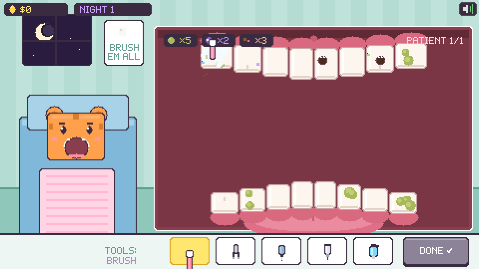
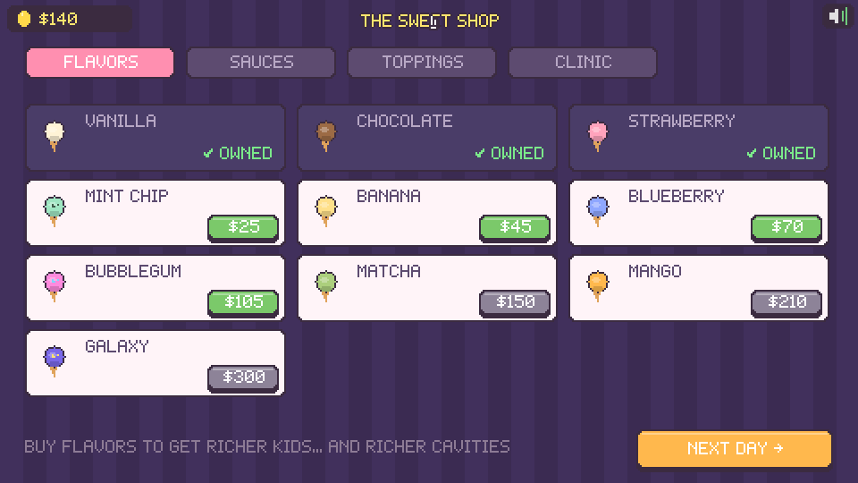

# 🍦 DOUBLE LIFE 🦷

**Scoop by day. Drill by night.**

A cute pixel-art 2.5D simulator game about a very sound business model:
by day you run an adorable ice cream parlor and serve *super sweet* treats
to little animal kids… and by night you're **Dr. Molar**, the town dentist,
fixing the exact cavities you caused. For money. Business is booming!

## ▶️ How to play

No build, no dependencies — plain HTML5 canvas + vanilla JS.

- **Just open `index.html` in a browser** (double-click it), or
- serve the folder: `npx serve .` / `python3 -m http.server` and open the URL.

Works with mouse or touch. Progress auto-saves in your browser.

## ☀️ Day — the ice cream parlor

Animal customers (turtle, tiger, snake, puppy, kitty, bunny, froggy, panda)
walk up and show their order in a speech bubble. Make it:

1. **Tap a cone or cup** to start a base.
2. **Hold a tub to scoop** — the ball grows in your scooper — then
   **drag it onto the cone** and release. *Plop.* Stack up to 3.
3. **Grab a sauce bottle** and drizzle: every droplet is simulated —
   it lands, sticks, slides down the scoops and drips off the cone.
4. **Grab a topping jar and shake it** — sprinkles, cookie bits & friends
   tumble, bounce and stick where they land.
5. Press **SERVE**. Perfect orders pay tips. Extra sugar makes kids extra
   happy… and grows tonight's cavity forecast (🦷× in the HUD).

Wrong scoops? Dump them in the trash. Drop a scoop on the counter and it
*splats* (you monster).

## 🌙 Night — Dr. Molar's clinic

The same kids you served today arrive with problems proportional to the
sugar you sold them. Full-mouth view, 16 teeth, five tools:

| Tool | Use |
|------|-----|
| 🪥 **Brush** | Scrub the green plaque off, pixel by pixel |
| 🥢 **Tweezers** | Grab stuck sprinkles & cookie bits and *pull* until they pop |
| 🛠️ **Drill** | Hold on a cavity germ until it's gone (they panic, it's great) |
| 💉 **Filler** | Fill the drilled hole with shiny silver |
| 💦 **Spray** | Rinse away the foam for a SPARKLING bonus |

Every fixed tooth pays instantly. Finish the patient with **DONE** and the
next one slides into the chair.

## 🛍️ The shop

Between days, spend your (double) income mobile-game style:

- **7 unlockable flavors** — mint chip, banana, blueberry, bubblegum,
  matcha, mango, galaxy
- **3 extra sauces** — berry, caramel, honey
- **4 extra toppings** — cookie bits, choco chips, gummy bears, marshmallow
- **4 clinic upgrades** — gold scoop, mega brush, turbo drill, comfy chair

More flavors → sweeter orders → more cavities → richer nights. The loop.

## 🔧 Tech notes

- 480×270 canvas, nearest-neighbor upscaled; every shape is drawn from
  scanline rects so pixels stay crisp — no image assets at all
- Procedural pixel sprites (all 8 animals + faces are drawn in code)
- Custom 5×7 bitmap pixel font
- All audio synthesized live with WebAudio (sfx + day/night chiptunes) —
  no audio files; mute button top-right
- Sauce droplets, dripping, topping bounce physics are real little particle
  sims, not animations
- Save game via `localStorage`

Made with Claude Code. 🍨🪥
