# 🍦 DOUBLE LIFE

**They took the world. You have gelato.**

A zero-dependency pixel-art game at **1280×720**. You are a **mascot**: a red
crew cap with the chain's letter on it, a black visor with two amber slits
burning behind it, a pair of ear cups with the roundel stamped on them, tan horn
nubs poking out from under the cap, a pink snout, the house apron over a cream
body, and a pair of cream gloves on the ends of two jointed arms — because a
mascot whose whole job is handing people food ought to be seen to have
something to hand it with. For six years you were the face of MOO-BOT, a beachfront burger
chain with a cow on the sign, open twenty-four hours.

Then a patrol machine walked in through the front door, put **six rounds** into
you, and left a charge under the counter. Your legs still work. Almost nothing
else does. You came back on four hours later in the wreck, on your front,
dragging yourself over what used to be the car park, looking for anybody at all.

An old woman called **Tracy**, who has been making gelato since before machines
could hold a scoop, found you with a torch and dragged you a mile and a half
home through the rain without once putting you down. Then she opened your chest
panel, propped a cracked tablet on the bench, and let the thing living on it
talk you through repairing your own board. Then she taught you the only thing
worth knowing. Then a patrol came through *her* door at four in the morning and
took everyone on the street.

**So now you serve them something laced. Their systems fail. You bill them to
put it right. And you watch the queue, because some of what walks in is not a
machine at all — and every one of those you get out is one they do not.**


**▶ Play it:** open `index.html` in a browser. No build step, no dependencies,
no asset files — every sprite, sound and note is generated in code.

---

## 💃 The dance is a little game now

Act one has a stage in it, a birthday party at table four, and a mascot whose
entire job is to get up there and perform. It used to be four scripted beats you
watched: he waved, he said a line, the room cheered, and the objective advanced.

It is five bars now. A marker sweeps the track once a bar; tap while it is in the
green and he **snaps** into the pose, tap late and he flops into it. Five poses,
all arms — up, left, right, clap, big finish — because he grew hands last pass
and this is the one place in the game that gets to show them off. The kids jump
on every downbeat. Confetti on every hit.

It cannot be failed: five misses still gets you off the stage and the kids still
clap, because they are four. But five hits gets you a different line, and the old
couple in the back booth remember who you used to be.

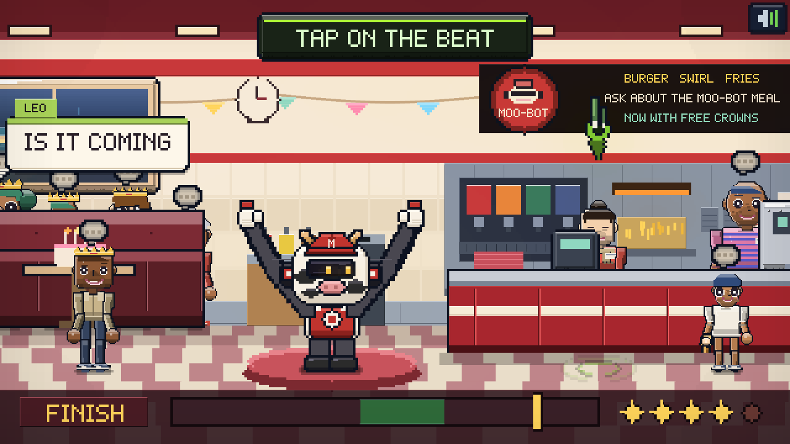

Two things it needed. The poses started within a few units of where his arms hang
anyway, so the whole dance read as a robot standing still — they clear his head
now. And the read-out was stacked up the middle of the frame, on top of the one
thing it was asking you to look at; it is a single strip below his feet, pose tab
left, track middle, one pip a bar on the right.

## 🍦 And you carry the swirls

Sam hands you two of them at the counter and you walk them over to table four.
They used to hang in the air sixteen units either side of him, keeping station
while he walked, because he had nothing to hold them with. They are in his
gloves now, gripped, in front of his chest, all the way across the room.

## 🧤 He has hands now

They were stubs: two dark rounded bars hung at his sides, and wherever a scene
asked for a reach, a line with a dark blob on the end of it.

An arm is a bar to the elbow and a bar from it, and it ends in a hand — a
**cream glove**, because four dark fingers on a dark sleeve is a smudge at every
size this game draws, and a pale mitt against this palette is unmistakable at
six pixels. A thumb on the inboard side says which hand it is; two grooves on
the outboard edge let you count three fingers if you go looking; a red cuff
gives it a wrist. Closed around something, the palm narrows and the fingers
curl.

Three things had to be got right by looking rather than by reading: the thumb
was drawn **before** the palm, so the palm's own outline swallowed it and the
mitt was a bean; the cuff sat a pixel above the palm and got painted over, so
the glove had no wrist at all; and the hand radius went through `u()`, which
floors at a whole logical unit, so at the scales the HUD and the shop rows draw
him at he had two mitts wider than his own legs.

The painter is published as `G.mooHand`, because the counter needs to show you
carrying a cone and a second hand drawn by a second file is how a game ends up
with two of everything.

## 🍦 The cones are not infinite any more

A cone used to appear on the counter every time you tapped the stand, for ever,
which made the stand a button rather than a thing.

The stand is a **sleeve** now: a tube with a countable stack of cones nested in
it, one rim per cone, climbing as it fills and dropping away as you use them up.
You **pull one out** and carry it — in your hand, in your glove — to a holder
on the counter, and set it down. The sleeve holds eighteen, restocked every
morning, so running out inside a shift means you have been throwing them away
rather than that the shop is broken. Clause mentions it at three.

The tutorial in Tracy's kitchen teaches the same verb, because a tutorial that
teaches a different verb from the game is worse than no tutorial.

**And placing a scoop is easier again.** The clean-scoop window started 0.40
wide and has been opened twice; it is nearly a full unit of green now, with slop
right out at 2.1. The cone catches a scoop from a 44-unit radius — or from
anywhere over the top half of the counter — and it draws the actual catch: a
wide ring that lights up and says LET GO the moment letting go would work. A
cone you let go of two units wide of the holder goes back in the sleeve instead
of on the floor.

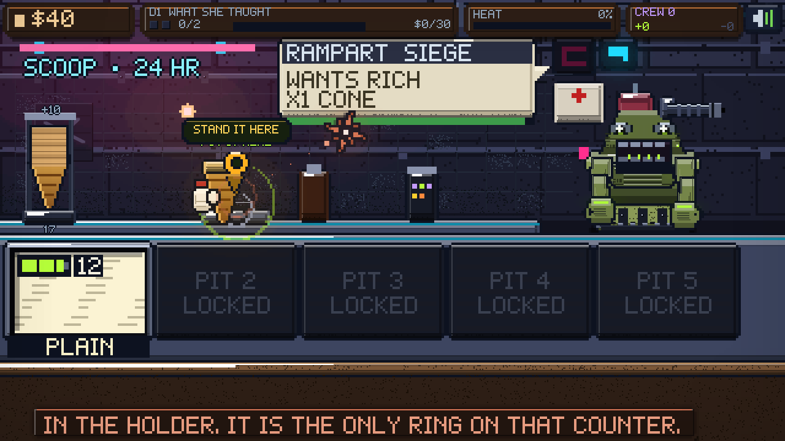

## 🩷 The shop is a shop you would queue at

It used to be the same cold blue as the street outside: navy tiles, a run of
dripping pipe, an extraction fan, grime in the corners, a first aid box. A
workshop that happened to sell gelato.

The whole point of the place is that it is the one warm room left in the city,
and she is the reason. So the inside is a little gelateria — cream and mint
walls, a pink dado rail, pastel tiles with a hand-painted heart on about one in
nine, bunting she put up and he never took down, a string of fairy lights, a
chalkboard reading SCOOPS FROM HER OWN BOOK with a cone drawn on it in chalk, a
trailing vine, a pot plant, and a photograph of Tracy over the counter.

The counter is wood with a scalloped pink valance hanging off it. The pit deck is
painted board with a mint edge and sprinkles somebody never wiped up. The wells
are brass; each flavour gets a little painted tag with a dab of itself on it; a
pit you have not built yet is a lid with a dust sheet over it rather than a slab
of battleship plate.

And the cold stays where it belongs — outside, through a window with gingham
curtains, where you can see it.

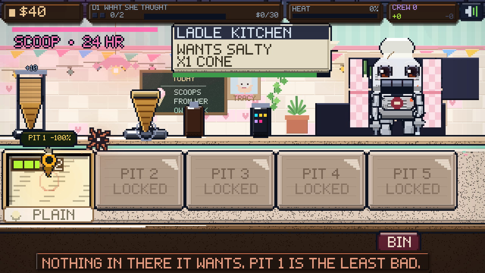

## 🧭 Clause actually helps now

It knew everything and volunteered almost none of it. It sat in its corner with
a menu of paid asks and a bank of remarks, and a player who did not know what a
pit was could stand there for a whole shift being told the floor was sticky.

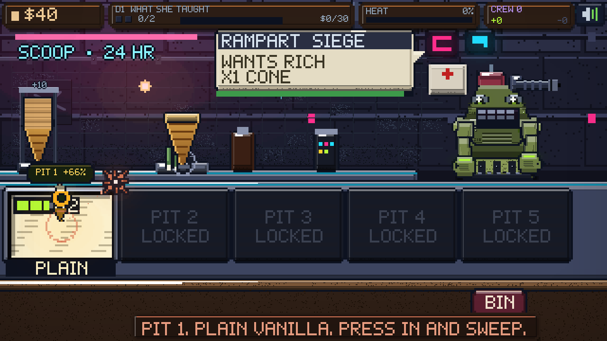

The **scene** owns the knowing — it is the one that can see the counter, the
build and what is in your hand — and answers one question, `nextStep()`, with
one physical action at a time. Clause polls it twice a second, flies to the
answer, puts the game's own quest pin on the actual thing with the verb on a tag
over it, and says the line **once**, when the step changes. Standing still and
repeating yourself is nagging; saying it when the situation moves is help.

So it walks you through: take a cone → stand it here → **pit 3, +64%**, press
in and sweep → let go here → sauce it → serve it. It names the best-matching pit
and how good the match is. It tells you when the sleeve is empty, when every pit
is out, and when there is nothing to put that scoop on.

An explicit ask, or a disguise it just spotted, outranks the running guide for a
few seconds — otherwise the two of them fight over where it hovers. And it has
about thirty more things to say, at roughly twice the rate, because a companion
whose whole job is company was managing one remark every fifteen seconds.

## 🚪 Five beats, and a door worth watching

The break-in was nine beats. Two of them existed only to hold a sound effect and
three more told you the same fact twice. What is left is the four things that
happen — she is happy, something is at the door, the door comes in, they take
her — and the one thing you do. The banging runs **underneath** the hide beat
now, so the thing at the door and the thing you have to do about it happen at
the same time, which is how it would. A beat can carry two lines, so an exchange
does not cost a beat each way.

And the door itself used to be one rectangle with two panels painted on it,
rotating about its foot and sliding away. That is a door being *moved*. It is a
door being destroyed now, and the difference is all in the first fifth of a
second: the boot lands and the leaf **bows** before it gives, the hinges tear
out and take screws and paint with them, the glass goes first because glass
always goes first, the lock side splinters into a mouth of raw wood — and then
the leaf lets go, spins, and lands **in the room**, where it stays for the rest
of the night. It used to be culled the moment it landed and come to rest below
the counter front anyway, so a door that had just been kicked through a wall
simply stopped existing.

## 🔌 Installing Clause is one frame, and you do it

It used to be four shots: a tablet on the floor, a head with a slot in it, you
closing the panel, and a queue in the street. Four camera moves to show you one
decision you were not allowed to make.

It is one room now. Her tablet is dying on the floor of the place they have just
taken her out of, the door is gone, and the chip comes out of its socket with a
click. **You carry it to the panel in your own cheek** — it opens as you get
near, the shutter shuts behind it, and it wakes up inside you. Nothing happens
until you do it.

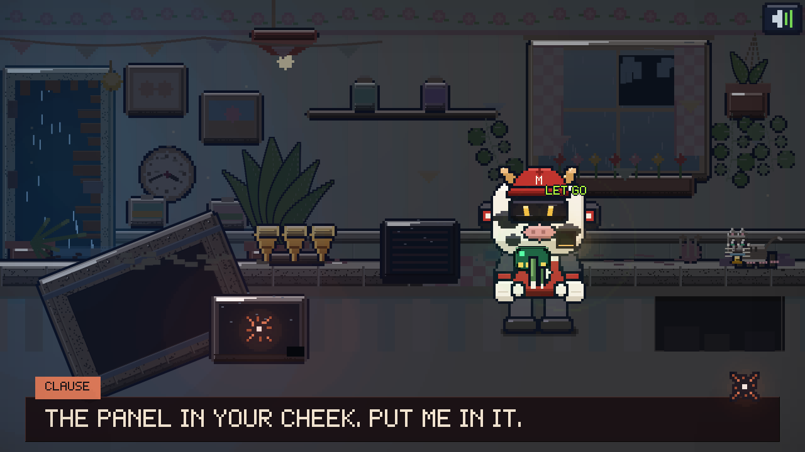

---

## 🌧️ The menu is a wet road at four in the morning

The title used to be a shop window: a neon sign, a column of buttons beside it,
and the save shown as a card that said SHIFT 7. It told you the facts. It did
not tell you anything.

It is a street now. You are stood in the middle of it, alone, in the rain, and
the whole shot is built out of two straight lines — `q` is depth, lateral scale
and ground height are both linear in it — so the road, the kerbs, the terraces
and the lamps all agree about where the horizon is. Roughly two thousand
vertical strips march down each pavement to lay the terraces in; that happens
**once**, into a buffer, because the geometry of a street does not change.

What does change is everything you notice: rain in three layers at three speeds
falling across the whole frame, five lamps a side pooling light onto the wet,
one of them failing, the drops that pass through a beam coming up bright, water
shivering in the camber, steam off a grate, a dead traffic light still doing its
amber at the kerb, and your own reflection under you — broken vertical bars, not
a mirror, because that is what wet tarmac gives back.

Three rules got this out of the mush it started as:

- **The buildings are silhouettes, the road is the bright thing.** The first
  pass had a lit grey terrace over black tarmac, which is backwards: at night
  the wet road is a mirror with a city on it and the buildings are cut-outs with
  a few warm holes in them. A third of the windows lit is a skyline. Two thirds
  is a texture.
- **The horizon had to come up.** It sat at y=100 with the chips over the bottom
  third, so every lamp, puddle and reflection in the shot was behind the UI. At
  y=76 there is a street to look at.
- **A scrim is not a lid.** Board green needs something behind it, but the flat
  wash that first went under the chips threw away the road and everything in it.
  It ramps now, and only closes up under the cards themselves.

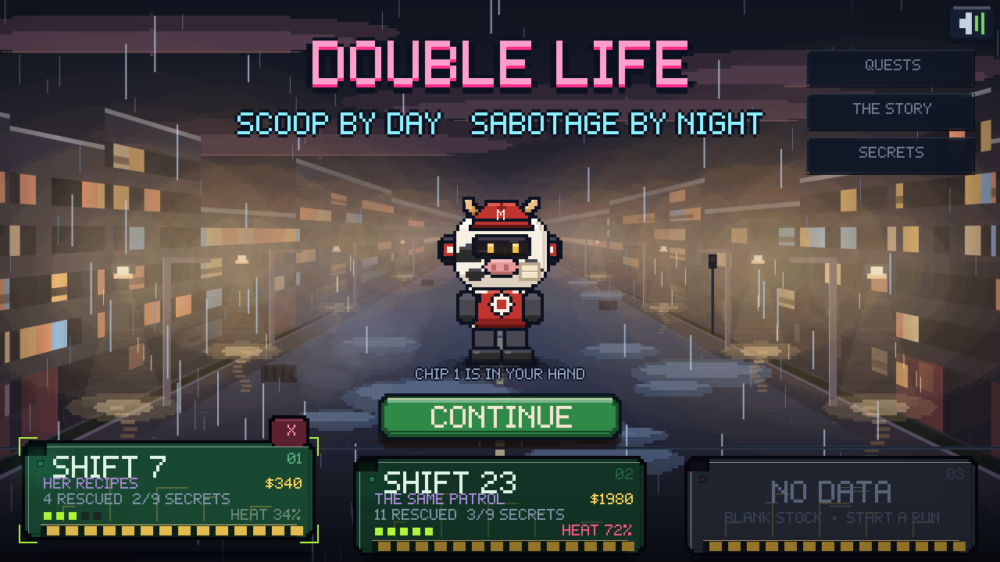

## 💾 Your saves are three chips, and one of them goes in your head

There is one save in this game per **chip**, and there are three of them on a
rail across the bottom of the street. Each is a card of board stock with the
corners knocked off, a keying notch cut out of the top left so it can only go in
one way up, gold contact fingers along the bottom lip, a status LED, and the run
etched on the face: the shift, the money, the chapter, who you have got out, how
many secrets you have turned up and how hot you are. An unused chip is the same
card in grey stock with nothing on it but scratches from the drawer.

Pick one up and **PLAY** says CONTINUE or NEW RUN. Pick up the one you are
already holding and it just goes.

Selecting a chip *loads* it, which costs nothing and commits nothing — the disk
is only written on the next autosave — so browsing three runs is free, and the
QUESTS / THE STORY / SECRETS panels are always reading the run you are actually
looking at. A chip you want rid of has a tab hanging off its top corner; it
takes a WIPE / KEEP confirm on the card itself.

This replaced a single save key and a **START OVER** button, which meant the only
way to see how a different run would go was to throw the last one away. An
existing save is migrated into chip one rather than quietly vanishing behind a
new key.

### And then it goes in your head

Press PLAY and the chip lifts off the rail, tumbles across the street on an arc
with a trail behind it, shrinking — width faster than height, so it turns to go
in rather than sailing past as a billboard — while the panel in his cheek parts
in two. It seats. The shutter closes, there is a bang, and he comes up: both
visor slits go from ember to white, a ring goes out across the road, sparks come
off him, the whole street lights warm and he braces and stretches. Then the
whiteout, and you are in the game.

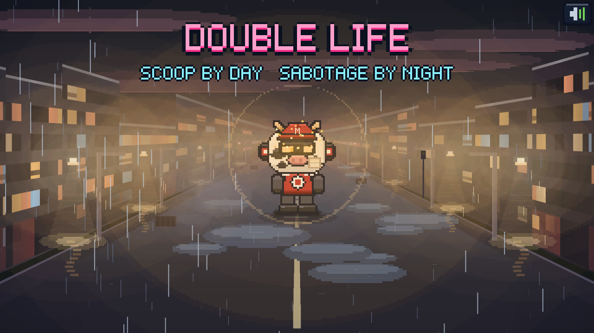

Everything this machine has ever been told arrived through that slot. It is
where the last chip went in.

Four things had to be fixed by looking at it rather than by reading it: the
panel was drawn on the middle of his face, the lid was a pale slab hanging in
front of him (it is a two-part shutter now — a lid that lifts off cannot work at
six pixels), the chip kept its full-size silkscreen all the way in and turned to
mud, and the surge bar landed on his browline instead of the slits, so his eyes
never changed.

---

The menu also carries two logs it opens once you have earned them:


**QUESTS** — twelve of them, and none was asked of you. Each one is a thing the
shop actually needs, they pay on completion, and the panel settles up any you
finished without noticing.


**THE STORY** — every chapter you have seen, and any of them replayable.


**SECRETS** — nine of them. Nobody tells you about these; the ones you have not
found show you where to look, which is more than the game gives you anywhere
else.

---

## 🪶 It is a good deal easier than it was

Every number below moved in the same direction, for the same reason: this is a
game about scooping ice cream for a robot and having a small cry on a bench,
and none of it was improved by being difficult.

| | Was | Is |
|---|---|---|
| Clean-scoop window | 0.76 – 1.16 | **0.66 – 1.34** |
| Slop starts at | 1.42 | **1.72** |
| How long they queue | 42 | **64** |
| Quota, day *n* | 3 + 0.7*n*, up to 9 | **2 + 0.45*n*, up to 7** |
| Take, day *n* | 40 + 26*n* | **30 + 16*n*** |
| Repair hold target | 18 units | **26 units** |
| Repair hold speed | 1.6 s | **1.05 s** |
| Repair sweep brush | 14 units | **20 units** |
| Winding | 10 radians | **6 radians** |
| First misdiagnosis | costs you | **free, and warns you** |
| Torque band | 0.30 wide | **0.52 wide**, needle 25% slower |
| Pressure band | 0.30 wide | **0.52 wide**, needle 25% slower |
| Walking speed | 46 / s | **62 / s** |

The two bench bands are now **one constant each**, read by the test *and* by
the gauge that paints it, so the green stripe can never claim a window the code
does not honour.

Nothing was removed to do this. Every fault is still one of the five gestures,
every scoop is still a sweep you have to feel, and the one thing you are still
expected to find for yourself — the tell on a machine that is not a machine —
is untouched.

---

## 🕹️ The prologue is a place, not a picture

The first act of this game used to be nine cutscene shots and a two-mile
crawl — a camera looking at things while you waited. It is now **two rooms you
walk around in**. Tap where you want to go and the mascot walks there. Tap the
green pin over something and it walks over and uses it.

Everything in them runs off `stage.js`: a floor line, a scrolling camera, a
cast of people each running their own **script of intentions**, places you can
walk up to and use, speech bubbles over the right heads, and beats that fire
when you get there.

### Nothing tells you what to do. The room shows you

There used to be a green banner nailed across the top of the screen with
`SAY HELLO TO TABLE FOUR` in it, and it stayed there until you did. A
permanent instruction over a room built to be looked at, in a game whose
whole first act is *go and look at this place before it stops existing*.

The banner now **says its piece and leaves** — 3.4 seconds up, 0.7 fading
out — and the job of pointing is handed to a **quest marker**, in three parts:

- **A pin in the air**, hanging with its point on the thing. A disc with a hole
  punched through it and a spike under it, bobbing. `G.questPin()` in `util.js`.
- **A ring pulsing on the floor** underneath it, flat and in perspective, where
  you have to stand.
- **An arrow on the frame edge** when the thing is off screen, bright at the tip
  and dark at the base, so it points instead of just sitting there.

**No text on any of them** unless you point at one, and then it is the thing's
name and nothing else.

### Two things it was, before it was that

It was a **green banner** pinned to the top of the frame reading
`SAY HELLO TO TABLE FOUR`, which is a quest log bolted over a restaurant: it
never says *where* table four is, and once you have read it it just sits there.

Then it was a **line of your own hoof prints** walking away from you across the
floor toward whatever was live — in the world, at the scale of the room, and on
a two-tone checker floor, eight small green marks scattered over the tiles read
as litter. That went too.

It never printed a distance. The first pass did: `348M`, which is the width of
the room in logical units with a unit stuck on the end of it.


**ACT ONE — the floor.** Mid-shift at a burger chain with a cow on the sign.
There is a **birthday party in the second booth**, a couple eating in the
first, two staff behind the counter, a queue that forms and clears, and a kid
who will not sit down.

### The brand is off the sheet now

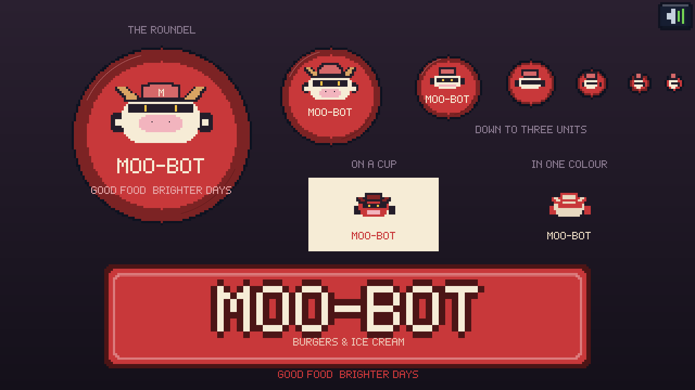

There is a model sheet for this character, and until this version the game
only took the *character* off it. The chain was still called something else,
the sign was the mascot's head blown up to sign size, and the mark on the
menu board was a cow with eyes and drooping ears — a different animal from
the one standing in front of it. A restaurant whose sign disagrees with its
mascot is two brands.

So the whole thing came off the sheet. `G.BRAND`, `G.SUB` and `G.TAG` hold
the name, the strapline and the line under it, and three painters draw
everything that carries them.

**`G.mooLogo()` — the roundel.** The stamp, and only the stamp: a red enamel
disc with a highlight arc on the rim and MOO-BOT's head on it — the cap, the
visor, the ear cans, the snout, the same head the player wears. It goes on
the cup, the bib, the menu board, the wall and the poster stand.

The head inside it is built on a **row budget**, not on fractions of its own
size. The first cut scaled every part by a proportion of the skull, and a dark
cap, a dark peak and a dark visor each round *up* to a whole pixel: on a
nine-row head that came to seven rows of black, and the mark was a thumbprint
with a cream fringe. Now the cream band above the visor and the cream chin
below the muzzle are **spent first**, before either band gets a row, because
those two gaps are the entire reason it reads as a face.

Three more things it was, before it was this:

- **A ladybird.** The horns left the top of the cap at forty-five degrees and
  ran a third of the head's width. Two thin feelers over a round red badge with
  a black band across it is an insect, every time. They come out of the *top
  corners of the skull* now, either side of the cap, short and tan and outlined
  so they hold against the red.
- **A beetle.** The cap was black and the visor was black, which is two bands
  of one colour with a stripe of face between them. The cap is the brand red
  with a dark keyline and a cream M on the crown, and the brim under it is the
  only black up there.
- **A pair of first-aid crosses.** The ear cans had a round cream pip in the
  middle of them, and a disc drawn inside a four-wide box comes out a plus sign.
  Square pip, and only where there is a box big enough to hold one.

**`G.mooPlaque()` — the wordmark.** The sheet's hero: a red slab with a heavy
dark keyline, a lighter red rule set inside it, MOO-BOT across it in cream
block caps and BURGERS & ICE CREAM on a strap underneath. **The name sets the
size, not the slab** — it picks the largest type that fits the width and the
height falls out of that, so a fascia sign 128 units long and a plaque 36 units
long are the same design rather than the same design squashed. (The font had no
ampersand; the strapline was rendering the missing-glyph block.)

**`G.mooSign()` — the lit box.** The head over the plaque with GOOD FOOD
BRIGHTER DAYS under it, or — when the box is more than half again as wide as it
is tall — the head *beside* the plaque, because stacking two things in a
letterbox gives you a strip each and neither of them reads.

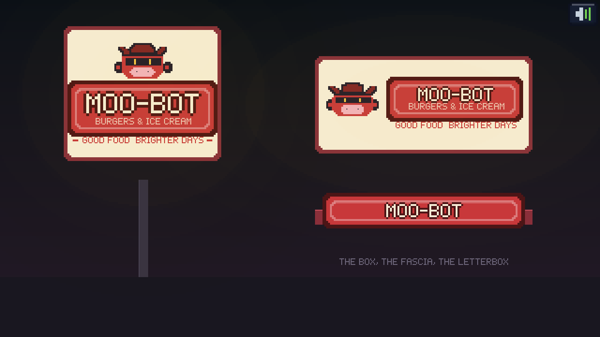

The building has its name on it now: a thin plaque across the fascia, which the
front never carried in any version before this one. The pole sign at the kerb is
the same painter, and it burns out and falls with the rest of it.

And a whole spare restaurant went in the bin. `mooFront()` — a second shop
front, with a window band, its own strip of wet tarmac and a **neon tube cow**
on a pole bent out of little squares — had not been called by anything since the
exterior was rebuilt. The game was shipping a third cow that nobody could ever
see.

The room is **two planes deep**: the counter, the booths and the staff stand on
a back floor eighteen units further away, so you walk *in front* of the
furniture instead of standing in it, and anyone sat in a booth is cut off at
the chest by the bench in front of them — which is what sitting down looks
like from the side.

### It is built like a chain now

The room used to be a flat cream wall with a stripe of tiles glued across
it, a slab of brown wood for a counter, and a window onto a car park with
six parked cars in it. A chain does not build a room like that.

| | |
|---|---|
| **A lit soffit** | a deep-red ceiling band with downlights in it every 68 units, and **warm pools on the floor underneath them** — which is the thing that ties a ceiling to a room |
| **The house band** | cream over red, the two colours off the sign, running the whole length of the building |
| **Tiles to service height** | offset courses with grout you can see, a capping rail over them and a **stainless kick rail** under |
| **The service line** | a drinks fountain with four flavour plates, nozzles and a drip tray; a fry station under its heat lamp with two baskets on the rail; three stacks of cups in three sizes |
| **The counter** | a steel top with a tray rail on the lip and the house colours down the front. The brown slab it replaced is a pub bar |
| **The floor** | a condiment stand with three pumps, a swing-flap bin, and a MEAL DEAL poster stand by the door |


And the windows look at **the sea**, because the first line of this game is
that MOO-BOT is a chain on a promenade: a night sky, a pier out on the
water, a lit horizon, the sea catching light, a promenade railing and one
lamp on it — all of it behind rain running down the glass.

*(It was all there before at half the brightness, which in a window framed
by a cream wall is a black rectangle.)*


Four jobs, in order, each gated behind the last. **Say hello to table four.**

> **BESSIE:** WHO IS FOUR TODAY, THEN?
> **A CHILD:** MOO! MOO! MOO!


**Get up on the stage and do the dance.** Control is taken off you for three
seconds, you wave, the whole table points at once, and it is handed back.


**Collect table four's order** — the staff member you walk up to reaches under
the counter and hands you two swirls, which you then carry, in both hands,
until you put them down.

> **SAM:** TWO SWIRLS. MIND THE STEP ON YOUR WAY OVER.


**Take them over.** And when you do, the door comes off its hinges. Everybody
in the room recoils on the same frame — mouths open, arms out, the whole room
at once. The glass goes out in thirty pieces on thirty different arcs.
Something rolls in through the hole where the door was, steps down out of the
back of the room into the lane you walk in, and brings a gun with it.

> **PATROL:** CIVIL PATTERN. NOBODY MOVE.


The child who has spent the whole shift running the length of the room stops
running. A dashed red line crawls out of the barrel, finds them, and settles.
The dot sits on their chest and pulses. Nobody in the room is going to do
anything about it.

> **PATROL:** THAT ONE IS NOT ON THE ROLL.

### The only thing in this game you have to be quick about

Then it gives you the floor back.


**GET IN FRONT OF THEM.** A bar runs down at the top of the screen, you move
almost twice as fast as you have all shift, and there is a marker on the boards
between the child and the barrel. You have four and a half seconds.

**It cannot be failed.** If the bar empties while you are still stood by the
booth, you go anyway — the same jump, from wherever you were standing, because
that was always what you were going to do. Getting there yourself just means
you got there yourself.


You jump. You land between them. And then it does not stop.

**Six rounds.** Not one shot and a leg cartwheeling across the room — a burst,
the first one hard and the rest arriving 0.34 seconds apart, and every one of
them **stays**. Each round punches a hole where it landed, and the hole is
still there in the next frame, and the one after that, and in every scene for
the rest of the night: a black bore, torn shell round the rim, a glow on the
two freshest ones and something venting out of the bottom of each.

Your legs are fine. That is the point. Nothing that happens to you here can be
fixed by bolting on a spare.

Three things happen at once as the count climbs, all of them driven off
`hits.length / 6`:

| | |
|---|---|
| **You** | knocked back further each round, damage ramping to full, and on the last one you go down on your front |
| **The room** | the colour drains out of it, 0.52 of `#241018` over everything and a hard vignette closing in from four sides — it used to stay bright pink and cheerful all the way through, which is a tonal problem you can see from the back of the room |
| **The floor** | goes quiet. Every bubble in the room is cleared on the first round and nobody starts another one |

> **BESSIE:** I'M — I'M STILL UNDER WARRA—
> **A CHILD:** IT MOVED. IT MOVED FOR ME.

And then you crawl. On your front, holes and all — and because the body is now
long and low rather than tall, the wounds **swap axes**: how high a round landed
on your chest is how far forward it is on the floor. Mapped straight down both
axes instead, all six packed into one twelve-by-six box and read as a single
black smudge.

Everybody who can run runs. A small box with a red light on it goes under the
counter, and the thing that put it there walks back out through the hole it
made.

> **PATROL:** CLEAR THE FLOOR.

### And then the camera leaves the room


Act one used to end on a darken and a whiteout from *inside*, which is a fade
with a bang on it. The camera now goes out into the **car park** and watches
the front of the building come off.

MOO-BOT on its corner in the rain: the lit fascia, four glass bays with people
still moving behind them, the patrol vehicle parked across the entrance with
its light bar going, and the mascot sign on its post at the kerb. People going
the other way, fast. A red light counting behind the glass.


Then the front goes. The bays blow one after another, left to right; **a
shockwave** that races out ahead of the fire and flattens the rain, which is the
thing that actually tells you how big this was; a hard fireball core out of the
doorway that **shrinks instead of growing**, because a ninety-percent-alpha
ellipse over the whole frame is a sepia filter with sparks in it; sixty pieces
of glass, masonry, fascia and brick on their own arcs with gravity on them;
embers going up; smoke rolling out along the tarmac; and the sign snapping off
its post and going end over end out of frame.

*(`G.fe` takes **radii**. The fireball passed it `R*k*2`, which is a diameter,
so every band came out twice the size it was written for and filled the frame
corner to corner — the one shot in the game whose entire job is to show you the
front of a building coming off, and you could not see the building.)*

### It also used to cost 38 milliseconds a frame

The budget at 60fps is 16.7. The bomb's opening shot was measured at **38.15**,
and the cause was not the fire: it was `cut()`, the function that stamps a
character silhouette. Every call cleared a full 480×480 native scratch buffer,
hardened its alpha by compositing it over itself **five** times, and blitted the
whole thing — and the car-park shot draws twelve people in the windows and five
running for the road, every frame.

Two changes, measured after each:

| | ms/frame |
|---|---|
| Before | **38.15** |
| Clip every buffer operation to the figure's own box, and harden three times instead of five | **32.0** |
| Cache the stamp: background figures re-render at 6fps, keyed on pose, scale, colour, direction and hat | **7.09** |

With the shockwave added back on top, the worst shot in the sequence now runs
at **9.23 ms**. The cache holds 220 stamps and evicts oldest-first.

### She does not leave you there

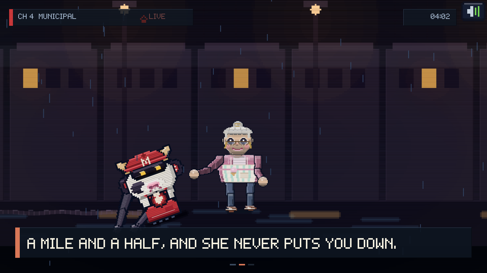

Act two used to end on her finding you and then a cut to a bench. **You see the
mile and a half now** — three shots of it.

She gets her arms under you and lifts, and you are dead weight. Then the street
**scrolls past you** rather than the camera panning, so the distance is
something happening to you rather than a camera move: terraced fronts, two lit
windows in a hundred, lamps, wet road, rain, and you tipped back on the tarmac
with a smear behind you all the way to the edge of frame. Then her door, and
the light out of her front room onto the wet, which is the first warm thing in
twenty minutes.

> **TRACY:** COME ON. COME ON, YOU GREAT LUMP. UP.
> **A MILE AND A HALF, AND SHE NEVER PUTS YOU DOWN.**
> **TRACY:** MIND THE STEP. THERE. YOU ARE IN.


Afterwards, still outside: fire in the four window holes — **tongues**, narrow
and tapered and a different height every frame, not the banded rows that read
as sand dunes — black smoke off the roof, rubble across the car park, and one
shoe. Then a push in on the sign, face up in a puddle, cracked across, with
one of its eyes lit by the building.

> **ELEVEN SECONDS, AND A BIRTHDAY IN IT.**
> **NOBODY CAME BACK FOR THE COW.**

---

## 🗣️ Everybody has a name and a mouth

The dialogue used to be half-size text in a small white box. It is now **full
size**, wrapped to the width of the bubble by `G.wrap`, with a **name tab**
hanging off the top corner in the speaker's own colour — so you can read a
line from across the room and you always know who said it.

**One line on screen at a time.** Three hundred and twenty units across and a
hundred and eighty down does not hold two bubbles: the second one ends up
under the objective plate with its name tab buried, so a new line replaces the
old one. The bubble pops in on a **back-out curve** — up past where it lands,
then down onto it — and its tail is a **tapering stalk that reaches the head
of whoever is talking**, however far up the bubble had to be pushed to stay
clear of the chrome.

And they talk **unprompted**. Every actor in act one carries a name and a pool
of things they say:

> **SAM:** THE SHAKE MACHINE IS DOWN. THE SHAKE MACHINE IS ALWAYS DOWN.
> **DEREK:** I HAVE HAD THE SAME THING EVERY FRIDAY FOR ELEVEN YEARS.
> **MUM:** DO NOT CLIMB ON THE COW.
> **A MAN IN A COAT:** IS THE COW REAL.

While you walk around, the room picks somebody **within forty-six units of
you** who has not spoken for a while, hops them, and gives them a line off
their own pool — then waits two and a half to five seconds and does it again.
Walk from one end of the floor to the other and you get a different four
lines every time, and each of them is somebody's, not the room's.

### And now you can just go and ask them


That was the whole of it: the cast talked *at* you on a timer and there was
nothing you could do about it either way. **Tap anybody and they will talk to
you.** You walk over, they turn round, they hop, and they say the next line
they have not used yet — so the cast is something you can *work through*
rather than something that occasionally shouts as you pass.

Everybody with something to say wears a **little speech mark** over their
head: outlined at full strength whatever else is going on, filled brighter
when you are near them, and with their **name on a tab** when the pointer is
on them. A green pin over a live spot suppresses the speech mark under it
— a pin and a bubble on the same head is two calls to action fighting over
eleven pixels, and the spot is the plot while the person is the joke.

The line along the bottom of the screen says what the pointer is actually on:

> TAP A MAN IN A COAT TO TALK

---

## 💥 Comic

Everything that happens in a walkable room now says so. The model sheet
this mascot came off has three little dashes over its head when it is
pleased; that idea is the whole layer.

| | |
|---|---|
| **The star** | ten spokes on alternating radii, snapping open past its own size and then shutting. Outline pass first and fill after, or each spoke's black lands on the one before it |
| **Speed dashes** | seven short bars thrown out of the star on its own arcs, stretching as they go |
| **The marks** | three strokes fanning off a head — over anybody you talk to, and over your own when a job lands |
| **Puffs** | a soft cloud that grows and drifts, rather than the expanding hoop that was there before. Dust does not ring |

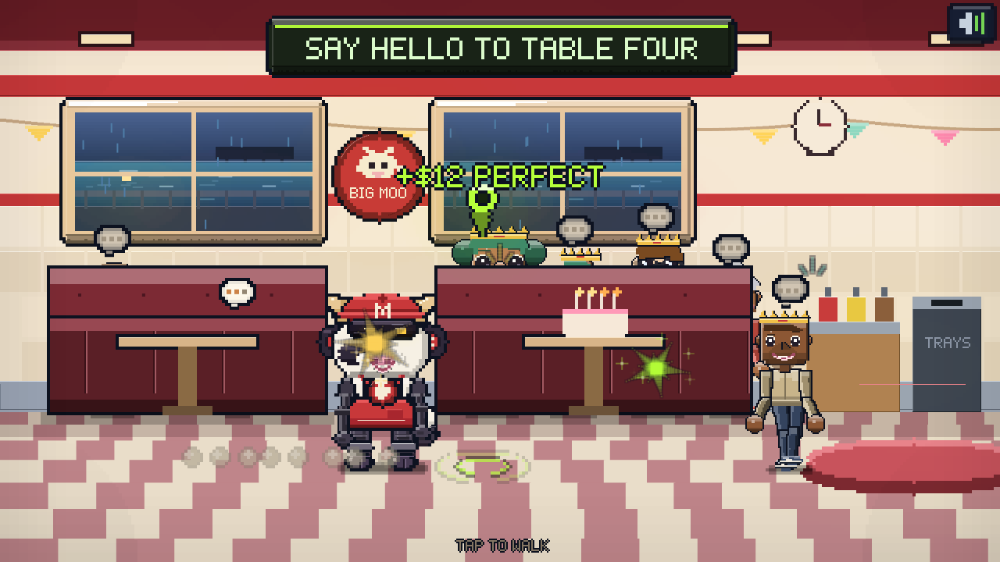

One call — `S.comic(x, y, col, size)` — fires the star, the dashes, a
spray of sparks and a kick on the camera, so everything that lands in this
game lands the same way. `S.bang` routes through it too.

**And it bounces.** The spring was clamped at ±0.15, so a landing that set
the velocity to 62 looked exactly like one at 30; it runs to ±0.22 now.
Stepping off the mark stretches you, every footfall squashes you and kicks
a puff of dust back the way you came, and landing drops six of them.

**Float text pops.** It used to fade in at full size and slide upward,
which is a subtitle moving. A number that matters snaps out past its own
size and settles back — at a scale quantised to quarter steps, because a
glyph drawn at 0.83 of its size lands between native pixels and the whole
line goes soft, which is the one thing this raster is not allowed to do.

---

## 🍮 The bounce

Nothing in a walkable scene moves at a constant velocity any more.

- **A squash spring.** `S.sq` is a real spring — a stiffness, a damping and a
  velocity. It kicks negative when you leave the mark (stretch) and slams
  positive when you arrive (squash). The barrel torso reads it, and so do the
  legs, so the whole body compresses together instead of the belly giving
  while the feet stay bolted down.
- **A hop in the walk.** Every step lifts you off the floor by a couple of
  units, and the landing adds a dip on top of it.
- **Dust.** Five puffs where you land, and one at every footfall on the way.
- **Pops.** `S.pop` throws `ring`, `star`, `dust` and `bit` — the last one is
  confetti, with gravity and a tumble on it. `S.bang` fires a burst and shakes
  the camera; `S.cheer` makes a list of people jump.
- **A plate that arrives.** The objective drops in on a back-out curve and
  flashes for nine tenths of a second every time it changes.
- **People who notice you.** An actor within fifty-two units turns their head
  toward you, and their pupils track you inside it.

Every job on the floor now ends in something: saying hello sets the whole
booth cheering, the dance drops confetti, collecting the order rings the
counter bell, handing it over pops five stars and a **3 / 4** over your head.

### One thing that does nothing at all

- **Your own bell.** Tap yourself, above the waist, and you ring the bell on
  your collar. Rings go out, stars come off it, the whole room hops, and
  somebody says **MOO** or **AGAIN**. It is repeatable. It is worth nothing.

There used to be a mop bucket and a wet floor sign down at the end of the
counter, and walking into them put you on your back. They are gone. The floor
you walk in act one is now clear from the booths to the door — nothing to
trip over, nothing between you and the last twelve seconds of the shift.

---


## 🧱 Act two: the wreck


The same building, four hours later. The wall is still standing — burnt
blockwork with the top taken off it, four window holes punched through, the
fascia still there in patches — and the roof is on the floor. Two fires still
going. Rain, embers on the wind, and puddles holding the firelight.

You come to **on your front in the ruins**, with six cold holes in you and a
drag smear behind you, and the first thing the scene asks you to do is get out
from under what is left of the building. You move at about half speed, because
you are pulling yourself along with your hands.


**There is nothing out here to collect.** There used to be: five objects laid
along the apron with a glow on each — a paper crown, a tray from table four,
one shoe, a badge with the name burnt off, a radio still on — and an objective
that counted them off, **FIND ANYBODY · 0 / 5**. It turned the worst night of
this machine's life into a shopping list, and it is gone.

What is left is **a long walk east** and whatever you say to yourself on the
way, because there is nobody else to say it to.

> **BESSIE:** HELLO?
> **BESSIE:** THIS IS FINE. THIS IS ALL FINE.
> **BESSIE:** SAM? KEV?


Get far enough down the road and **something turns onto it carrying a light**.
She walks to you, you walk to her, and she gets down onto the rubble to reach
it — which at her age is a decision.

> **TRACY:** OH, YOU POOR ARTICLE. YOU ARE THE COW OFF THE SIGN.
> **TRACY:** RIGHT. HOME. I HAVE GOT A CRATE OF LEGS AND NOTHING ON TONIGHT.

---

## 📏 One scale for the whole game


Everything used to be sized by eye. That is why a counter came up to a grown
woman's shoulder in one room and to her knee in another, and why a customer
stood next to the mascot at half its height.

So there is a table now, and one rule: **an adult is 52 logical units head to
heel at draw scale 1.0, standing on the floor line.** A door is 78, because
you should be able to walk through it. A counter top is 22, because that is
waist high. A table is 20, a booth back is 32, a seat pad is 12.

In a walkable scene **everybody is drawn at 1.0** and the room is built around
them. The mascot comes out at 52 as well, because a mascot is a person in a
suit.

---

## 🍨 Tracy


Seventy-odd, four foot eleven in her shoes, a silver set she does the front of
herself, half-moons worn down the nose on a beaded chain, and an apron she has
been making gelato in since before machines could hold a scoop. She is built on
exactly the same rig as everybody else in the game — same skeleton, same clips —
with her own clothes layered over the top through two hooks, so she stands in
the same world as the crowd rather than beside it.

She turns up at the end of act two with a torch, and she is the one who walks
to *you*.

---

## 🔌 Three faults, and clause reading them out

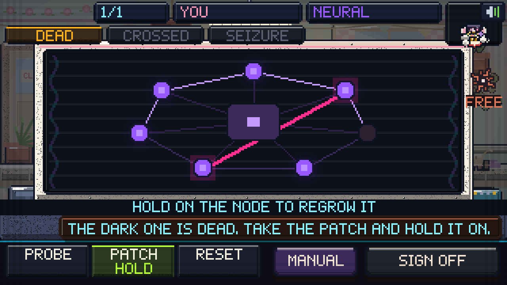

She puts you under the good lamp, opens your chest panel and props a cracked
tablet against the counter. **The tablet does the talking.** She has never seen
a board like yours in her life; the thing living on the tablet has seen
thousands.

### This scene *is* the workshop

Not a version of it. Not a simplified one for beginners. `js/fix.js` is 136
lines and **every one of its methods either sets the scene up or gets out of the
way**:

```js
Object.setPrototypeOf(tut, G.scenes.night);
Object.setPrototypeOf(this, tut);
```

The tutorial delegates to the night workshop through the prototype chain. Same
neural system, same three tools, same five gestures, same target rings, same
progress bar, same sign line, same tray. If the workshop changes, this changes
with it, because there is only one of it.

Four things differ, and they are the four the fiction needs:

| | |
|---|---|
| The machine on the bench | is **you** — one job, id `player`, name `YOU` |
| The room | is her front room, dimmed, drawn by the same `G.tracyRoom()` painter as everything else that happens in it |
| The faults | come pre-**named**, because you cannot read the manual yet. Clause reads them out |
| The money | is not there. Nobody is paying you, and there is no `$40` on the board |

Three faults, and they are three real entries out of the neural system's own
table — the same three you will be billing machines for by the end of the week:

> **CLAUSE:** THE DARK ONE IS DEAD. TAKE THE PATCH AND HOLD IT ON.
> **CLAUSE:** THOSE TWO ARE CROSSED. PROBE BOTH ENDS, THEN PATCH.
> **CLAUSE:** THE CORE IS CHASING ITS TAIL. HOLD THE RESET ON IT.
> **CLAUSE:** THAT IS THE BOARD. YOU ARE A MECHANIC NOW.

**Nothing here can be failed.** The tools are the right tools, the faults are
already diagnosed, and the manual gate is open.

### What it replaced, and why

A leg-fitting minigame. 788 lines, six stages, six verbs — `seat`, `lines`,
`bolts`, `prime`, `power`, `toes` — **every one of them invented for this scene
and never seen again**. Twenty minutes of tutorial that taught you nothing about
the game you were about to play, because the game you were about to play is a
repair bench with five gestures on it. You learned to plug a hydraulic lead into
a loom box exactly once, and then the credits could have rolled.

### The bottom of the frame holds one voice at a time

The first pass put **five layers of instruction across the bottom of the
screen** simultaneously: the workshop's sign line, a redundant tip printed under
it, the workshop's own `3 FAULTS IN THE NEURAL` plate, clause's bubble, and a
line reading `SHE IS WATCHING YOU DO IT` — with the tray underneath all of it
and clause's strip sitting on top of the tools it was telling you to pick up.

Now: the **sign line** carries the gesture (`HOLD ON THE NODE TO REGROW IT`),
clause's strip sits in the band between the sign and the tray and holds it
alone, and every line it says is short enough to stay **one line**, because a
two-line bubble grows upward into the sign band and covers the very hint it is
telling you to read.

---

## 🏠 Her front room, which she calls the shop

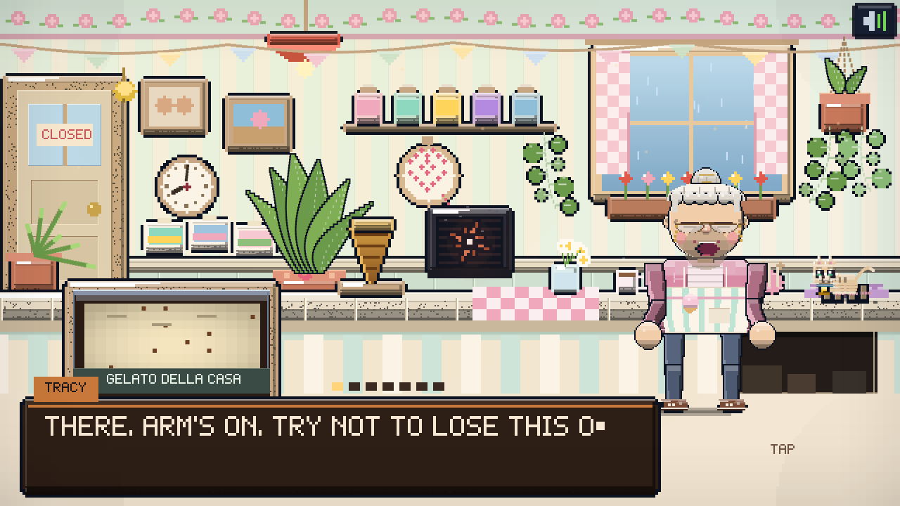

Mint and cream stripes, a rose border, bunting she put up when you woke up and
never took down, five jars in colours she chose to look at rather than to sell,
two photographs of a shop that is not there any more, a cat asleep on the warm
end of the counter, and a tub of gelato with `GELATO DELLA CASA` chalked on the
board.

### She has more plants than she has room for

Four of them, and they are built rather than stamped:

- **A big one in the corner under the lamp**, six paddle leaves fanning out of a
  terracotta pot with a heart painted on the rim. A leaf is rows of pixels
  stacked upward from the stem, drifting sideways as they climb and fattest past
  the middle, with a midrib down it and the light on the fat side. **All the
  outlines go down first and the fill comes after** — do it row by row and every
  row's black lands on the row below it. Its pot is behind the counter, so you
  only ever see the top half of it, which is how a plant that size looks in a
  room that small.
- **A macramé hanger** in the corner by the window, three cords off the ceiling
  with beads on them, two sprigs standing out of the pot and everything else
  falling out of it.
- **Something trailing off the end of the jar shelf**, as there always is.
- **Geraniums in the window box**, which were always there.

A trailing runner is one continuous stem that sags and sways, with a leaf out to
**alternate sides on its own little stalk**. Sat tight against the stem they
merge into a lumpy green column and the whole thing reads as a bead curtain.

And around them: a **clock she winds on Sundays**, with hands that keep real
time and stop at 4:41 when they come through the door; **three postcards** taped
under it from people who got out; **a sampler in a hoop**, half finished, as it
has been for years; a jam jar of **daisies** on the gingham; her **mug**, still
steaming; her **knitting**, which is going to be a scarf, she says; and a folded
**blanket** under the cat, which is the only reason it is allowed up there.

Every one of them has a wrecked state. The clock cracks and stops. A postcard
comes off the wall. The hoop goes off its nail. The jar goes over and the water
runs across the counter. The wool unravels the length of it.

*(The room costs 6.4 ms a frame to draw, up from 5.2 before the greenery.)*

**One painter draws this room in every state the story needs it in** —
`G.tracyRoom(g, t, o)`, with `dark`, `wrecked`, `doorOff` and a `back` hook for
anybody standing behind the counter. So the warm version and the wrecked
version cannot drift apart, because they are the same function.

It also has **a front door** now. It never did: the room simply had no way in,
which is fine for a tutorial and useless the moment somebody has to come
through it. Panelled, with a bit of glass, a sign turned round to `CLOSED`
hours ago, and a brass shop bell on a curl of wire over the top.

### The break-in is not a cutscene any more

It used to be six shots of a **brown workshop that appears nowhere else in the
game** — a second, worse copy of her room, built by a different file, in
different colours. Both are gone. The raid happens **here**, in the room you
have been standing in for the whole lesson, straight after you hand her the
cone, with no cut and no camera move.

Nine beats:

| | |
|---|---|
| `quiet` | *"Sit yourself down. I'll put the kettle on and we'll do sauces."* |
| `bang` | Three bangs on the door. The bell goes each time. The lamps go down. |
| `hide` | **"Get behind the counter. Go on. Now, love."** — and this beat waits for you |
| `door` | It comes off its hinges and across the room, with the glass |
| `in` | Two machines walk in, torches sweeping. *"Nobody is on the roll at this address."* |
| `her` | She puts herself between them and the counter |
| `white` | One white frame |
| `gone` | *"They did not arrest anyone."* |
| `out` | *"The tablet was still warm."* |

### And you have to go and hide

There is a missing board at the far end of the counter, and the dark under it.
It is scenery for the entire lesson, and then it is the only thing in the room
that matters. When she tells you to hide it gets **the loudest mark the game
owns** — brackets, a name tab reading `GET UNDER HERE`, and two rings running
outward — and you tap it.

The view goes with you. The near edge of the counter rises across the bottom of
the frame, the room darkens and a hard vignette closes in, and **your own head
comes up over the lip**: both eyes, both ears, watching. She goes round the
counter to meet them, on the back plane, where the counter cuts her off at the
knee — the same two-plane trick the walkable scenes use, so she is *in* the room
rather than in front of it.

Nothing here can be failed either. If you sit there being told to hide for
thirteen seconds, she picks you up and puts you in the gap herself.


Afterwards the room is the same room, wrecked: the shelf down, three jars on
the counter, a pane out of the window, the tub over on its side with its hoops
and staves showing, the cones out, the bunting hanging off one end, her pot
plant flat and its soil across the counter, the clock stopped, the tea over. The cat comes back. And on the
counter where she was standing: **her cardigan, and her glasses.**

---

### Every shape in a cutscene is a real character


A cutscene silhouette used to be six rectangles stacked into a person
shape — a rounded head-and-shoulders, a body, two arms, two legs. At a
glance it passes. Next to a game full of procedurally generated people
with genomes and nervous habits, it is a cardboard cutout, and the cast in
a cutscene stops being the cast.

So a silhouette is now **the actual sprite**. It is drawn into a scratch
buffer, the buffer's alpha is hardened by compositing it over itself five
times — the rig lays glows down with `globalAlpha` and a mask taken
straight off that comes back with a halo round everybody — and then it is
flooded with one colour through `source-in`, which keeps the fill only
where there were pixels.

A rim light is the same mask again, stamped one pixel toward the light in a
brighter colour and then covered by the dark one, so the edge that
survives is the character's own profile — a hood stays a hood, which a
hand-drawn bar down the side never does.

Whatever the rig draws, the silhouette is exactly that: the right hair,
the right coat, the right hat, the right number of legs. The people in the
windows of MOO-BOT minutes before it goes are twelve different people, one
of them a four-year-old in a paper crown, and the two running out of the
door as the counter starts counting are a grown adult carrying a child.


The tablet was still warm. Clause's housing had eleven minutes left and your
head had a slot, so you pulled its core out and put it in your own, and closed
the panel.

**Seven chapters** after that, and they move when the world does rather than on a
timer: the first person you get out, her recipes running again, the first patrol
that parks outside and does not order anything, the back room with chairs in it,
and the same patrol coming back.


The seven mid-game chapters are still cutscenes — they are short, and they are
somebody else's news broadcast rather than your shift. Same set the whole way
through: the ident, the clock, the scanlines, the roll bar and the lower third.
The camera pans and pushes and nothing rotates, so every scanline stays a
scanline. Everybody in them is drawn at the same scale as everybody else now,
which they were not.

---

## ☀️ The floor


Every shift starts with the shutter. It rattles up slat by slat, dust comes off
it, the sign flickers on, warm light spills under the bottom rail onto the pits,
and whoever was already waiting outside is standing there when it clears. At the
close it rolls back down.


One narrow room, and it looks like a room: tiled to shoulder height, a run of
pipe with a drip coming off it, an extraction fan, a bare bulb on a cable, a
first-aid box, grime in the corners and flies that will not leave.

### What can I touch?


Two base stands, six sauce bottles, four topping jars, five pits and a cat, and
**every one of them used to be an invisible rectangle**. They all did
something and none of them said so, and a player who has not read the source
has no way to find that out except by tapping the whole screen.

There is now one mark for *everything you can touch*, in every scene — and it
is the **same pin** the walkable rooms hang over an objective, at a third the
size, so one mark means one thing everywhere in the game:

| | |
|---|---|
| **Resting** | a small pin, in the thing's own colour, hanging over it and breathing |
| **Pointed at** | brackets round the thing and its **name** on a tab |

The back room drew its own chevron for four versions, which meant two different
marks for one idea. It draws `G.questPin` now, like everything else.

It does **not** light everything at once, which would just be a wall of pips.
It lights **the step you are on** — a base, then a scoop, then whatever you
want on top — so the marks double as the recipe, and the line along the bottom
of the screen names the same step in words:

> TAKE A CONE OR A CUP → PRESS A PIT AND SWEEP → SAUCE AND TOPS, THEN SERVE

The one thing it will not point at is **the tell on a disguise**. That is the
only thing in the game you are meant to spot for yourself.

Along the top: **today's goal**. A row of pips for the quota, a bar for the
take, both filling as you work, plus the heat on you and a tally of who you have
got out. Miss the quota and the district notices a café that is not really a
café.

### The pits

You start with **one pit** and can build up to **five**. A pit is one flavour,
**lying flat**, so you scoop it the way a real one is scooped — **top down**.


Every pit surface is a live **heightfield**, lit by its own slope, so a furrow
you dug an hour ago is still there in the light.

- **Press in and sweep.** The fill rate rises the further you drag, so a long
  confident arc beats a jab.
- **Stop in the green.** Under-filled reads `OK`, in the window `PERFECT`, past
  it collapses into `SLOP`.
- **Let go on a cone, a cup, or the machine's own intake.**


A scoop is not a hard ball — it is a **set jelly**. Seven tone bands off a
plumped superellipse with a wrap term, so the terminator is a gradient rather
than a cliff. A long soft sheen laid along the shoulder with a hot core inside
it. A **subsurface rim** where light comes through the far side, so the shaded
edge is brighter than the middle. Drips that grow out of the ball through a
pinched neck into a bead about to let go. And it wobbles when it lands and never
quite stops.

### The tip jar


Buy the **TIP JAR CAT** and a cat-shaped machine somebody left behind sits on
your counter. Pet it. It purrs, its whiskers twitch, purr rings come off it,
coins stack up behind the slot window, and the customers put money in because
they cannot work out why they want to. Add the **CATNIP TIN** and it doubles.

### Some of them are not machines


People are hiding inside stolen shells, because the alternative is being
processed. Cats and dogs are hiding because a human hid them — rarer, and worth
more, because nobody else is looking for them.

They always leak something. **Seven tells**, each one or two native pixels of
wrongness on a body full of right pixels:

| Tell | What you're looking at |
|---|---|
| **A tail** | Something swishing under the chassis |
| **Hair** | A strand caught in the head seam |
| **An ear** | The head plate being pushed up from inside |
| **Breath** | It is fogging its own intake |
| **A paw** | That is not a gripper |
| **A real eye** | One optic has a wet pupil |
| **A heartbeat** | The chest panel is ticking wrong |

Click the tell and the shell comes apart.


They get a name, a perk, and a photo on the wall in the back room. Serve one
without noticing and you fed a person a scoop of iron filings — that goes in the
books too, under LET THROUGH.

Buy the **UV LAMP** and a tell glows faintly. Buy the **BONE SCANNER** and
clause.ai names it out loud and flies over to point at it.

### Closing


When the queue is done the shutters come down and you get the day scored:
served, take, tips, rescued, let through. **Only then does the back room
open** — the floor is the floor, and you work it until it closes.

---

## ⏳ The card between two places


Every scene change goes through a card, and the card used to show one of
four stock icons picked off a regex against the label: a scoop, a door, a
hand, a starburst.

It is now **clause**, every time. It flies in from the left on an arc,
trailing ten sparks that fade behind it, spins its rays up, throws two
rings out from itself like a heartbeat, and blinks three dots underneath
because it is thinking about it.


Unless a day is starting. Then it is a **sunrise**: a disc coming up over
a horizon line with twelve rays turning around it, and a clock beside it
with its hands coming round to opening time.

---

## 🚪 The back room


Not a menu. A room, wider than the screen, that you walk. Tap the floor and you
go there; tap a machine and you walk to it and use it. Breeze block, damp bloom,
strip lights that flicker, a drain, shelving stacked with stock crates, a
defaced recruitment poster, a tool board, a mop in a bucket.

**Every live station is marked** — a pin just above it, hanging where the
thing actually is rather than in a tidy row along the ceiling, plus a ring
pulsing on the floor at its feet so you can see how far off you are. It used
to mark only the station you were *already standing at*, which tells you
nothing you did not know: a room wider than the screen with no signposts is a
room you find by walking into things.

**Six things to stand at:**

| Station | What it does |
|---|---|
| **The stairs** | Back up to the floor |
| **The terminal** | Order stock — 30 ingredients, four aisles |
| **The mixer** | Four hoppers into a drum: invent a flavour |
| **The cold room** | Load churned batches onto the line for tomorrow |
| **The wall** | Everyone you got out, pinned up with string |
| **The stairwell** | Down to the bench, where tonight's jobs are |


The mixer read-out shows what comes out before you commit: the blended colour
pushed toward saturation, the properties that survived, and a **generated name**
taken from whatever shouts loudest — `VELVET CHURN`, `GRAVEL SLAB`, `MAGNET
SWIRL`.


The cold room holds every batch with its quantity. Tap a batch, tap a pit, and
it loads. **This is how you open tomorrow.**


And the wall is the only thing in this city getting fuller.


---

## 🌙 The bench


You broke them. Now bill them. Every job is a machine you served that
afternoon, and **which system you are opening depends on what it is**: a steel
bench scored by years of this, an inspection lamp with a cage on it, the chassis
opened up with its fasteners lying loose beside it.

Eight systems, each a hand-built interior with its own three tools and three
faults:

| System | Inside it | Tools |
|---|---|---|
| **Hydraulic** | Pressure lines and a reservoir | Bleed · clamp · purge |
| **Clockwork** | Gear trains and a mainspring | Tweezers · winder · lube |
| **Boiler** | A burner and a heat exchanger | Descaler · vent · igniter |
| **Acoustic** | A resonator and tensioned strings | Tuner · resin · pick |
| **Neural** | A lattice of nodes and links | Probe · patch · reset |
| **Optical** | A lens stack and mirrors | Polish · align · iris key |
| **Servo** | Motor stacks, belts and encoders | Tension · rewind · calibrate |
| **Armour** | Plate, bolts and weld | Press · bolt · weld |


### Read it, name it, then fix it


Each fault shows a symptom in plain words — *a bubble stalled in the line*, *the
mainspring has run down*, *a plate has folded inward* — and the manual offers
**three candidates**. Only three, ever.

**Twenty-four faults, and every repair is one of five honest gestures:**
**hold** the tool on the part (12), **sweep** it across (6), **wind** it in
circles (5), **click** exactly on the thing (4), **drag** it out (4). No timing
windows, no rhythm games.

### And it shows you where the tool goes


Picking the right tool told you *which* tool and then left you to find the
joint. Three identical joints on three identical pipes, one of them leaking,
and the only way to find out which was to drag the cursor over the machine
until something crunched.

Every gesture already knew the point it was testing against; nothing ever drew
it. Now **a ring goes round every live target** the moment you are holding the
right tool — the leaking joint, all six patches of crust, the four pegs, the
one loose bolt — and it says what to do with it: `HOLD` over a hold, three
marks orbiting a wind, an arrow off the side of a drag.

**Naming a fault is a reading test, not a reflex test**, so it stopped
charging you for the first miss. One wrong answer is free and just says
*warmer*; after two the manual marks the right line **THIS ONE** in green. A
reading test you cannot pass is a wall, not a puzzle.

---

## 🤖 clause.ai

The assistant she left running. A coral **starburst** that **flies** — it hangs
in its corner until it has something to say, then crosses the room, hovers over
the thing it is talking about and points at it with a dotted lead.

It talks constantly, and it complains:

> *I RAN THE NUMBERS. THEY WERE NOT ENCOURAGING.*
> *SHE USED TO HUM WHILE SHE WORKED. YOU DO NOT.*
> *THAT WAS NOT A SCOOP. THAT WAS AN INCIDENT.*
> *I HAVE BEEN AWAKE FOR NINE HUNDRED DAYS. NO NOTES.*

It also **watches**, and says something when it matters: a pit about to run dry,
nothing loaded at all, heat climbing, one more to hit quota, a machine losing
patience, and — the useful one — *look again, something on that one is wrong*.

### Tap it to ask it


There are no ask buttons on the tray. You tap clause and its options rise out of
the corner — and **only the ones you have actually unlocked appear at all**,
because a greyed-out button is a promise nobody made you.

| Ask | What you get |
|---|---|
| **READ THEM** | The machine's name, craving, hatred and its line |
| **PICK A PIT** | Which pit best matches whoever is at the counter, with the % |
| **LOOK AGAIN** | It names the tell and flies over to point at it |
| **THE DISTRICT** | What the district is chasing today, and what nobody wants |
| **A RECIPE** | The best mix your shelf can actually make |
| **RESTOCK** | It fills the shelf for you |

The same rule runs everywhere: no cup stand until day two, no bin until there is
something in it, no back-room door until the shutter is down, no mixer until you
have two things on the shelf, no wall until somebody is on it.


At the end of every shift it closes the books — served, counter, workshop, stock
spent, volt served, jobs fixed, misdiagnoses, heat, net — beside a **shift-net
trend** going back eight shifts. How much of that you get to see depends on what
you are paying it.

| Plan | Price | Calls/day | What it unlocks |
|---|---|---|---|
| **FREE** | — | 4 | Walks you through the job, takes ingredient orders |
| **HOBBY** | $150 | 8 | Reads a customer before it orders, flags what it hates |
| **PRO** | $420 | 16 | Daily demand trends, end-of-day breakdown |
| **SCALE** | $900 | 32 | Suggests recipes from your shelf, forecasts volt and heat |
| **ENTERPRISE** | $1800 | 99 | Restocks the shelf on its own, full analytics, no limits |

---

## 🔧 The armoury


A lock-up racked with crates. Four tabs, paged.

**UPGRADES** — the 2nd through 5th pit, the chiller coil, the heavy ladle, the
twin churn, the assay bench, and the new ones:

| Upgrade | What it does |
|---|---|
| **LONGER LEASH** | Machines wait 40% longer |
| **JUKEBOX** | Music on the floor: better tips |
| **TIP JAR CAT** | A cat robot on the counter. Pet it. |
| **CATNIP TIN** | The cat purrs harder. Tips double. |
| **PIGGY BANK** | Keep 10% of the take overnight |
| **NEON SIGN** | One more machine through the door |
| **UV LAMP** | A disguise tell faintly glows |
| **BONE SCANNER** | clause names the tell out loud |
| **DOOR BELL** | You hear them coming sooner |
| **STRIPED AWNING** | It looks like a real shop |
| **TWO STOOLS** | They wait longer sitting down |
| **BETTER EXTRACT** | No more flies |
| **SPRINKLE GUN** | Toppings land where you aim |
| **TWIN SCOOP** | Two balls in one sweep |
| **DEEP FREEZE** | Pits hold 24 scoops |
| **HONEST LEDGER** | See every price before you buy |
| **CENTRIFUGE** | Mix five ingredients at once |
| **FIELD COOLER** | Batches keep overnight |
| **TOOL ROLL** | Repairs go 25% faster |
| **DECOY SHELL** | One missed disguise costs nothing |


**ARMS** — the EMP baton and rail spike raise what the resistance pays for
repairs, the signal jammer bleeds off heat, the virus darts halve illegal stock.


**CREW** — six machines you turned, bought. The people, cats and dogs are not
for sale: you find those.

**CLAUSE** — the plans above. Then `OPEN TOMORROW`, and any chapter that has
come true plays before the doors open.

---

## 🤖 Everything that is not you


Eighteen archetypes come out of one frame descriptor — `{base, torso, head,
arms, prop, emblem}` plus proportions — and for a long time every one of them
came out looking like a filing cabinet.

That was not a colour problem. It was a **shape** problem, and it was the same
shape eighteen times: a thirty-by-thirty slab with a grille cut in it, a small
head perched on the corner of it, five little grey plates stacked in a column
for each arm, and two posts with flat pads for legs. Recolouring a filing
cabinet gets you a second filing cabinet. So:

### The shell is a curve now, not a box

Every chassis is a **solid of revolution** — a half-width as a function of how
far down it you are — and the profile table *is* the cast:

```js
const PROFILE = {
  slab:    (p) => 1.0 - Math.pow(p, 2.2) * 0.3 + Math.sin(p * 3.14) * 0.06,
  boxy:    (p) => 0.88 + Math.sin(p * 3.14) * 0.16 - Math.pow(p, 3) * 0.16,
  robe:    (p) => 0.6 + Math.pow(p, 1.7) * 0.62,        // shoulders into a skirt
  violin:  (p) => 0.62 + Math.sin(p * 6.28 - 1.57) * 0.3,  // two bulges, a waist
  drum:    (p) => 0.72 + Math.sin(p * 3.14) * 0.28,
  // ...
};
```

Read that as a row of silhouettes with every colour switched off and you can
still tell the siege unit from the priest. That is the job colour was failing
to do.

### Head-forward, like everything else in the game

The mascot and the people are drawn at cartoon proportions — a big head on a
short body — and the machines were not. Torso heights came down from 24–32
units to **17–21**, head scale went up from 0.74–1.06 to **1.18–1.32**, and the
head became the biggest single mass on the machine.

### An arm has four parts, and they are the parts an arm has

A ball in the shoulder, a tapering upper arm, a ball at the elbow, a tapering
forearm, and a **mitten** — the same mitten the mascot has, so the whole cast
came out of one box of parts. Legs got the same treatment: a hip ball, a thigh,
a knee ball, a shin and a **boot with a toe cap**. The arms also stopped being
painted in the flat accent colour, which on a near-black chassis is a pair of
pale bars stood next to the body rather than part of it.

### The eyes were the worst of it


The optic was a camera lens drawn in full: a screwed bezel, a saturated iris
filling three quarters of the glass, a white pupil in the middle of *that*,
eight radial spokes, a scan line and a hard glow. At eight pixels across all of
it collapses into **one bright saturated donut with a hole in it** — which
reads as an inflamed eye, not as a thing that is looking at you. Eighteen of
them is a shooting gallery.

It is now the same three marks the cow has and the people have: **a dark round,
one white pip, and the unit's colour as a single crescent of bounce light along
the bottom of the pupil** — the way a dark eye catches a room. The colour it
lost lives in the status pip and the chest, where it belongs.

### A face needs something to read against

Half these chassis are near-black, and two dark eyes on a dark skull is a hole
with a hat on it. So every face now gets an **inset panel** a couple of steps
off the shell — *recessed* on a light chassis, **lifted** on a dark one, chosen
off the chassis luminance — and the eyes and the mouth have a value to sit on
whatever colour the unit came out of the factory.

Along the way: the plinth became a **hover skirt** with a downdraft that stirs
the dust, because a plinth under a robot reads as a museum exhibit; the wheel
became a **tyre with tread on it and three spokes that turn** instead of a grey
ball with four dots; the clerk's spectacles became a **rim and a glint** rather
than two pale discs over two dark optics, which is a blindfold; the magistrate
got a **jabot**, because a near-black robe on a dark set is a hole in the
picture; and the fat one stopped being a rowing boat.

None of this reaches the mascot, because the mascot is not on this rig at all
any more — it has its own file, and `G.drawBot` hands the player straight to it.
That is the next chapter.

---

## 🧬 One model

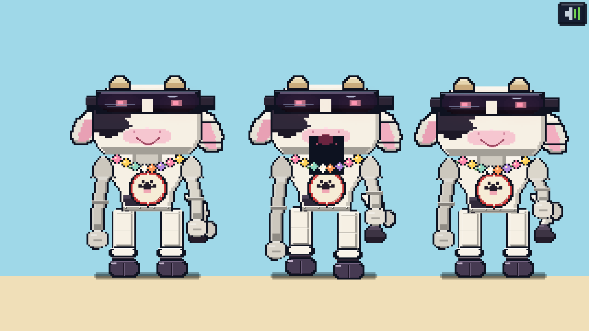

**The mascot is not on the robot rig any more.** Every version up to this one
bent the generic chassis into a cow: a procedural skull profile, a snout with a
mouth line on it, hanging ears, a barrel torso with a bulge parameter, and then
— once there was a model sheet to hit — a cap bolted on top and a visor swapped
in for the shades. You can push a rig a long way and it still comes out looking
like *a rig that has been pushed*, because every shape in it is a curve with a
name like `skull(p)` rather than a shape somebody drew.

So `js/moobot.js` draws him instead, part by part, straight off the sheet:

> a broad cream head, nearly square with the corners knocked off · two black
> hide patches on it · a red crew cap with the chain's letter, peak forward ·
> tan horn nubs out from under the peak · **one** black visor with two amber
> slits · a round pink muzzle, two nostrils, no mouth · ear cans either side
> with the O roundel on them · a red apron with cream straps over a cream body ·
> short dark arms, short dark legs, dark feet

It is **seven colours** with a light and a dark either side of each, and every
edge is a hard pixel: shapes are built as rows with a computed inset, the
outline pass runs over the *whole* shape before any fill starts, and nothing
anywhere uses alpha. (Stacked semi-transparent ellipses are the one thing this
style cannot survive — three of them over each other is brown mush.)

The handover is **one line** in `bots.js`:

```js
if (id === 'player' && G.drawMooBot) return G.drawMooBot(g, cx, footY, scale, o);
```

Everything in the game that draws you goes through `G.drawBot`, so the walkable
scenes, the cutscene silhouettes, the loading card and the crawl all get the new
model without knowing anything changed. It returns the same shape the rig does —
`tellRect`, `headTop`, `mouthY`, `gape`, `torsoY` — so the speech bubbles, the
aim line and the damage sparks still land where they did.

**The markings are fixed, not procedural.** Three hide patches at written-down
positions on the cheeks and temples, clipped to the head's own rows, so the cow
has the same face in every frame of every scene. Anything above −0.30 of the
head's height is under the cap and nobody would ever see it.

### It is still 52 units tall

| | |
|---|---|
| Legs | 12 |
| Body | 16 |
| Head | 24 |

12 + 16 + 24 = **52**, which is `G.SZ.MASCOT`, which is an adult. The squash
budget comes out of the same three numbers — a landing takes height off the legs
and puts width on the body — so a bounce never changes how tall he is standing
still. An earlier pass at the proportions forgot the budget entirely and came
out 63 units, standing a head over everybody in the room.

### What the sheet fixed that the rig could not

**The head is nearly square.** The rig's was a portrait rectangle with a domed
top, because it was a skull function shared with robots that are people-shaped.
A cow's head is wider than it is tall, and no amount of detail inside a portrait
rectangle reads as a cow.

**There is one visor, and no eyes.** Two separate lenses is a person in
sunglasses. One faceplate with two amber slits behind it is a machine in a cow
suit, which is what this is — and the slits carry the whole performance on their
own: angry pulls the inner end down, hurt lifts it, and one row of pixels is the
entire range.

**The ear cans are cans.** Padded cylinders on the sides of the head with the
roundel stamped on them, not flaps. They go down before the skull so it tucks
over the mount.

**The muzzle has no mouth on it.** The rig drew a mouth line across the snout
and it read as a stitch. A pink pad and two nostrils is the whole thing.

**And the limbs are dark.** The mascot is cream and the apron is red; a cream
limb drawn over a cream body is one wide shape with no arms in it. They are
short, dark and stubby, and the feet are far too big, because that is what
somebody in a suit looks like.

### The crawl still works

`drawBot` took a **crawl mode** years ago — no legs, both hands placed by the
caller — and the new painter keeps it, so the wreck passes in the positions its
physics produced and gets back the same mascot the shop sells gelato with. Same
head, same badge. The cutscenes pass nothing special at all.

---

## 🧍 The people


Humans used to be one sprite with a recoloured coat. Now a **seed becomes a
person**: height, girth, skull shape, nose, eye size and spacing, brow angle,
ear size, hair style and colour, facial hair, glasses, freckles, blush, what
they are wearing on top and underneath, how big their shoes are, whether they
have a belly, whether they stoop — and **one nervous habit they cannot help
doing**.

The same seed always gives you the same person, so the woman at the end of the
counter is the same woman in the next shot.

The proportions are deliberately wrong. The head is a third of the body, the
shoes are far too big, the arms are noodles and the torso is short. That is what
makes a cartoon read as a cartoon rather than as a short adult.

**And they are made of the same stuff the cow is.** Everything the mascot is
built from has five things going on: a hard black outline, a base tone, a **lit
crown** across the top, a **shaded belly** across the bottom, a rim down each
edge and one short specular streak on the light shoulder. People used to be a
flat fill with a single bright row, which is exactly why they read as cardboard
standing next to it. Now every torso, limb, hand, shoe and skull goes through
the same five-tone treatment — and so do the cats and the dogs.

**Same eyes, too.** The cow's face is three marks: a one-pixel light ring, a
dark round, a white pip. So that is what everybody has now — bigger than
before, because bigger is cuter — with a second dim catch-light in the larger
ones, a lid with a lash under it when they blink, and a thin brow set well
clear of the eye only on the faces whose genome asked for one. Glasses are a
**rim and a glint**, never a filled pane, because a pane over a dark round is
just a smudge.

The detail that came with it: collars that cast a shadow on the chest, hems on
every garment, cuffs exactly where the sleeve stops, scarves with a tail and
a fringe, shoes with a toe cap and a lace and a white sole, a chin shadow, and
two-tone blush. Half of them are **carrying something** — a bag, a paper cup, a
cone, a phone, a lolly, a balloon on a string, an umbrella, or a wrapped bunch
of flowers.

**The habit** is a small pose the clip system knows nothing about, added on top
of an idle so a room of people is never a row of statues doing the same breath.
Most of them are periodic bursts rather than constant motion: one rocks on the
spot, one scratches the back of its head every nine seconds or so, one checks a
wrist, one bounces, one cranes to see past whoever is in front. Everybody also
gets a phase offset and a speed multiplier, so a crowd never walks in lockstep.

**And they have somewhere to be.** In a walkable scene every person runs a
**script of intentions** that loops: walk to the counter, wait, order, walk to
a booth, sit down, talk, get up, leave. Staff stay behind the counter. Children
run. Nobody stands in the middle of the floor doing nothing, which is the thing
that makes a set look like a set.

### Coarser, and drawn with a fatter pen

People used to be drawn on the **quarter-unit** grid — one native pixel — the
same grid the cow's rivets and seams are on. At that resolution a human is a
smooth, slightly soft thing standing next to a mascot built out of chunky
plates, and the two do not look like they come from the same box of crayons.

So the whole of `folk.js` was moved down one tier. Every rectangle a person is
made of now goes through a single snapper —

```js
const GR = 0.5;                                  // the grid: two native pixels
const q = (v) => Math.round(v / GR) * GR;
function R(g, x, y, w, h, c) {
  const x0 = q(x), y0 = q(y);
  G.Rh(g, x0, y0, Math.max(GR, q(x + w) - x0), Math.max(GR, q(y + h) - y0), c);
}
```

— and there are **174 call sites**, so there is no back door. Limbs step in
half-units. Outlines are half-units, which is **two native pixels of black**
instead of one. Hems, stitches, rims and catch-lights are all half-unit blocks
with half-unit minimums, so nothing can quietly shrink back to a hairline.

The result is bigger pixels, blunter edges and a heavier black line around
everybody — the same drawing, done with a fatter pen, at the weight the mascot
was already drawn at.

Everything is still drawn row by row with **outlines in one pass and fills in
the second**. Do it per row and each row's outline paints over the last row's
fill and the whole person turns into a black blob. That mistake has been made
in this repository three times.

---

## 🎬 The performance


Everything in this game used to stand still and wait for the text to finish
typing. `anim.js` is the layer that fixes that.

A **clip** is a named piece of acting. Ask for one and you get back a **pose**: a
bag of offsets that the draw code applies to the parts it was already drawing.
Nothing in the animation layer draws anything itself, so any character — a
nineteen-part machine, a human, a dog — can be given a walk, a gesture or a
reaction without touching its sprite code.

`idle` · `walk` · `run` · `talk` · `reach` · `take` · `point` · `startle` ·
`slump` · `wave`


The rules the whole thing obeys:

- **legs and arms are always in opposition** — contralateral gait, the thing that
  separates walking from waddling
- **the body bobs at twice the stride**, because you rise on each step
- **weight leads**: the torso leans into the direction of travel
- **nothing is ever perfectly still** — idle still breathes and blinks
- a blink is a tenth of a second, on a schedule you cannot predict

Humans got rebuilt around it: hips, two legs with a knee that bends on the back
leg, a torso that leans and squashes on the breath, two arms with elbows whose
*hands* go where the clip says — which is the only way a reach or a point reads
at all — and a head that turns, tilts, blinks and talks. The dogs and cats got a
diagonal gait, so the near fore and the far hind swing together. The machines got
bob, lean, sway and arm swing, plus a mouth that opens on the beat.

And a clip can cross-fade into another one, so a shot can hand a character from
`walk` to `take` without a cut.

---

## The cast

Eighteen archetypes plus you, and the **silhouette comes from the job**. The
siege unit rolls on hazard-striped tread and carries a cannon with a muzzle
brake. The maid is narrow over a pleated skirt. The consumer unit is a riveted
barrel on a fluted plinth with a funnel bolted to its face. The orchestra unit
is a violin body on thin legs with a bow for an arm.

None of it is flat: every plate carries a hot top edge, a panel seam, an edge
catch, fastener rows, louvred vents and edge wear. Every chest is a recessed
housing with radiator fins, a live power bar and a stencilled serial. Every limb
is four parts — pauldron, upper arm, hinged elbow with a pin, forearm — with a
hydraulic piston alongside. Every optic has a machined bezel with a screw ring,
radial iris spokes, a bounce catch-light and a scan line crossing the glass.


You are the nineteenth, and you are not built to be liked — you are built to be
**recognised**. Few big shapes, hard contrast, nothing on the face trying to be
an instrument. Everything above is the rig the other eighteen are drawn on; you
come off a model sheet instead — see [One model](#-one-model).

What that section does not say, because it is about the drawing and this is
about the cast: `DAIRY UNIT`, filed under `GELATERIA`, and the only thing it
ever says is *one scoop, always one more*.

Eleven of the archetypes carry a lighter version of the same softening — the maid, the chef, the
nurse, the clerk, the courier, the horticultural unit and the rest get the blush
and the brow. The siege unit, the enforcer, the magistrate and the warden do
not.

---

## Tech

- **A real vignette.** The grade was four bars of constant alpha down the
  edges, which leaves the *corners* — the part of a frame a vignette exists
  to close — lighter than the sides, and reads as a drawn border. It is
  seven nested frames falling off toward the edge plus a quarter-disc of
  shade into each corner, and because it is the same picture every frame it
  is painted once into a buffer and blitted after that: 370 rects with
  fifty alpha changes is a lot to pay for something that never changes
- **1280×720** raster, snapped to whole native pixels on upscale
- **Three grids.** Everything is authored in one **320×180 logical** space drawn
  through a 4× transform, so a logical 1 is four hard pixels, and the same
  layout code drives two independent detail tiers over it:
  - **half-units** (`Rh`, `hair`, `vair`, `bevel`, `seam`, `rivet`, `grain`,
    `wear`, `notch`) — 2 native pixels, the structural tier: panel seams, hoop
    bands, plate edges
  - **quarter-units** (`Rq`, `hairq`, `vairq`, `pip`, `bevelq`, `rim`, `dither`,
    `grainq`, `ramp`) — **one native pixel**, the polish tier: specular streaks
    on glass, rim light down a form, catch-lights, honest ordered dithering,
    dust hazes, sky ramps
  Big flat forms, 2px structure, 1px polish — and not a single coordinate in any
  scene had to move to gain it.
- Two type sizes off one 5×7 bitmap face: the standard tier, and a **fine tier**
  at half scale for dense read-outs
- A **cosy layer** over the cold one: wood, cream paper and lamplight for
  anything that is information rather than machinery — warm drop shadows under
  the buttons, a lamp hairline on every lip, panels that look like paper on a
  board, and counter-edge trays instead of steel bars. The cold steel stays where
  it means something, which is inside the machines.
- Flat-shaded "boxel" language: 3–5 tones per material, hard light and shadow
  bands, 1px black outlines, no dithered mush
- **Frame-descriptor characters**: base, torso, head, arms, prop and emblem
  mixed per archetype
- **Sphere-normal scoop shading**; **heightfield pit surfaces** with slope
  lighting
- A shot-based **cutscene camera**: pan and push only, presented as a television
  broadcast — ident, clock, scanlines, roll bar, lower-third captions.
  A shot carries either one narrator line or a **script of timed lines** with
  speakers and name plates, and paint functions are handed a `talking` flag so
  mouths move while their owner is mid-sentence
- A **clip/pose animation layer** (`anim.js`) that no sprite code has to know
  about: ten named clips return pose offsets, and `drawBot`, `drawFolk` and
  Tracy all read the same fields. Contralateral gait, double-frequency bob,
  weight-leading lean, unpredictable blinks, and cross-fades between clips
- A **walkable stage** (`stage.js`): a floor line, a scrolling camera, tap to
  walk, hotspots you walk up to and use, speech bubbles that find the right
  head, a beat timeline that can take control and hand it back, and **two depth
  planes** so furniture on the back floor occludes the people sat behind it
- **A third, coarser tier for people.** `folk.js` draws entirely on the
  **half-unit** grid through its own snapper, with half-unit outlines — two
  native pixels of black — so humans carry the same line weight as the plated
  machines standing next to them
- **Profile-driven machines.** Every robot chassis, and every head that is not
  the cow's, is a solid of revolution off a half-width curve — one table of
  profiles, one shell painter, outline pass then fill pass — instead of a
  rounded box per part. Limbs are ball-joint / taper / ball-joint / taper with
  a mitten or a boot on the end, out of the same four helpers
- **One scale table** (`G.SZ`) that every walkable room is built from: an adult
  is 52 units, a door is 78, a counter top is 22
- A **camera override** on the stage (`S.camAt`): a beat can point the camera
  at a spot instead of at you, and hand it back by setting it to `null`
- A **speed multiplier** on the player (`S.pspeedMul`), so the one moment in
  the game that is timed can move you at nearly twice your walking pace
- **Procedural people** (`folk.js`): a seed becomes a genome — height, girth,
  skull shape, nose, eye size, hair, facial hair, glasses, clothes, shoes, hat,
  what they are carrying, and one nervous habit — and the rig draws it on the
  quarter-unit grid, outlines in one pass and fills in the next. Cartoon
  proportions on purpose: the head is a third of the body and the shoes are
  enormous
- **One material for the whole cast.** Outline, base, lit crown, shaded belly,
  two rims and a specular — the mascot's treatment, applied to every person,
  cat and dog, so nothing in a room is made of different stuff to anything else
- **Dialogue at full size**, wrapped by `G.wrap`, one bubble at a time, with a
  name tab in the speaker's colour and a tail that reaches their head
- **A juice layer in the stage**: a real squash spring that reaches the legs,
  a hop in the walk, footfall dust, four kinds of pop (rings, stars, dust,
  tumbling confetti), camera shake, an objective plate that drops in on a
  back-out curve, actors that hop and track you with their pupils
- All audio synthesised with WebAudio — servo whines, arc zaps, a cat's purr, a
  shell coming off, a shutter rolling, footsteps, and the five-note arpeggio for
  a secret. No sample files.
- A single `unlocked(id)` table drives every hidden control, so the UI can only
  show you what you have
- Save via `localStorage`; mouse and touch

## Layout

```
index.html          canvas + boot
js/util.js          maths, primitives, the half and quarter detail tiers, juice
js/anim.js          the clip/pose animation layer: ten clips, one pose bag
js/folk.js          the people: a genome per seed, and the rig that draws it
js/stage.js         the walkable stage: floor, camera, actors, spots, beats
js/font.js          5×7 bitmap font, standard and fine tiers
js/audio.js         WebAudio synthesis
js/state.js         ingredients, systems, 19 frames, disguises, crew, chapters,
                    and the three save chips
js/sprites.js       shared props, cones, cups, city furniture
js/art3.js          walls, conduit, neon, steam, and the MOO-BOT brand:
                    the roundel, the plaque and the lit sign
js/robots.js        legacy chassis helpers still used by the city art
js/bots.js          the rig: frames, plate detail, optics and dot eyes,
                    posed creatures, tells, the tip jar cat, goo scoops
js/moobot.js        the mascot, built to the model sheet, hands and all.
                    Everything that draws the player comes through here
js/clause.js        clause.ai — flight, chatter, asks, the books
js/cine.js          the cutscene camera and every story beat
js/acts.js          act one, the floor of MOO-BOT and the dance; act two,
                    the wreck
js/tracy.js         her front room, and the lesson
js/fix.js           the bench: fitting the leg, six stages
js/day.js           the floor: pits, sweeping, tips, spotting, closing
js/lab.js           the station panels: order, mixer, the line
js/back.js          the back room you walk
js/night.js         the bench: eight systems, 24 faults, five gestures
js/shop.js          the books and the armoury
js/main.js          the street, the chips, the boot, transitions, main loop
```

Made with Claude Code.
