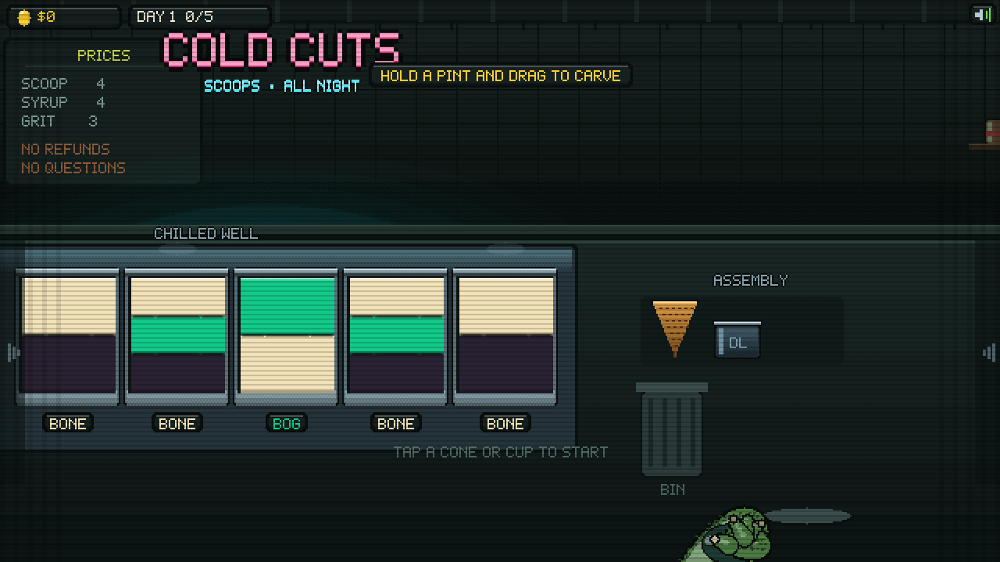
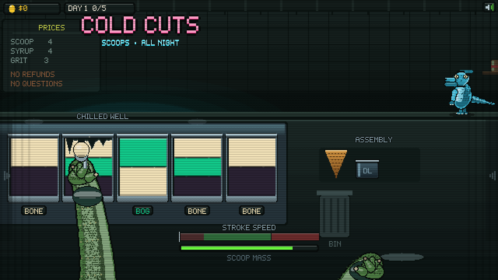
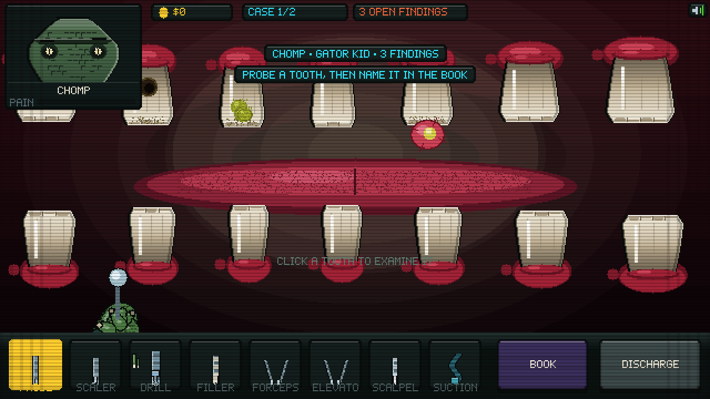
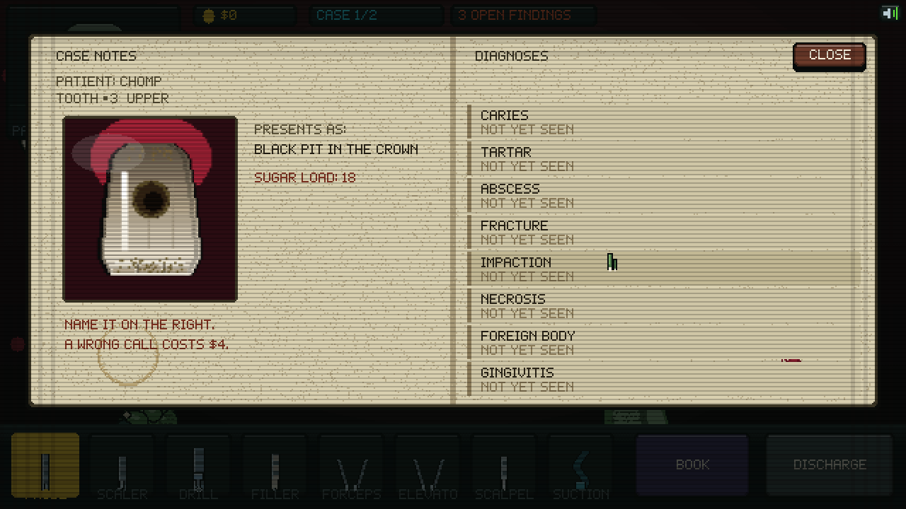
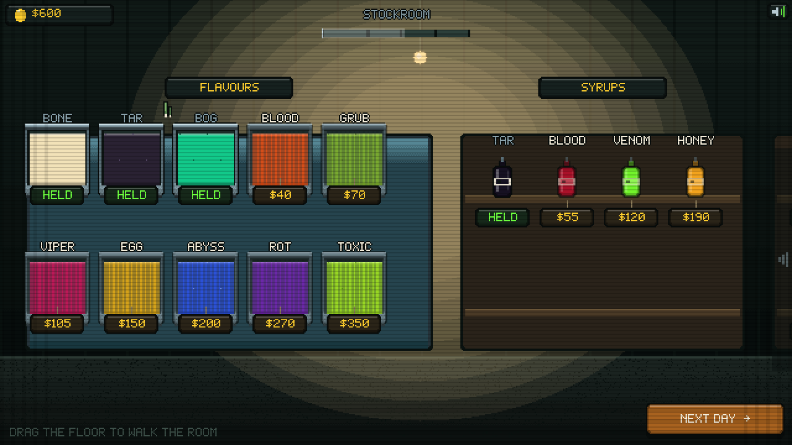

# 🐊 DOUBLE LIFE

**Sell the sugar. Bill for the damage.**

A dark pixel-art simulator. By day you run a grimy late-night ice cream counter,
carving scoops out of layered steel pints for a queue of amphibians and reptiles.
By night you are the only dentist in town, and every patient in your chair is a
customer you poisoned that afternoon.

**▶ Play it:** open `index.html` in a browser. No build, no dependencies, no assets —
every sprite, sound and note is generated in code.

---

## ☀️ The parlour

Drag the floor to walk the counter: a chilled well of pints on the left, the
assembly bench in the middle, syrup and grit on the right. Both of your scaly
forearms are in shot the whole time.

### Carving is the skill

Pints are **big rectangular tubs sliced into flavour strata**. Hold one and drag
sideways to carve:

- A **stroke-speed band** rules the cut. Too slow and the scoop packs icy and
  ragged; too fast and you skim off nothing.
- Mass only builds while you are inside the band.
- The ball takes the flavour of the **deepest layer your stroke reached** — so an
  order buried under two other flavours needs a deliberate, deeper cut.
- The carve is **persistent**: the pints stay dug out for the rest of the shift.

Then a **packing minigame** — stop the sweeping needle in the green to get PACKED
(rounder, glossier, better paid) instead of RAGGED.

Stack up to three, drizzle syrup whose droplets genuinely land, cling, run around
the curve of a scoop and drip off the bottom, then shake a jar of grit that
bounces and sticks where it falls. Serve. Every gram of sugar is logged.

## 🌙 The clinic

One hard lamp, sixteen teeth, and the kids from this afternoon.

### You must name the disease before you may cut

Probe a tooth to examine it, then open the **notebook** and match what you can see
against the diagnosis list. Get it right and the tooth is charted and its
procedure unlocks. Get it wrong and the patient jolts, you lose $4, and the book
stays open. Nothing can be treated until it is charted.

Eight findings, each with its own look and its own ordered fix:

| Finding | Presents as | Procedure |
|---|---|---|
| **Caries** | Black pit in the crown | Drill → fill |
| **Tartar** | Crusted yellow-green buildup | Scale |
| **Abscess** | Swollen bulge, pus head | Lance → suction |
| **Fracture** | Jagged crack, sharp edges | Bond |
| **Impaction** | Tilted, crowding its neighbour | Extract → suction |
| **Necrosis** | Grey-dead, dark core | Drill → clear → seal |
| **Foreign body** | Something wedged in the gap | Forceps |
| **Gingivitis** | Gum weeping blood | Scale → suction |

### Every instrument is a skill check

- **Drill** — a depth meter climbs while you hold. Release in the green. Push past
  it into the nerve and the patient screams, blood sprays, the screen shakes and
  you eat a fine.
- **Scaler** — keep the drag speed in the band. Overdo it and you gouge the gum.
- **Scalpel** — a ring closes on the abscess head. Release when it is tight.
- **Elevator** — rock left and right **on the beat**. Off-beat rocks cost progress
  and hurt. When it finally lifts: crack, gush, and a dark bleeding socket.
- **Forceps** — grip and pull against resistance until it pops.
- **Filler** — stop the level on the line. Under is a redo; over is a bad bite.
- **Suction** — blood pools, stains and runs down the teeth, and it stays there.
  The field must be clear before you can discharge.

A **pain meter** tracks how badly you are doing. Max it out and the patient passes
out and you lose the fee.

## 🛒 The stockroom

Pan a back room under one swinging bulb. Everything for sale is a physical object
on a shelf with a price tag: a chest freezer of pints, a rack of syrups, jars of
grit, and a steel cabinet of clinic upgrades (Carbide Burr, Surgeon Loupe, Steady
Claw, Sedative Gas). Richer flavours mean sweeter orders, which means worse teeth,
which means better nights.

## The cast

Twelve amphibians and reptiles, all with **beady dot eyes**: bullfrog, cane toad,
tree frog, axolotl, fire newt, pit viper, python, gecko, iguana, gator kid,
snapper, salamander. You are the crocodile.

## Tech

- 640×360 canvas, nearest-neighbour upscaled; every shape is scanline `fillRect`
  work so the pixels stay hard
- Procedural sprites throughout — organic scanline skulls, two-pass solid limbs,
  reptile scale fields, layered pints with a live carve surface, clinical enamel
  with cusps and fissures
- Custom 5×7 bitmap font
- All audio synthesised with WebAudio: wet squelches, bone cracks, drill whine,
  suction, screams, and two sequenced tracks
- Droplet, particle, gore and carve simulation, not canned animation
- Save via `localStorage`; mouse and touch

Made with Claude Code.
