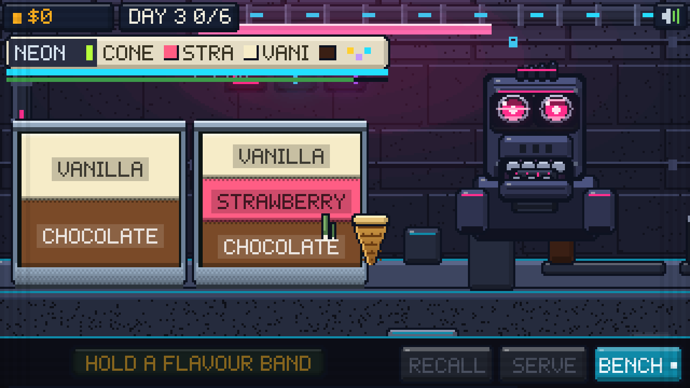
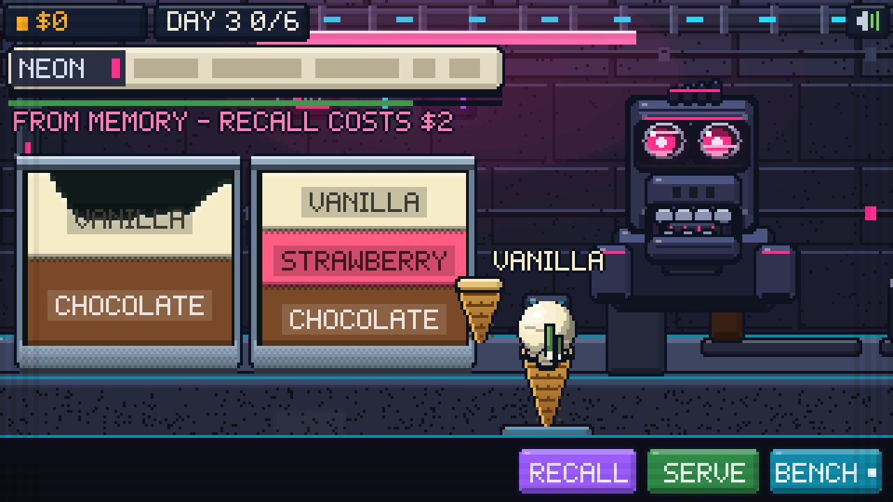
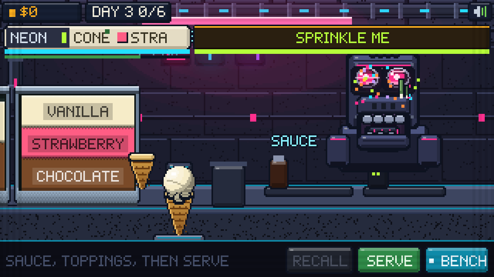
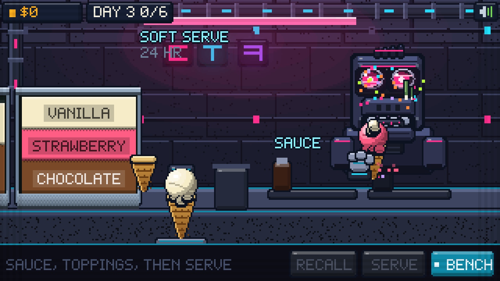
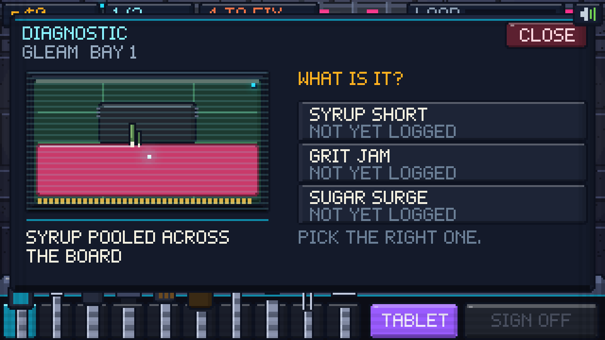
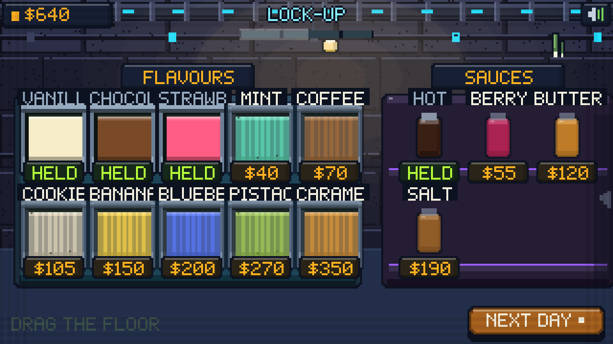

# 🤖 DOUBLE LIFE

**Sell the sugar. Bill for the repair.**

A chunky pixel-art simulator at **320×180**. By day you run a neon ice cream
kiosk on a wet back street, carving scoops out of layered steel tubs for a
queue of robots. By night you are the only mechanic in the district, and every
machine on your bench is a customer whose gears you filled with sugar that
afternoon.

**▶ Play it:** open `index.html` in a browser. No build, no dependencies, no
assets — every sprite, sound and note is generated in code.

---

## ☀️ The kiosk

A close two-shot: your tubs on the left, a robot's enormous open intake on the
right, and a plated city wall behind you both with conduit, neon signage,
hanging glyph boxes and steam coming up off the pavement. Drag the floor to pan
the counter over to the sauce bench.

### You have to remember the order

The chit prints across the top of the wall — base, flavours with counts, sauce,
toppings — and it is **readable for six seconds**. Then the cells redact
themselves and you are working from memory.

- **RECALL** re-prints it for a moment, and takes **$2** off the tip. It always
  works. It is a cost, not a punishment.
- The **ORDER BUFFER** upgrade keeps the chit up four seconds longer.
- The green bar under the chit is patience. It is generous — forty seconds.

### Some robots want something strange

Most machines have a habit, shown on its own tab beside the chit with a live
progress bar. The quirk **never** blanks out — remembering a weird habit on top
of the order is not fun; remembering the order is.

| Habit | What it wants |
|---|---|
| **SPRINKLE ME** | Shake the jar over the *robot*, not the cone |
| **SAUCE ME** | Pour the sauce over the robot's shell |
| **HAND FEED ME** | No cone. Carry bare scoops to its intake and drop them in |
| **ALL ONE FLAVOUR** | Every scoop the same |
| **CUP ONLY** | Build it in a cup |
| **NOTHING ON TOP** | No sauce, no toppings, at all |
| **IN A HURRY** | Serve inside fourteen seconds for a fat tip |

Whatever lands on the shell sticks there, and it counts toward tonight's sugar.

### Scooping

Tubs are **big rectangular vats sliced into flavour strata, and every stratum is
labelled right on the ice cream** — vanilla, chocolate, strawberry, mint chip,
coffee, cookies, banana, blueberry, pistachio, caramel. No meters, no timing
windows:

- **Press the band you want and hold.** The scoop digs in, a ball swells in the
  bowl, crumbs fly and the pitch rises until it comes free with a pop.
- The tub visibly craters where you dug, and **stays** cratered for the shift.
- **Keep holding, carry it over, and release.** A dashed seat shows where it
  lands; on release it squashes, settles and names itself.

Scoops are round, hard-shaded balls — five flat tones taken off the sphere
normal against one top-left key light, a square specular, drip lobes on the
lower rim. Stack up to three, drizzle sauce whose droplets genuinely land,
cling, run around the curve of a scoop and drip off the bottom, then shake a jar
of toppings that bounces and sticks where it falls.

Serve it and you watch them eat it. The cone comes up in a servo claw into the
corner of an intake that chomps at 3.4 Hz — wide open through most of the cycle,
snapping shut on each bite. Whole scoops stay whole; the one being eaten shrinks
bite by bite.

## 🌙 The workshop

One inspection lamp, one robot opened up on the bench, six module bays filling
the frame, and its head lolling back off the top watching you work.

### Scan it, name it, then fix it

Scan a bay to pull up the **diagnostic tablet**: the scan image on the left, the
symptom in plain words underneath, and **three candidate faults** on the right.
Only three, ever. Get it right and the bay is logged and its repair unlocks.
Get it wrong and the machine jolts and the tablet stays open.

Eight faults, every one of them something you did to them this afternoon:

| Fault | Presents as | Repair |
|---|---|---|
| **Sugar crust** | Hard crust welded over the contacts | Scrape |
| **Syrup short** | Sauce pooled across the board, arcing | Vacuum → solder |
| **Grit jam** | Sprinkles packed into the gear teeth | Blow |
| **Cold seize** | Frosted, seized solid | Heat → oil |
| **Dairy rot** | Soured cream eating the terminal | Vacuum → scrape → solder |
| **Impact crack** | Housing split by something hard | Weld |
| **Foreign body** | Something solid wedged in a slot | Pullers |
| **Sugar surge** | Scorched board, fuse popped | Swap module → solder |

### The tools just work

Once a bay is logged, its repair runs on feel, not on timing. Hold the tool and
it happens, with one honest progress bar and a lot of feedback:

- **Scraper** — drag over the crust and it flakes off in chips.
- **Blower** — hold and the sprinkles lift out of the gear, which then spins.
- **Vacuum** — coolant pools, stains and runs, and it stays there. The bay must
  be clear before you can sign off.
- **Heater** — hold on the frost until it steams off.
- **Oiler** — hold to flood the bearing.
- **Solder** — hold to re-run the joint, with sparks.
- **Welder** — hold to close the crack, with a hard arc and a screen flash.
- **Pullers** — grip the wedged object and drag it out.
- **Swapper** — hold and waggle; the dead module rocks further each time and
  then comes out with a crack, a gush of coolant and an empty socket.

There is a **LOAD** readout that rises while you work and settles on its own. It
is there for the wince, not to punish you — nothing in the workshop can cost you
a job.

## 🛒 The lock-up

Pan a back room under one work lamp. Everything for sale is a physical object on
a shelf with a name plate and a price tag: a chest of flavour vats, a rack of
sauces, jars of toppings, and a cabinet of workshop upgrades (Chill Coil, Servo
Grip, Order Buffer, Surge Damper, Plasma Bit). Richer flavours mean sweeter
orders, which means worse faults, which means better nights.

## The cast

Twelve machines, all built out of hard-edged boxel volumes. Every one has:

- **A glowing optic** — a quantised round lens in a hard black rim, a bright
  metal bezel, a fat coloured iris around a white-hot core, a scan band sweeping
  the glass, one square catch-light, and armour shades that go angry, worried or
  sick. Legible from 6 px to 26 px.
- **An intake hatch that really opens** — the jaw drops in front of the chest
  inside a hard black frame, with metal crusher plates top and bottom, a lit
  conveyor belt for a tongue and a darkening throat behind it.
- **Its own chassis** — colour ramp, neon accent, head variant (brick, dome,
  bucket, CRT bezel, visor) and head furniture (whip antenna, fin array, dish,
  twin aerials, hazard lamp).
- **Its own build** — width, height, jaw throw and optic size all vary, so the
  cast rigs to genuinely different sizes.

Dozer · Sable · Chrome · Minty · Rustbolt · Violetta · Pixel · Medibot · Tank ·
Neonkid · Cargo · Spindle. You are the ice cream robot, and what you show of
yourself is a small servo claw holding the tool.

## Tech

- **320×180** canvas, nearest-neighbour upscaled; every shape is scanline
  `fillRect` work so the pixels stay hard
- Flat-shaded "boxel" language: 3–5 tones per material, hard light and shadow
  bands, 1 px black outlines, no dithered gradients pretending to be soft
- Round things are quantised per scanline with real terminators and rim light —
  never flat discs, never rounded squares standing in for balls
- Robots are a procedural rig: chassis plate, optics, intake, hatch, pauldrons,
  cable looms, then head furniture
- Layered tubs with a live dig surface and on-band flavour labels
- Custom 5×7 bitmap font
- All audio synthesised with WebAudio: servo whines, arc zaps, clanks, vacuum,
  drills, boot chimes, and two sequenced tracks
- Droplet, particle, coolant and carve simulation, not canned animation
- Save via `localStorage`; mouse and touch

Made with Claude Code.
