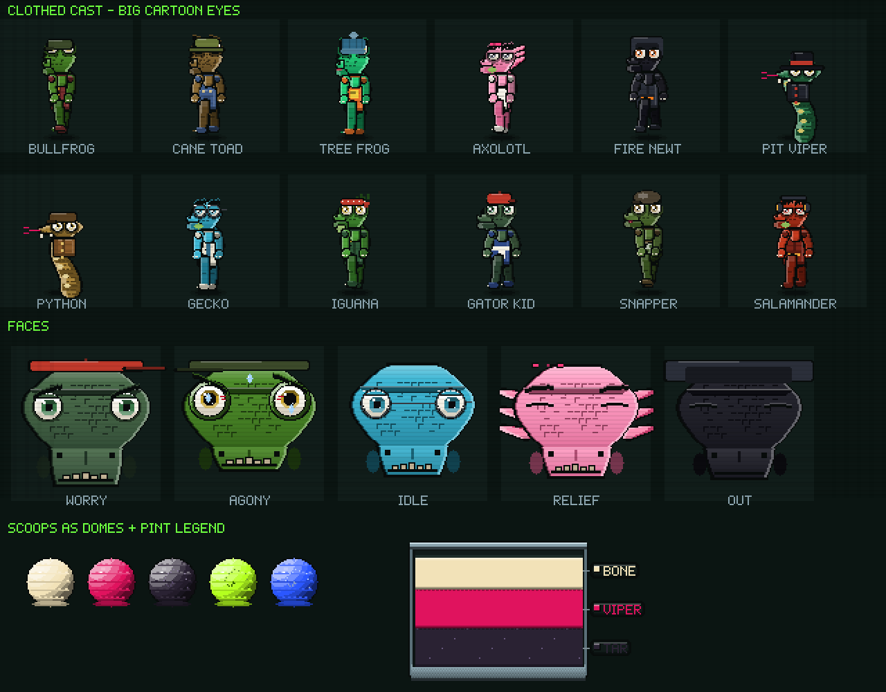

# 🐊 DOUBLE LIFE

**Sell the sugar. Bill for the damage.**

A dark pixel-art simulator. By day you run a grimy late-night ice cream counter,
carving scoops out of layered steel pints for a queue of amphibians and reptiles.
By night you are the only dentist in town, and every patient in your chair is a
customer you poisoned that afternoon.

**▶ Play it:** open `index.html` in a browser. No build, no dependencies, no assets —
every sprite, sound and note is generated in code.

---

## ☀️ The parlour

Drag the floor to walk the counter: a chilled well of pints on the left, the
assembly bench in the middle, syrup and grit on the right. Both of your scaly
forearms are in shot the whole time.

### Scooping

Pints are **big rectangular tubs sliced into flavour strata, and every stratum is
labelled right on the ice cream** — you can always see which band is which
flavour. There are no meters and no timing windows:

- **Press the band you want and hold.** The scoop digs in, a dome swells inside
  the bowl, crumbs fly and the pitch rises until it comes free with a pop.
- The tub visibly hollows out where you dug, and **stays** hollowed for the shift.
- **Carry the dome over and set it on the cone.** A dashed seat shows where it
  lands; on release it squashes, settles and names itself.

Scoops are drawn as **lit 3D domes** — churned ridges following the curvature, a
melt lip at the base, a hard sheen — not flat discs. The cone keeps a running
list of what is on it.

Stack up to three, drizzle syrup whose droplets genuinely land, cling, run around
the curve of a scoop and drip off the bottom, then shake a jar of grit that
bounces and sticks where it falls. Serve. Every gram of sugar is logged.

## 🌙 The clinic

One hard lamp, sixteen teeth, and the kids from this afternoon.

### You must name the disease before you may cut

Probe a tooth to examine it, then open the **notebook** and match what you can see
against the diagnosis list. Get it right and the tooth is charted and its
procedure unlocks. Get it wrong and the patient jolts and the book stays open.
Nothing can be treated until it is charted — identifying the disease is the whole
puzzle.

Eight findings, each with its own look and its own ordered fix:

| Finding | Presents as | Procedure |
|---|---|---|
| **Caries** | Black pit in the crown | Drill → fill |
| **Tartar** | Crusted yellow-green buildup | Scale |
| **Abscess** | Swollen bulge, pus head | Lance → suction |
| **Fracture** | Jagged crack, sharp edges | Bond |
| **Impaction** | Tilted, crowding its neighbour | Extract → suction |
| **Necrosis** | Grey-dead, dark core | Drill → clear → seal |
| **Foreign body** | Something wedged in the gap | Forceps |
| **Gingivitis** | Gum weeping blood | Scale → suction |

### The instruments just work

Once a tooth is charted, its procedure runs on feel, not on timing. Hold the
instrument and it happens, with one honest progress bar and a lot of feedback:

- **Drill** — hold on the lesion until the decay is bored out. No nerve to hit.
- **Scaler** — drag over the crust and it flakes off in chips.
- **Scalpel** — put the blade on the swelling and it opens.
- **Elevator** — hold and waggle; the tooth wobbles further each time and then
  comes out with a crack, a gush and a dark bleeding socket.
- **Forceps** — grip the wedged object and pull away.
- **Filler** — hold to pack the hole full.
- **Suction** — blood pools, stains and runs down the teeth, and it stays there.
  The field must be clear before you can discharge.

There is an **OUCH** readout that rises while you work and settles on its own. It
is there for the wince, not to punish you — nothing in the clinic can cost you a
case.

## 🛒 The stockroom

Pan a back room under one swinging bulb. Everything for sale is a physical object
on a shelf with a price tag: a chest freezer of pints, a rack of syrups, jars of
grit, and a steel cabinet of clinic upgrades (Carbide Burr, Surgeon Loupe, Steady
Claw, Sedative Gas). Richer flavours mean sweeter orders, which means worse teeth,
which means better nights.

## The cast

Twelve amphibians and reptiles, **all dressed and all with big cartoon eyes** —
shaded eyeballs with a coloured iris, a specular catch-light, working eyelids and
brows that go angry, worried or sick. Every one wears something: the cane toad in
dungarees and a bucket hat, the gator kid in a jersey and a backwards cap, the
gecko in a lab coat and round spectacles, the fire newt in a hood, the pit viper
in a fedora, the python in a knitted scarf.

Bullfrog · cane toad · tree frog · axolotl · fire newt · pit viper · python ·
gecko · iguana · gator kid · snapper · salamander. You are the crocodile.

## Tech

- 640×360 canvas, nearest-neighbour upscaled; every shape is scanline `fillRect`
  work so the pixels stay hard
- **No flat circles anywhere.** Scoops, eyeballs and shells are quantised lit
  domes with a real terminator and rim light; gums are one formed ridge of tissue
  scalloped between the teeth; the tongue is a domed muscle with a median furrow;
  light is dithered rather than stacked alpha discs
- Characters are a real rig — shoes, shins, thighs, hips, ribcage, shoulders,
  arms with elbows, neck, skull, muzzle — then clothes, then eyes. Limbs are
  filled from a densified spine as a single span per scanline, so they read as
  tubes instead of strings of spheres
- Procedural sprites throughout — organic scanline skulls, layered pints with a
  live dig surface and on-band flavour labels, clinical enamel with cusps and
  fissures
- Custom 5×7 bitmap font
- All audio synthesised with WebAudio: wet squelches, bone cracks, drill whine,
  suction, screams, and two sequenced tracks
- Droplet, particle, gore and carve simulation, not canned animation
- Save via `localStorage`; mouse and touch

Made with Claude Code.
