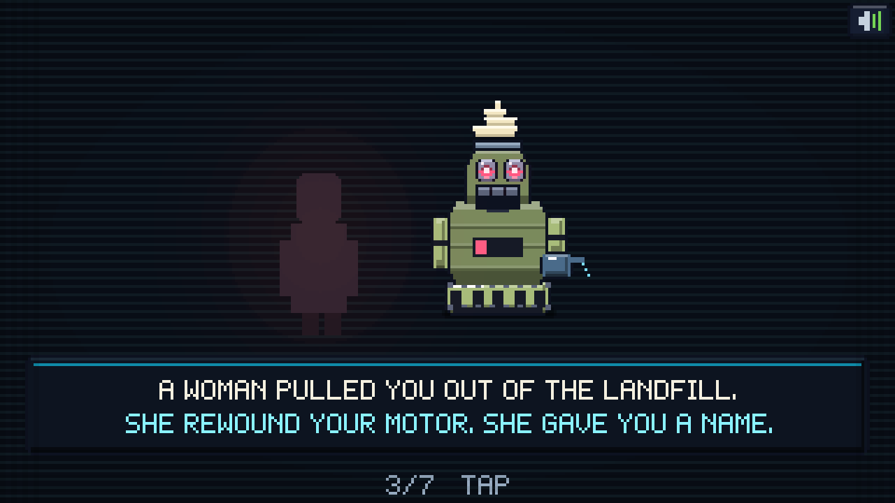
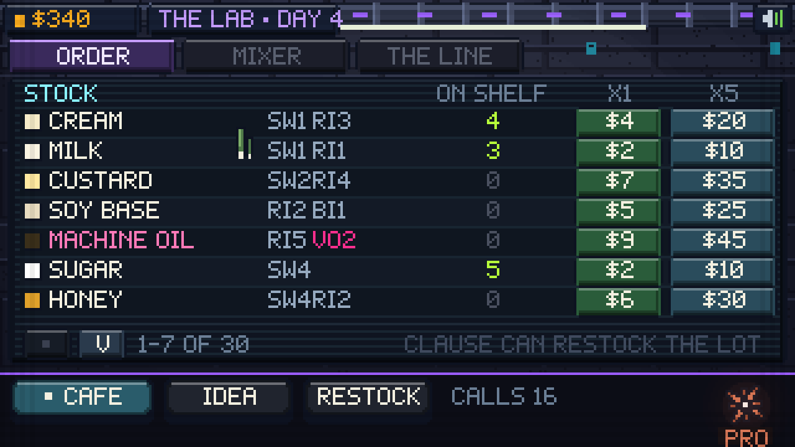
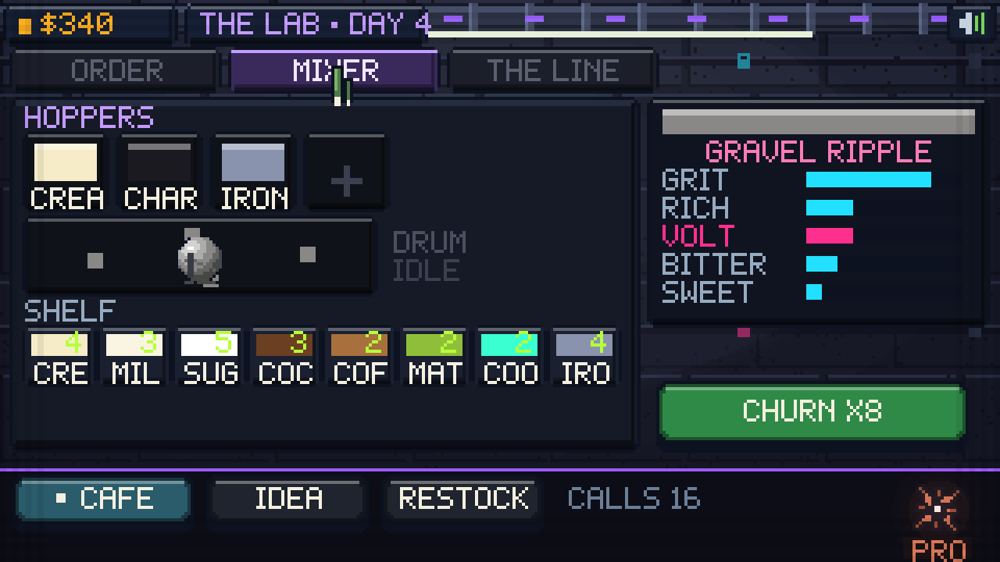
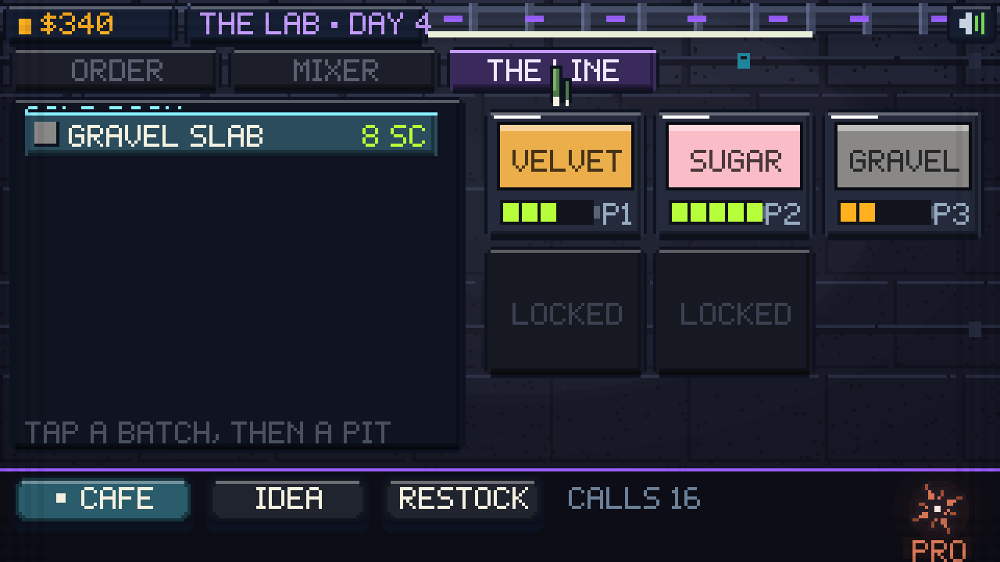
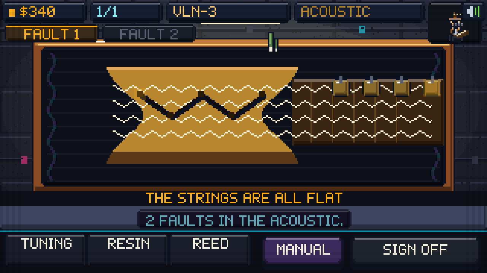
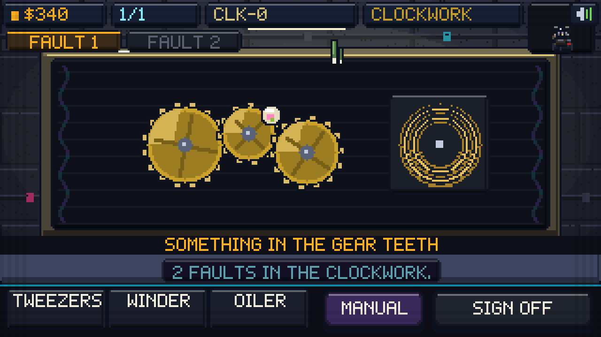
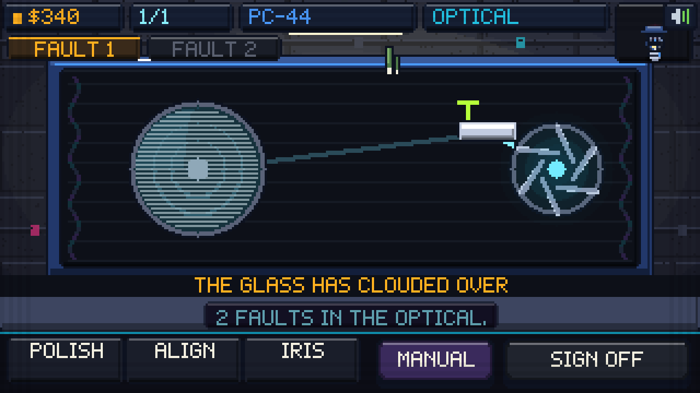
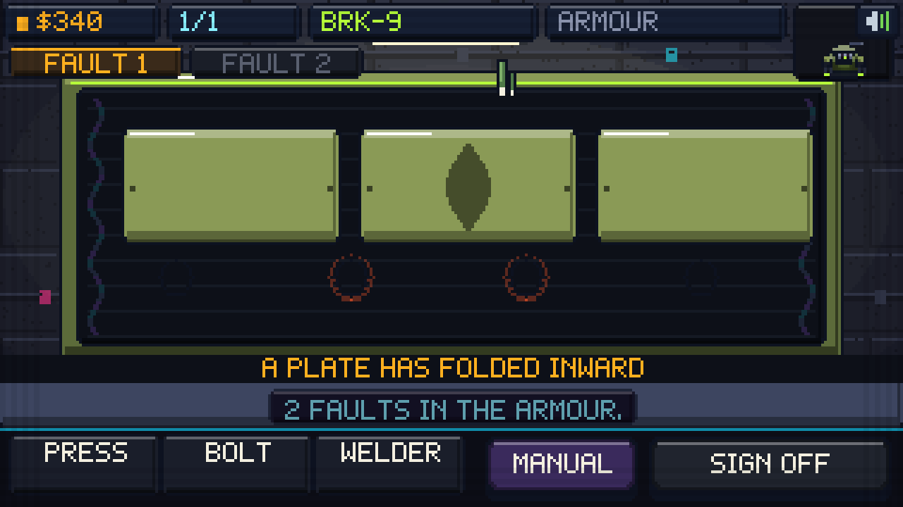

# 🍦 DOUBLE LIFE

**They took the world. You have ice cream.**

A zero-dependency pixel-art game at **320×180**. You are a discarded ice cream
machine, salvaged and kept running by a human who loved you, in a city the
machines now own. So you do the only thing you were built to do — and you do it
with intent. **Serve them something laced. Their systems fail. Bill them to put
it right. Spend the money on stock, on weapons, and on machines you turn to our
side.**


**▶ Play it:** open `index.html` in a browser. No build step, no dependencies,
no asset files — every sprite, sound and note is generated in code.

---

## 📖 The story



Seven cards, then you are behind the counter. The short version: a woman named
in no records pulled you out of a skip, cleaned your hoppers, and left you
running. She is gone. Her city is not. Every machine that walks in tonight
belongs to the thing that took it.

---

## ☀️ The café


One narrow room: a work shelf at the back with your cones, cups, sauces and
topping jars, and in front of it the **pit deck**, sunk into the counter and
lit from below. You start with **one pit** and can build up to **five**.

A pit is one flavour, **lying flat**, so you scoop it the way a real one is
scooped — **top down**.

### Scooping


Every pit surface is a live **heightfield** — a 16×10 grid of depths, lit by
its own slope, so a furrow you dug an hour ago is still there in the light.

- **Press into the pit and sweep.** A disc of cells presses down under the
  scoop and the ball builds in the bowl. Dragging is what earns it: the fill
  rate rises the further you move, so a long confident arc beats a jab.
- **Stop in the green.** Under-filled reads `OK`, in the window reads
  `PERFECT`, past it collapses into `SLOP` and the machine grudgingly pays.
- **Let go on a cone, a cup, or the machine's own intake.** The ball drops,
  squashes, settles and sags.
- Each pit shows a little **battery** — how many scoops are left in it before
  the flavour is gone for the day.


Scoops are shaded off the **sphere normal** into five flat tones against one
top-left key light, with a square specular, and **sagging goo lobes on the
lower rim that grow with the mix's own `goo` value**. Corn syrup and banana
run. Charcoal and iron filings hold their shape.

### They ask for a craving, not a flavour

The tag on the wall names what the machine **wants** — `RICH`, `BITTER`,
`AROM`, `COLD`, `SPARK` — never a flavour by name. You match it out of what is
actually on your line, and a live **percentage** on the tag tells you how close
the build is. Buy the `HOBBY` plan and clause.ai also tells you what it
**hates** before it opens its mouth.

Eighteen archetypes, each with its own craving, its own hatred, its own
patience, its own pay multiplier, and its own internals for later:

| Machine | Job | System | Wants | Hates |
|---|---|---|---|---|
| SIEGE UNIT | Armour corps | Armour | Rich | Sour |
| MAID UNIT | Domestic | Servo | Aromatic | Grit |
| ENFORCER | Family business | Hydraulic | Bitter | Sweet |
| PATROL UNIT | Civic order | Optical | Sweet | Heat |
| CONSUMER UNIT | Demand modelling | Boiler | Sweet | Salty |
| ORCHESTRA UNIT | State culture | Acoustic | Aromatic | Goo |
| KITCHEN UNIT | Nutrient issue | Boiler | Salty | Sweet |
| MEDICAL UNIT | Population health | Neural | Cold | Volt |
| MAGISTRATE | Compliance | Neural | Bitter | Spark |
| EXCAVATOR | Deep extraction | Hydraulic | Grit | Aromatic |
| CHAPLAIN UNIT | Morale | Optical | Cold | Heat |
| ENTERTAINMENT | Mood control | Acoustic | Spark | Bitter |
| RECORDS UNIT | Administration | Clockwork | Sweet | Heat |
| INFANTRY | Pacification | Servo | Salty | Aromatic |
| SCRAPPER | Unlicensed | Clockwork | Volt | *nothing* |
| COURIER UNIT | Logistics | Servo | Cold | Goo |
| HORTICULTURAL | Green zones | Hydraulic | Aromatic | Volt |
| WARDEN UNIT | Detention | Armour | Bitter | Sweet |

None of them is a recolour. The **silhouette comes from the job**: the siege
unit rolls on tread and carries a cannon, the maid is narrow over a skirt, the
consumer unit is a barrel on a plinth with a funnel bolted to its face, the
orchestra unit is a violin body on thin legs with a bow for an arm and a scroll
over its head. Base, torso, head, arms and prop are mixed per archetype, so you
can name one at 12 px across.

You are on the same rig — a nineteenth frame, built as what you are: a churn
drum on salvaged tread, a dispenser head, a nozzle for an arm, and a soft-serve
swirl still set in the crown from the day the shop closed.

### Lacing it

Anything with **volt** in the mix will take them down — coolant, iron filings,
magnet dust, battery acid, thermite. Serve it, watch the sparks come out of the
seams, and it staggers out of the door. It is now **tonight's job**, and it is
paying you to fix what you did. Serving laced stock raises **HEAT**; let that
run and the city starts paying attention.

---

## 🧪 The lab

The backrooms behind the café. Three tabs.

### ORDER — buy stock online



Thirty ingredients across four aisles, priced from $2 to $44, each carrying its
own properties:

| Aisle | What's in it |
|---|---|
| **Base** | Cream, milk, custard, soy base, **machine oil** |
| **Sweet** | Sugar, honey, corn syrup, sweetener |
| **Taste** | Vanilla pod, cocoa, strawberry, mint, coffee bean, pistachio, banana, lemon, matcha, lavender, liquorice |
| **Additive** | Sea salt, chilli, charcoal, edible glitter, popping candy, **coolant**, **iron filings**, **magnet dust**, **battery acid**, **thermite** |

The five in bold are illegal, they are the ones with volt in them, and they are
the whole point of the business.

### MIXER — invent flavours



Four hoppers into one drum. Load two or more ingredients and the read-out shows
you what comes out: the blended colour pushed toward saturation, the twelve
properties that survived, and a **generated name** taken from whatever shouts
loudest — `VELVET CHURN`, `GRAVEL SLAB`, `SUGAR RIPPLE`, `MAGNET SWIRL`. Churn
it and the drum spits out a **batch of eight** scoops, or sixteen with the twin
churn fitted.

### THE LINE — prepare tomorrow



The cold room holds every batch you have churned, with its quantity. Tap a
batch, tap a pit, and it loads — twelve scoops to a pit, eighteen with the
chiller coil. **This is how you open tomorrow.** An empty line means a shift
of machines walking out unserved.

---

## 🌙 The workshop

You broke them. Now bill them. Every job on your bench is a machine you served
that afternoon, and **which system you are opening depends on what it is**.




Eight systems, each a hand-built interior with its own furniture, its own three
tools and its own three faults:

| System | Inside it | Tools |
|---|---|---|
| **Hydraulic** | Pressure lines and a reservoir | Bleed · clamp · purge |
| **Clockwork** | Gear trains and a mainspring | Tweezers · winder · lube |
| **Boiler** | A burner and a heat exchanger | Descaler · vent · igniter |
| **Acoustic** | A resonator and tensioned strings | Tuner · resin · pick |
| **Neural** | A lattice of nodes and links | Probe · patch · reset |
| **Optical** | A lens stack and mirrors | Polish · align · free |
| **Servo** | Motor stacks, belts and encoders | Tension · rewind · calibrate |
| **Armour** | Plate, bolts and weld | Press · bolt · weld |




### Read it, name it, then fix it


Each fault shows you a symptom in plain words — *a bubble stalled in the line*,
*the mainspring has run down*, *one node has gone dark*, *a plate has folded
inward* — and the manual offers **three candidates**. Only three, ever. Name it
right and the repair unlocks and its fee is logged. Name it wrong and the
machine jolts, and a misdiagnosis costs you.

**Twenty-four faults, and every repair is one of five honest gestures:**

- **Hold** the tool on the part (12 faults) — clamps, patches, igniters, resin
- **Sweep** it across (6) — purging a line, descaling a core, polishing glass
- **Wind** it in circles (5) — mainsprings, encoders, tension screws
- **Click** exactly on the thing (4) — bolts, dead nodes, a crossed link
- **Drag** it out (4) — grit in the gear teeth, something wedged in a slot

No timing windows, no rhythm minigames. You can see the part, you can see the
tool, and it does what it looks like it does.

---

## 🤖 clause.ai

Your friend. A little coral **starburst** in the corner of every scene that
talks to you, teaches you the job in nine beats, and does the work you would
rather not.

- **Ask it to buy things** — name an ingredient and a quantity and it orders.
- **Ask it to read a customer** before the customer orders.
- **Ask it for today's trends**, or for a recipe out of what is on your shelf.
- **Ask it what tonight looks like** before you commit to a laced serve.


At the end of every shift it closes the books: served, counter takings,
workshop fees, stock spent, volt served, jobs fixed, misdiagnoses, heat, net —
beside a **shift-net trend** going back eight shifts, so you can see whether the
business is actually working. How much of that you get to see **depends on what
you are paying it**.

| Plan | Price | Calls/day | What it unlocks |
|---|---|---|---|
| **FREE** | — | 4 | Walks you through the job, takes ingredient orders |
| **HOBBY** | $150 | 8 | Reads a customer before it orders, flags what it hates |
| **PRO** | $420 | 16 | Daily demand trends, end-of-day breakdown |
| **SCALE** | $900 | 32 | Suggests recipes from your shelf, forecasts volt and heat |
| **ENTERPRISE** | $1800 | 99 | Restocks the shelf on its own, full analytics, no limits |

---

## 🔧 The armoury


Where the money goes. Four tabs.

**UPGRADES** — the 2nd through 5th pit ($120 → $1100), the chiller coil so pits
drain slower, the heavy ladle for bigger faster scoops, the twin churn, and the
assay bench so you can see a mix before you commit to it.

**ARMS** — the EMP baton and rail spike raise what the resistance pays you for
repairs (+20%, +40%), the signal jammer bleeds off heat faster, and the virus
darts halve the price of illegal stock.

**CREW** — six machines you turned.


| Ally | Was | Does |
|---|---|---|
| **MAGPIE** | Scrapper | Free ingredient every day |
| **DASH** | Courier | Orders arrive free |
| **MIREPOIX** | Kitchen unit | +15% on a good match |
| **SALINE** | Medical unit | One free misdiagnosis |
| **BLOOM** | Horticultural | Aromatics half price |
| **BULWARK** | Siege unit | Suspicion capped |

Each is drawn as a live portrait in the list, on the same rig as the customer
who used to wear that chassis.

**CLAUSE** — the plans above.

Then `OPEN TOMORROW`, and the line you prepared had better be loaded.

---

## Tech

- **320×180** canvas, nearest-neighbour upscaled; every shape is scanline
  `fillRect` work, so the pixels stay hard at any zoom
- Flat-shaded "boxel" language: 3–5 tones per material, hard light and shadow
  bands, 1 px black outlines, contact shadows, square speculars, no dithered
  gradients pretending to be soft
- Round things are quantised per scanline with real terminators and rim light
- **Frame-descriptor characters**: base, torso, head, arms, prop and emblem are
  mixed per archetype, so the silhouette is dictated by the job
- **Sphere-normal scoop shading** with sag lobes driven by the mix's own goo
- **Heightfield pit surfaces** with slope lighting, so digs persist
- Ingredient → flavour algebra: additive properties, saturation-pushed colour
  blend, generated names
- Custom 5×7 bitmap font, word-wrapped speech
- All audio synthesised with WebAudio — servo whines, arc zaps, clanks, drum
  churn, boot chimes, and sequenced tracks. No sample files.
- Save via `localStorage`; mouse and touch

## Layout

```
index.html          canvas + boot
js/util.js          maths, primitives, particles, camera, buttons
js/font.js          5×7 bitmap font
js/audio.js         WebAudio synthesis
js/state.js         ingredients, flavours, systems, 18 archetypes, economy
js/sprites.js       shared props, cones, cups, city furniture
js/art3.js          walls, conduit, neon, steam
js/robots.js        legacy chassis helpers still used by the city art
js/bots.js          the archetype rig: frames, plate, lens, goo scoops
js/clause.js        clause.ai — tutorial, asks, orders, the books
js/day.js           the café: pits, sweeping, serving, sabotage
js/lab.js           the backrooms: order, mixer, the line
js/night.js         the workshop: eight systems, 24 faults, five gestures
js/shop.js          the books and the armoury
js/main.js          title, story, transitions, main loop
```

Made with Claude Code.
